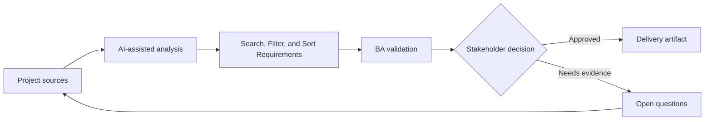

# Search, Filter, and Sort Requirements

<div class="case-meta">
  <span>Data and Integration</span>
  <span>Search experience</span>
  <span>Project use case</span>
</div>

## Project context

Users need to find cases across thousands of records using keyword search, filters, saved views, and sorting. Current requirements say searchable and filterable without defining behavior. In Search experience, this work usually starts when data movement, mapping, reconciliation, privacy, and lineage decisions affect multiple systems and owners. The BA should treat Record field list and User tasks as evidence to organize, not as raw material for an unconstrained AI answer. The goal is to make the next decision clearer for the people who own the outcome.

## BA challenge

The BA must specify search semantics, filter combinations, sorting rules, saved views, empty states, performance expectations, and data fields included in search. For Search, Filter, and Sort Requirements, the practical difficulty is silent data loss and weak lineage. AI can accelerate field mapping, rule comparison, reconciliation design, lineage review, and exception analysis, but the BA must still expose assumptions, missing approvals, and the point where stakeholder judgment is required.

## Where AI fits

<div class="ba-workbench-panel">
AI fits this Data and Integration use case when it is constrained to field mapping, rule comparison, reconciliation design, lineage review, and exception analysis. A useful first AI task is: Generate search behavior questions from user tasks. AI should not approve scope, invent policy, bypass source schemas, sample payloads, mapping rules, data-quality reports, and ownership matrix, or turn a draft into a final decision.
</div>

- Generate search behavior questions from user tasks.
- Draft filter and sort rule matrix.
- Identify ambiguity in contains, exact match, date range, and status filters.
- Create search acceptance criteria and edge cases.

## Inputs to prepare

- Record field list
- User tasks
- Current search examples
- Data volume
- Performance requirements

Before prompting for Search, Filter, and Sort Requirements, label each input by owner, date, approval status, sensitivity, and role in the decision. The most important evidence lens is source schemas, sample payloads, mapping rules, data-quality reports, and ownership matrix; without it, AI may rank old notes, draft designs, and approved rules as if they had equal authority.

## BA workflow

1. List user search tasks and fields users expect to search.
2. Ask AI to identify search/filter/sort ambiguities.
3. Define searchable fields, match logic, filter combinations, sort order, and saved view behavior.
4. Review backend search feasibility and performance constraints.
5. Write acceptance criteria for no results, partial matches, invalid filters, and permissions.
6. Create QA data set with edge cases.

Run the workflow as data contract review before integration build: start with "List user search tasks and fields users expect to search.", then keep a visible decision log as the artifact moves toward Search behavior spec. This prevents AI suggestions from silently becoming backlog, design, release, or operational commitments.

## Diagram



## Deliverables

| Deliverable | What it contains | Owner | Done signal |
| --- | --- | --- | --- |
| Search behavior spec | Field, match type, ranking, permission, and result display | BA | Search semantics are clear |
| Filter/sort matrix | Filter, operator, combination rule, default, and edge case | BA and backend | Filter logic is implementable |
| Saved view requirement | Create, edit, share, default, permission, and deletion behavior | Product owner | Saved views have lifecycle |
| Search QA data set | Records, expected matches, no-match cases, and permission cases | QA | Search can be verified |

Treat Search behavior spec as a BA-owned data and integration control pack. AI may draft structure, but the BA must validate whether "Search semantics are clear" is actually true, whether the artifact is traceable to source evidence, and whether the receiving team can act on it.

## Prompt to try

```text
Act as a senior AI-aware Business Analyst. Help me apply the "Search, Filter, and Sort Requirements" use case to my project. First ask for source evidence and constraints. Then create a structured analysis with project context, assumptions, AI-fit boundary, workflow steps, deliverables, risks, controls, open questions, and stakeholder decisions. Do not invent policy, thresholds, or approvals.
```

## Review checklist

- Record field list is labeled with owner, date, approval status, and sensitivity.
- Search behavior spec traces to source evidence and has a named human owner.
- The AI task stays inside field mapping, rule comparison, reconciliation design, lineage review, and exception analysis and does not approve scope or policy.
- The "Search ambiguity" risk has a practical control: Define match behavior and searchable fields.
- Open assumptions are converted into validation questions or stakeholder decisions.
- Success metric: Search and filtering behavior is precise enough to implement, test, and explain to users.

## Risks and controls

| Risk | Why it matters | BA control |
| --- | --- | --- |
| Search ambiguity | Users and developers may expect different match logic | Define match behavior and searchable fields |
| Filter conflict | Combined filters may behave unexpectedly | Specify AND/OR and default rules |
| Permission leakage | Search may expose records user cannot see | Include permission filtering |
| Performance gap | Search may be correct but too slow | Add performance expectations |

The main control for the "Search ambiguity" risk is explicit human accountability: Define match behavior and searchable fields. If evidence is weak, the output should create a validation question or decision item, not a final requirement.
