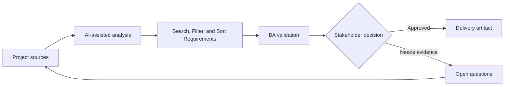

# Search, Filter, and Sort Requirements

<div class="case-meta">
  <span>Data and Integration</span>
  <span>Search experience</span>
  <span>Project use case</span>
</div>

## Project context

Users need to find cases across thousands of records using keyword search, filters, saved views, and sorting. Current requirements say searchable and filterable without defining behavior. In a real delivery environment, this work usually appears under time pressure: stakeholders want clarity, delivery needs a backlog, QA needs testable behavior, and operations needs a process that can survive exceptions. The BA uses AI here to accelerate analysis and synthesis, but the BA remains accountable for evidence, business meaning, stakeholder decisioning, and artifact quality.

## BA challenge

The BA must specify search semantics, filter combinations, sorting rules, saved views, empty states, performance expectations, and data fields included in search. The practical difficulty is that AI can make early material look more complete than it is. A strong BA keeps the output reviewable by separating source-backed facts, assumptions, unsupported claims, decision gaps, and recommended next actions. The objective is not to make the document longer; it is to make the project decision clearer and safer.

## Where AI fits

<div class="ba-workbench-panel">
AI is useful in this use case when it is constrained to analysis support, pattern detection, structured drafting, and critique. It should not approve scope, invent policy, decide business trade-offs, or replace accountable stakeholder judgment.
</div>

- Generate search behavior questions from user tasks.
- Draft filter and sort rule matrix.
- Identify ambiguity in contains, exact match, date range, and status filters.
- Create search acceptance criteria and edge cases.

## Inputs to prepare

- Record field list
- User tasks
- Current search examples
- Data volume
- Performance requirements

A BA should label these inputs before using AI: source owner, source date, approval status, sensitivity level, and whether the source is fact, opinion, policy, draft, or historical evidence. This preparation prevents the model from treating every input as equally current and authoritative.

## BA workflow

1. List user search tasks and fields users expect to search.
2. Ask AI to identify search/filter/sort ambiguities.
3. Define searchable fields, match logic, filter combinations, sort order, and saved view behavior.
4. Review backend search feasibility and performance constraints.
5. Write acceptance criteria for no results, partial matches, invalid filters, and permissions.
6. Create QA data set with edge cases.

The workflow works best as a staged AI collaboration: first organize the evidence, then ask for analysis, then create the artifact, then run a critique pass. The BA should keep a visible decision log throughout the process so that AI-generated suggestions do not silently become approved scope.

## Diagram



## Deliverables

| Deliverable | What it contains | Owner | Done signal |
| --- | --- | --- | --- |
| Search behavior spec | Field, match type, ranking, permission, and result display | BA | Search semantics are clear |
| Filter/sort matrix | Filter, operator, combination rule, default, and edge case | BA and backend | Filter logic is implementable |
| Saved view requirement | Create, edit, share, default, permission, and deletion behavior | Product owner | Saved views have lifecycle |
| Search QA data set | Records, expected matches, no-match cases, and permission cases | QA | Search can be verified |

These deliverables should be treated as BA-owned artifacts. AI can draft them, but the BA must validate source support, stakeholder meaning, traceability, and whether the artifact is ready for handoff.

## Prompt to try

```text
Act as a senior AI-aware Business Analyst. Help me apply the "Search, Filter, and Sort Requirements" use case to my project. First ask for source evidence and constraints. Then create a structured analysis with project context, assumptions, AI-fit boundary, workflow steps, deliverables, risks, controls, open questions, and stakeholder decisions. Do not invent policy, thresholds, or approvals.
```

## Review checklist

- Every AI-produced statement is tied to a source, assumption, or validation question.
- The BA has separated drafting assistance from business approval.
- Workflow steps identify the human owner for decisions, review, and exceptions.
- Deliverables are traceable to project inputs and can be reviewed by QA, product, or operations.
- Risk controls are practical enough to be used in a real project meeting.
- Success metric: Search and filtering behavior is precise enough to implement, test, and explain to users.

## Risks and controls

| Risk | Why it matters | BA control |
| --- | --- | --- |
| Search ambiguity | Users and developers may expect different match logic | Define match behavior and searchable fields |
| Filter conflict | Combined filters may behave unexpectedly | Specify AND/OR and default rules |
| Permission leakage | Search may expose records user cannot see | Include permission filtering |
| Performance gap | Search may be correct but too slow | Add performance expectations |

The key control is to make uncertainty visible. If evidence is weak, the output should create a validation question or decision item, not a final requirement. If the artifact influences delivery, release, compliance, customer experience, or operational workload, the BA should require explicit human review before handoff.
