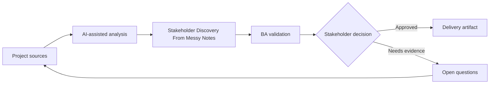

# Stakeholder Discovery From Messy Notes

<div class="case-meta">
  <span>Discovery and alignment</span>
  <span>Cross-functional product discovery</span>
  <span>Discovery</span>
  <span>Core</span>
  <span>Discovery synthesis pack</span>
  <span>Project use case</span>
</div>

## Project context

A product team starts a customer onboarding improvement project after several fragmented meetings with sales, support, compliance, and operations. Notes are incomplete, stakeholders contradict each other, and the BA must prepare a discovery summary before the next workshop. In Cross-functional product discovery, this work usually starts when stakeholders describe the same problem from different incentives and levels of detail. The BA should treat Meeting notes and transcripts and Stakeholder role list as evidence to organize, not as raw material for an unconstrained AI answer. The goal is to make the next decision clearer for the people who own the outcome.

## BA challenge

The BA must preserve nuance while turning raw notes into themes, confirmed facts, conflicts, decisions needed, and requirement candidates. The hard part is avoiding false consensus: sales wants instant activation, compliance requires KYC completion, and support needs clearer document guidance. For Stakeholder Discovery From Messy Notes, the practical difficulty is false consensus and invented scope. AI can accelerate sensemaking, contradiction detection, question generation, and workshop preparation, but the BA must still expose assumptions, missing approvals, and the point where stakeholder judgment is required.

## Where AI fits

<div class="ba-workbench-panel">
AI fits this Discovery and alignment use case when it is constrained to sensemaking, contradiction detection, question generation, and workshop preparation. A useful first AI task is: Cluster notes into themes without removing speaker attribution. AI should not approve scope, invent policy, bypass speaker attribution, decision authority, and source freshness, or turn a draft into a final decision.
</div>

- Cluster notes into themes without removing speaker attribution.
- Extract facts, assumptions, contradictions, and implied requirements.
- Generate stakeholder-specific validation questions.
- Prepare a decision-focused workshop agenda.

## Inputs to prepare

- Meeting notes and transcripts
- Stakeholder role list
- Existing process notes
- Known business goals
- Open questions from prior workshops

Before prompting for Stakeholder Discovery From Messy Notes, label each input by owner, date, approval status, sensitivity, and role in the decision. The most important evidence lens is speaker attribution, decision authority, and source freshness; without it, AI may rank old notes, draft designs, and approved rules as if they had equal authority.

## BA workflow

1. Create a source map with stakeholder names and meeting dates.
2. Ask AI to classify each note as fact, opinion, assumption, pain point, requirement candidate, or conflict.
3. Review the AI output and restore any missing speaker attribution.
4. Convert conflicts into decision questions with named decision owners.
5. Draft a workshop agenda that starts with decisions, not topics.
6. Publish a synthesis pack with evidence labels and unresolved assumptions.

Run the workflow as evidence grouping before solution discussion: start with "Create a source map with stakeholder names and meeting dates.", then keep a visible decision log as the artifact moves toward Discovery synthesis pack. This prevents AI suggestions from silently becoming backlog, design, release, or operational commitments.

## Diagram



## Deliverables

| Deliverable | What it contains | Owner | Done signal |
| --- | --- | --- | --- |
| Discovery synthesis pack | Themes, facts, contradictions, assumptions, and quotes with source IDs | BA | Every finding has stakeholder attribution |
| Decision backlog | Questions that require business decisions before requirements can be finalized | Product owner | Each decision has owner and target date |
| Workshop agenda | Prioritized validation questions grouped by risk | BA | Agenda focuses on conflicts and decision gaps |
| Requirement candidates | Early requirement statements with evidence and assumptions | BA | No candidate is marked final without validation |

Treat Discovery synthesis pack as a BA-owned alignment artifact. AI may draft structure, but the BA must validate whether "Every finding has stakeholder attribution" is actually true, whether the artifact is traceable to source evidence, and whether the receiving team can act on it.

## Prompt to try

```text
Act as a senior AI-aware Business Analyst. Help me apply the "Stakeholder Discovery From Messy Notes" use case to my project. First ask for source evidence and constraints. Then create a structured analysis with project context, assumptions, AI-fit boundary, workflow steps, deliverables, risks, controls, open questions, and stakeholder decisions. Do not invent policy, thresholds, or approvals.
```

## Review checklist

- Meeting notes and transcripts is labeled with owner, date, approval status, and sensitivity.
- Discovery synthesis pack traces to source evidence and has a named human owner.
- The AI task stays inside sensemaking, contradiction detection, question generation, and workshop preparation and does not approve scope or policy.
- The "False consensus" risk has a practical control: Require speaker attribution and a contradiction table.
- Open assumptions are converted into validation questions or stakeholder decisions.
- Success metric: The next workshop resolves the highest-risk conflicts and produces named owners for every open decision.

## Risks and controls

| Risk | Why it matters | BA control |
| --- | --- | --- |
| False consensus | AI may merge conflicting statements into one clean narrative | Require speaker attribution and a contradiction table |
| Unsupported requirement | AI may infer scope that no stakeholder approved | Mark every inference as assumption to validate |
| Stakeholder politics | Minority concerns may disappear in summaries | Track source role and decision authority |
| Workshop drift | Discussion may focus on easy topics | Rank questions by risk and dependency |

The main control for the "False consensus" risk is explicit human accountability: Require speaker attribution and a contradiction table. If evidence is weak, the output should create a validation question or decision item, not a final requirement.
