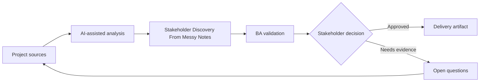

# Stakeholder Discovery From Messy Notes

<div class="case-meta">
  <span>Discovery and alignment</span>
  <span>Cross-functional product discovery</span>
  <span>Project use case</span>
</div>

## Project context

A product team starts a customer onboarding improvement project after several fragmented meetings with sales, support, compliance, and operations. Notes are incomplete, stakeholders contradict each other, and the BA must prepare a discovery summary before the next workshop. In a real delivery environment, this work usually appears under time pressure: stakeholders want clarity, delivery needs a backlog, QA needs testable behavior, and operations needs a process that can survive exceptions. The BA uses AI here to accelerate analysis and synthesis, but the BA remains accountable for evidence, business meaning, stakeholder decisioning, and artifact quality.

## BA challenge

The BA must preserve nuance while turning raw notes into themes, confirmed facts, conflicts, decisions needed, and requirement candidates. The hard part is avoiding false consensus: sales wants instant activation, compliance requires KYC completion, and support needs clearer document guidance. The practical difficulty is that AI can make early material look more complete than it is. A strong BA keeps the output reviewable by separating source-backed facts, assumptions, unsupported claims, decision gaps, and recommended next actions. The objective is not to make the document longer; it is to make the project decision clearer and safer.

## Where AI fits

<div class="ba-workbench-panel">
AI is useful in this use case when it is constrained to analysis support, pattern detection, structured drafting, and critique. It should not approve scope, invent policy, decide business trade-offs, or replace accountable stakeholder judgment.
</div>

- Cluster notes into themes without removing speaker attribution.
- Extract facts, assumptions, contradictions, and implied requirements.
- Generate stakeholder-specific validation questions.
- Prepare a decision-focused workshop agenda.

## Inputs to prepare

- Meeting notes and transcripts
- Stakeholder role list
- Existing process notes
- Known business goals
- Open questions from prior workshops

A BA should label these inputs before using AI: source owner, source date, approval status, sensitivity level, and whether the source is fact, opinion, policy, draft, or historical evidence. This preparation prevents the model from treating every input as equally current and authoritative.

## BA workflow

1. Create a source map with stakeholder names and meeting dates.
2. Ask AI to classify each note as fact, opinion, assumption, pain point, requirement candidate, or conflict.
3. Review the AI output and restore any missing speaker attribution.
4. Convert conflicts into decision questions with named decision owners.
5. Draft a workshop agenda that starts with decisions, not topics.
6. Publish a synthesis pack with evidence labels and unresolved assumptions.

The workflow works best as a staged AI collaboration: first organize the evidence, then ask for analysis, then create the artifact, then run a critique pass. The BA should keep a visible decision log throughout the process so that AI-generated suggestions do not silently become approved scope.

## Diagram



## Deliverables

| Deliverable | What it contains | Owner | Done signal |
| --- | --- | --- | --- |
| Discovery synthesis pack | Themes, facts, contradictions, assumptions, and quotes with source IDs | BA | Every finding has stakeholder attribution |
| Decision backlog | Questions that require business decisions before requirements can be finalized | Product owner | Each decision has owner and target date |
| Workshop agenda | Prioritized validation questions grouped by risk | BA | Agenda focuses on conflicts and decision gaps |
| Requirement candidates | Early requirement statements with evidence and assumptions | BA | No candidate is marked final without validation |

These deliverables should be treated as BA-owned artifacts. AI can draft them, but the BA must validate source support, stakeholder meaning, traceability, and whether the artifact is ready for handoff.

## Prompt to try

```text
Act as a senior AI-aware Business Analyst. Help me apply the "Stakeholder Discovery From Messy Notes" use case to my project. First ask for source evidence and constraints. Then create a structured analysis with project context, assumptions, AI-fit boundary, workflow steps, deliverables, risks, controls, open questions, and stakeholder decisions. Do not invent policy, thresholds, or approvals.
```

## Review checklist

- Every AI-produced statement is tied to a source, assumption, or validation question.
- The BA has separated drafting assistance from business approval.
- Workflow steps identify the human owner for decisions, review, and exceptions.
- Deliverables are traceable to project inputs and can be reviewed by QA, product, or operations.
- Risk controls are practical enough to be used in a real project meeting.
- Success metric: The next workshop resolves the highest-risk conflicts and produces named owners for every open decision.

## Risks and controls

| Risk | Why it matters | BA control |
| --- | --- | --- |
| False consensus | AI may merge conflicting statements into one clean narrative | Require speaker attribution and a contradiction table |
| Unsupported requirement | AI may infer scope that no stakeholder approved | Mark every inference as assumption to validate |
| Stakeholder politics | Minority concerns may disappear in summaries | Track source role and decision authority |
| Workshop drift | Discussion may focus on easy topics | Rank questions by risk and dependency |

The key control is to make uncertainty visible. If evidence is weak, the output should create a validation question or decision item, not a final requirement. If the artifact influences delivery, release, compliance, customer experience, or operational workload, the BA should require explicit human review before handoff.
