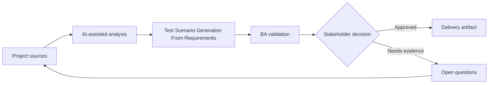

# Test Scenario Generation From Requirements

<div class="case-meta">
  <span>Delivery and QA</span>
  <span>QA collaboration</span>
  <span>Project use case</span>
</div>

## Project context

A QA team receives a set of user stories for a permissions-heavy admin module. Time is short, and testers need scenario coverage for roles, data states, negative paths, audit, and regression risk. In a real delivery environment, this work usually appears under time pressure: stakeholders want clarity, delivery needs a backlog, QA needs testable behavior, and operations needs a process that can survive exceptions. The BA uses AI here to accelerate analysis and synthesis, but the BA remains accountable for evidence, business meaning, stakeholder decisioning, and artifact quality.

## BA challenge

The BA must help QA generate scenarios without allowing AI to invent rules. The best output links each scenario to requirement evidence, acceptance criteria, and risk priority so QA can focus on coverage that matters. The practical difficulty is that AI can make early material look more complete than it is. A strong BA keeps the output reviewable by separating source-backed facts, assumptions, unsupported claims, decision gaps, and recommended next actions. The objective is not to make the document longer; it is to make the project decision clearer and safer.

## Where AI fits

<div class="ba-workbench-panel">
AI is useful in this use case when it is constrained to analysis support, pattern detection, structured drafting, and critique. It should not approve scope, invent policy, decide business trade-offs, or replace accountable stakeholder judgment.
</div>

- Generate scenario categories from acceptance criteria.
- Create positive, negative, boundary, permission, audit, and regression cases.
- Identify missing criteria before QA starts execution.
- Prioritize scenarios by risk and business impact.

## Inputs to prepare

- User stories
- Acceptance criteria
- Role matrix
- Data state definitions
- Prior defect history

A BA should label these inputs before using AI: source owner, source date, approval status, sensitivity level, and whether the source is fact, opinion, policy, draft, or historical evidence. This preparation prevents the model from treating every input as equally current and authoritative.

## BA workflow

1. Ask AI to extract rules from requirements and list missing rules separately.
2. Generate test scenarios with source requirement IDs.
3. Label each scenario by type and risk level.
4. Review unsupported scenarios with BA and QA before adding them.
5. Map scenarios to test data needs and expected results.
6. Update acceptance criteria if scenario generation reveals gaps.

The workflow works best as a staged AI collaboration: first organize the evidence, then ask for analysis, then create the artifact, then run a critique pass. The BA should keep a visible decision log throughout the process so that AI-generated suggestions do not silently become approved scope.

## Diagram



## Deliverables

| Deliverable | What it contains | Owner | Done signal |
| --- | --- | --- | --- |
| Scenario coverage matrix | Requirement, scenario, type, risk, test data, and expected result | QA and BA | Every high-risk rule has scenario coverage |
| Missing criteria list | Rules needed before testing can be complete | BA | Gaps become clarification questions |
| Test data plan | Data states and roles needed for execution | QA | Critical data is available before test run |
| Regression focus list | Areas likely affected by change | Tech lead and QA | Regression scope is risk-based |

These deliverables should be treated as BA-owned artifacts. AI can draft them, but the BA must validate source support, stakeholder meaning, traceability, and whether the artifact is ready for handoff.

## Prompt to try

```text
Act as a senior AI-aware Business Analyst. Help me apply the "Test Scenario Generation From Requirements" use case to my project. First ask for source evidence and constraints. Then create a structured analysis with project context, assumptions, AI-fit boundary, workflow steps, deliverables, risks, controls, open questions, and stakeholder decisions. Do not invent policy, thresholds, or approvals.
```

## Review checklist

- Every AI-produced statement is tied to a source, assumption, or validation question.
- The BA has separated drafting assistance from business approval.
- Workflow steps identify the human owner for decisions, review, and exceptions.
- Deliverables are traceable to project inputs and can be reviewed by QA, product, or operations.
- Risk controls are practical enough to be used in a real project meeting.
- Success metric: QA receives scenario coverage that is traceable, prioritized, and aligned to business rules.

## Risks and controls

| Risk | Why it matters | BA control |
| --- | --- | --- |
| Invented tests | AI may create scenarios for rules that do not exist | Require source IDs and assumption labels |
| Coverage overload | Too many scenarios can distract from critical risk | Rank by business impact and failure cost |
| Missing data setup | Good scenarios fail because test data is unavailable | Add test data requirements early |
| BA-QA disconnect | QA may test behavior BA did not intend | Review scenario matrix together |

The key control is to make uncertainty visible. If evidence is weak, the output should create a validation question or decision item, not a final requirement. If the artifact influences delivery, release, compliance, customer experience, or operational workload, the BA should require explicit human review before handoff.
