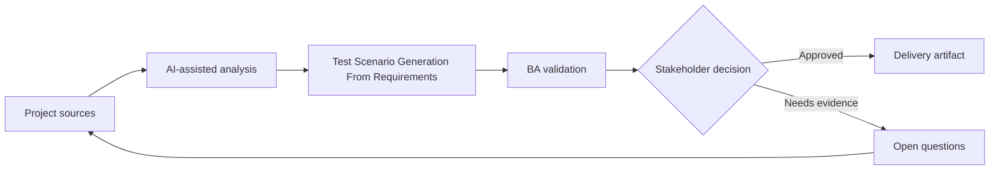

# Test Scenario Generation From Requirements

<div class="case-meta">
  <span>Delivery and QA</span>
  <span>QA collaboration</span>
  <span>Project use case</span>
</div>

## Project context

A QA team receives a set of user stories for a permissions-heavy admin module. Time is short, and testers need scenario coverage for roles, data states, negative paths, audit, and regression risk. In QA collaboration, this work usually starts when delivery decisions, test evidence, and release readiness need to stay connected to original intent. The BA should treat User stories and Acceptance criteria as evidence to organize, not as raw material for an unconstrained AI answer. The goal is to make the next decision clearer for the people who own the outcome.

## BA challenge

The BA must help QA generate scenarios without allowing AI to invent rules. The best output links each scenario to requirement evidence, acceptance criteria, and risk priority so QA can focus on coverage that matters. For Test Scenario Generation From Requirements, the practical difficulty is optimistic status and late requirement discovery. AI can accelerate scenario generation, defect triage support, readiness synthesis, and risk surfacing, but the BA must still expose assumptions, missing approvals, and the point where stakeholder judgment is required.

## Where AI fits

<div class="ba-workbench-panel">
AI fits this Delivery and QA use case when it is constrained to scenario generation, defect triage support, readiness synthesis, and risk surfacing. A useful first AI task is: Generate scenario categories from acceptance criteria. AI should not approve scope, invent policy, bypass requirement baseline, test results, defect history, and release decisions, or turn a draft into a final decision.
</div>

- Generate scenario categories from acceptance criteria.
- Create positive, negative, boundary, permission, audit, and regression cases.
- Identify missing criteria before QA starts execution.
- Prioritize scenarios by risk and business impact.

## Inputs to prepare

- User stories
- Acceptance criteria
- Role matrix
- Data state definitions
- Prior defect history

Before prompting for Test Scenario Generation From Requirements, label each input by owner, date, approval status, sensitivity, and role in the decision. The most important evidence lens is requirement baseline, test results, defect history, and release decisions; without it, AI may rank old notes, draft designs, and approved rules as if they had equal authority.

## BA workflow

1. Ask AI to extract rules from requirements and list missing rules separately.
2. Generate test scenarios with source requirement IDs.
3. Label each scenario by type and risk level.
4. Review unsupported scenarios with BA and QA before adding them.
5. Map scenarios to test data needs and expected results.
6. Update acceptance criteria if scenario generation reveals gaps.

Run the workflow as quality review before release or rework decision: start with "Ask AI to extract rules from requirements and list missing rules separately.", then keep a visible decision log as the artifact moves toward Scenario coverage matrix. This prevents AI suggestions from silently becoming backlog, design, release, or operational commitments.

## Diagram



## Deliverables

| Deliverable | What it contains | Owner | Done signal |
| --- | --- | --- | --- |
| Scenario coverage matrix | Requirement, scenario, type, risk, test data, and expected result | QA and BA | Every high-risk rule has scenario coverage |
| Missing criteria list | Rules needed before testing can be complete | BA | Gaps become clarification questions |
| Test data plan | Data states and roles needed for execution | QA | Critical data is available before test run |
| Regression focus list | Areas likely affected by change | Tech lead and QA | Regression scope is risk-based |

Treat Scenario coverage matrix as a BA-owned QA and delivery handoff artifact. AI may draft structure, but the BA must validate whether "Every high-risk rule has scenario coverage" is actually true, whether the artifact is traceable to source evidence, and whether the receiving team can act on it.

## Prompt to try

```text
Act as a senior AI-aware Business Analyst. Help me apply the "Test Scenario Generation From Requirements" use case to my project. First ask for source evidence and constraints. Then create a structured analysis with project context, assumptions, AI-fit boundary, workflow steps, deliverables, risks, controls, open questions, and stakeholder decisions. Do not invent policy, thresholds, or approvals.
```

## Review checklist

- User stories is labeled with owner, date, approval status, and sensitivity.
- Scenario coverage matrix traces to source evidence and has a named human owner.
- The AI task stays inside scenario generation, defect triage support, readiness synthesis, and risk surfacing and does not approve scope or policy.
- The "Invented tests" risk has a practical control: Require source IDs and assumption labels.
- Open assumptions are converted into validation questions or stakeholder decisions.
- Success metric: QA receives scenario coverage that is traceable, prioritized, and aligned to business rules.

## Risks and controls

| Risk | Why it matters | BA control |
| --- | --- | --- |
| Invented tests | AI may create scenarios for rules that do not exist | Require source IDs and assumption labels |
| Coverage overload | Too many scenarios can distract from critical risk | Rank by business impact and failure cost |
| Missing data setup | Good scenarios fail because test data is unavailable | Add test data requirements early |
| BA-QA disconnect | QA may test behavior BA did not intend | Review scenario matrix together |

The main control for the "Invented tests" risk is explicit human accountability: Require source IDs and assumption labels. If evidence is weak, the output should create a validation question or decision item, not a final requirement.
