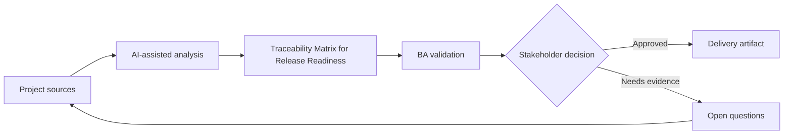

# Traceability Matrix for Release Readiness

<div class="case-meta">
  <span>Requirements and backlog</span>
  <span>Release governance</span>
  <span>Project use case</span>
</div>

## Project context

A release includes changes across onboarding, notifications, permissions, reporting, and support workflows. Stakeholders ask whether all approved requirements are covered by development and testing before go-live. In a real delivery environment, this work usually appears under time pressure: stakeholders want clarity, delivery needs a backlog, QA needs testable behavior, and operations needs a process that can survive exceptions. The BA uses AI here to accelerate analysis and synthesis, but the BA remains accountable for evidence, business meaning, stakeholder decisioning, and artifact quality.

## BA challenge

The BA must create a traceability matrix that links business goals, requirements, decisions, source evidence, stories, acceptance criteria, test cases, defects, and release sign-off. AI can reconcile artifacts, but the BA must verify links and unresolved gaps. The practical difficulty is that AI can make early material look more complete than it is. A strong BA keeps the output reviewable by separating source-backed facts, assumptions, unsupported claims, decision gaps, and recommended next actions. The objective is not to make the document longer; it is to make the project decision clearer and safer.

## Where AI fits

<div class="ba-workbench-panel">
AI is useful in this use case when it is constrained to analysis support, pattern detection, structured drafting, and critique. It should not approve scope, invent policy, decide business trade-offs, or replace accountable stakeholder judgment.
</div>

- Extract requirement IDs and acceptance criteria from backlog items.
- Match requirements to source decisions and test cases.
- Identify orphan requirements, untested criteria, and unresolved defects.
- Create a release readiness summary for stakeholders.

## Inputs to prepare

- BRD or requirement list
- Decision log
- Jira or backlog export
- Test case list
- Defect list

A BA should label these inputs before using AI: source owner, source date, approval status, sensitivity level, and whether the source is fact, opinion, policy, draft, or historical evidence. This preparation prevents the model from treating every input as equally current and authoritative.

## BA workflow

1. Normalize IDs across requirements, stories, tests, and defects.
2. Ask AI to propose trace links and confidence for each link.
3. Manually verify high-risk or low-confidence links.
4. Identify gaps: no story, no test, open defect, missing decision, or scope conflict.
5. Review readiness with product, QA, engineering, and operations.
6. Publish release traceability and sign-off exceptions.

The workflow works best as a staged AI collaboration: first organize the evidence, then ask for analysis, then create the artifact, then run a critique pass. The BA should keep a visible decision log throughout the process so that AI-generated suggestions do not silently become approved scope.

## Diagram



## Deliverables

| Deliverable | What it contains | Owner | Done signal |
| --- | --- | --- | --- |
| Traceability matrix | Goal, requirement, source, story, acceptance criteria, test, defect, and status | BA | Every approved requirement has coverage status |
| Gap report | Missing stories, missing tests, open defects, and unresolved decisions | BA and QA | Gaps are assigned or accepted |
| Release readiness summary | Coverage, exceptions, risks, and sign-off recommendation | Product owner | Stakeholders can make go-live decision |
| Change impact notes | Requirements affected by late changes or defects | BA | Impact is visible before release |

These deliverables should be treated as BA-owned artifacts. AI can draft them, but the BA must validate source support, stakeholder meaning, traceability, and whether the artifact is ready for handoff.

## Prompt to try

```text
Act as a senior AI-aware Business Analyst. Help me apply the "Traceability Matrix for Release Readiness" use case to my project. First ask for source evidence and constraints. Then create a structured analysis with project context, assumptions, AI-fit boundary, workflow steps, deliverables, risks, controls, open questions, and stakeholder decisions. Do not invent policy, thresholds, or approvals.
```

## Review checklist

- Every AI-produced statement is tied to a source, assumption, or validation question.
- The BA has separated drafting assistance from business approval.
- Workflow steps identify the human owner for decisions, review, and exceptions.
- Deliverables are traceable to project inputs and can be reviewed by QA, product, or operations.
- Risk controls are practical enough to be used in a real project meeting.
- Success metric: Release sign-off is based on visible coverage and accepted exceptions, not scattered artifact confidence.

## Risks and controls

| Risk | Why it matters | BA control |
| --- | --- | --- |
| False match | AI may link artifacts with similar words but different meaning | Verify material links manually |
| Coverage illusion | A requirement may have a test that does not cover the rule | Check test intent, not only ID match |
| Late exception hiding | Open defects may be minimized in summaries | Keep exceptions explicit with owner and decision |
| Matrix overload | Too much detail can hide release risks | Add summary by risk and readiness status |

The key control is to make uncertainty visible. If evidence is weak, the output should create a validation question or decision item, not a final requirement. If the artifact influences delivery, release, compliance, customer experience, or operational workload, the BA should require explicit human review before handoff.
