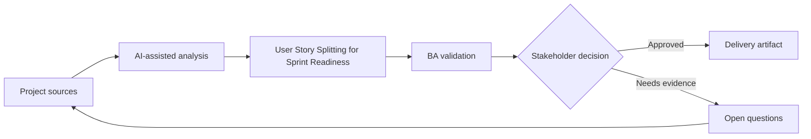

# User Story Splitting for Sprint Readiness

<div class="case-meta">
  <span>Requirements and backlog</span>
  <span>Agile delivery</span>
  <span>Project use case</span>
</div>

## Project context

A delivery squad receives a large feature idea: allow business customers to manage billing contacts and notification preferences. The product owner wants it in the next sprint, but developers cannot estimate it because scope and rules are mixed. In a real delivery environment, this work usually appears under time pressure: stakeholders want clarity, delivery needs a backlog, QA needs testable behavior, and operations needs a process that can survive exceptions. The BA uses AI here to accelerate analysis and synthesis, but the BA remains accountable for evidence, business meaning, stakeholder decisioning, and artifact quality.

## BA challenge

The BA must split the feature into user-goal-based stories with clear boundaries, dependencies, acceptance criteria, negative cases, and release order. AI can propose story splits, but the BA must validate business value and technical dependency with the squad. The practical difficulty is that AI can make early material look more complete than it is. A strong BA keeps the output reviewable by separating source-backed facts, assumptions, unsupported claims, decision gaps, and recommended next actions. The objective is not to make the document longer; it is to make the project decision clearer and safer.

## Where AI fits

<div class="ba-workbench-panel">
AI is useful in this use case when it is constrained to analysis support, pattern detection, structured drafting, and critique. It should not approve scope, invent policy, decide business trade-offs, or replace accountable stakeholder judgment.
</div>

- Generate split options by actor, workflow step, rule variation, and data boundary.
- Draft Given-When-Then acceptance criteria for each candidate story.
- Suggest dependency and release sequencing risks.
- Identify negative, permission, and audit scenarios.

## Inputs to prepare

- Feature idea
- Actor and permission model
- Current billing process
- Known business rules
- Technical dependency notes

A BA should label these inputs before using AI: source owner, source date, approval status, sensitivity level, and whether the source is fact, opinion, policy, draft, or historical evidence. This preparation prevents the model from treating every input as equally current and authoritative.

## BA workflow

1. Ask AI to propose multiple splitting strategies and explain trade-offs.
2. Reject splits based only on UI components if they do not deliver user value.
3. Map each story to one user goal and one testable outcome.
4. Add acceptance criteria, negative cases, audit expectations, and permissions.
5. Review sequence with developers and QA.
6. Publish sprint-ready stories with dependencies and open decisions.

The workflow works best as a staged AI collaboration: first organize the evidence, then ask for analysis, then create the artifact, then run a critique pass. The BA should keep a visible decision log throughout the process so that AI-generated suggestions do not silently become approved scope.

## Diagram



## Deliverables

| Deliverable | What it contains | Owner | Done signal |
| --- | --- | --- | --- |
| Story split map | Candidate stories grouped by actor, goal, dependency, and release order | BA | Each story has independent user value |
| Acceptance criteria set | Given-When-Then criteria with positive, negative, and boundary cases | BA and QA | QA can design tests without guessing |
| Dependency notes | Technical, data, policy, and workflow dependencies | Tech lead | Dependencies are visible before sprint planning |
| Open decision list | Unresolved rules and owners | Product owner | No story enters sprint with hidden business rule gaps |

These deliverables should be treated as BA-owned artifacts. AI can draft them, but the BA must validate source support, stakeholder meaning, traceability, and whether the artifact is ready for handoff.

## Prompt to try

```text
Act as a senior AI-aware Business Analyst. Help me apply the "User Story Splitting for Sprint Readiness" use case to my project. First ask for source evidence and constraints. Then create a structured analysis with project context, assumptions, AI-fit boundary, workflow steps, deliverables, risks, controls, open questions, and stakeholder decisions. Do not invent policy, thresholds, or approvals.
```

## Review checklist

- Every AI-produced statement is tied to a source, assumption, or validation question.
- The BA has separated drafting assistance from business approval.
- Workflow steps identify the human owner for decisions, review, and exceptions.
- Deliverables are traceable to project inputs and can be reviewed by QA, product, or operations.
- Risk controls are practical enough to be used in a real project meeting.
- Success metric: Sprint planning receives stories that QA and developers can estimate, test, and release in meaningful increments.

## Risks and controls

| Risk | Why it matters | BA control |
| --- | --- | --- |
| Component slicing | Stories may align to UI pieces instead of user outcomes | Evaluate each split by user goal and release value |
| Overloaded story | One story may contain multiple actors or rule sets | Limit each story to one actor goal and clear outcome |
| Missing negative cases | Happy-path stories may pass while real users fail | Require permission, boundary, and error scenarios |
| Unestimated dependency | Hidden integration work may disrupt sprint | Review dependencies with engineering before commitment |

The key control is to make uncertainty visible. If evidence is weak, the output should create a validation question or decision item, not a final requirement. If the artifact influences delivery, release, compliance, customer experience, or operational workload, the BA should require explicit human review before handoff.
