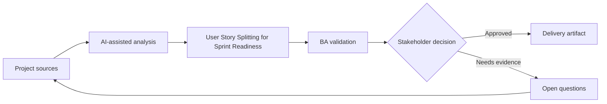

# User Story Splitting for Sprint Readiness

<div class="case-meta">
  <span>Requirements and backlog</span>
  <span>Agile delivery</span>
  <span>Refinement</span>
  <span>Core</span>
  <span>Story split map</span>
  <span>Project use case</span>
</div>

## Project context

A delivery squad receives a large feature idea: allow business customers to manage billing contacts and notification preferences. The product owner wants it in the next sprint, but developers cannot estimate it because scope and rules are mixed. In Agile delivery, this work usually starts when stories must become testable without losing business rules, exceptions, data needs, or NFRs. The BA should treat Feature idea and Actor and permission model as evidence to organize, not as raw material for an unconstrained AI answer. The goal is to make the next decision clearer for the people who own the outcome.

## BA challenge

The BA must split the feature into user-goal-based stories with clear boundaries, dependencies, acceptance criteria, negative cases, and release order. AI can propose story splits, but the BA must validate business value and technical dependency with the squad. For User Story Splitting for Sprint Readiness, the practical difficulty is vague criteria and unowned assumptions. AI can accelerate gap finding, rewrite critique, edge-case expansion, and acceptance-criteria drafting, but the BA must still expose assumptions, missing approvals, and the point where stakeholder judgment is required.

## Where AI fits

<div class="ba-workbench-panel">
AI fits this Requirements and backlog use case when it is constrained to gap finding, rewrite critique, edge-case expansion, and acceptance-criteria drafting. A useful first AI task is: Generate split options by actor, workflow step, rule variation, and data boundary. AI should not approve scope, invent policy, bypass approved rules, examples, edge cases, and QA expectations, or turn a draft into a final decision.
</div>

- Generate split options by actor, workflow step, rule variation, and data boundary.
- Draft Given-When-Then acceptance criteria for each candidate story.
- Suggest dependency and release sequencing risks.
- Identify negative, permission, and audit scenarios.

## Inputs to prepare

- Feature idea
- Actor and permission model
- Current billing process
- Known business rules
- Technical dependency notes

Before prompting for User Story Splitting for Sprint Readiness, label each input by owner, date, approval status, sensitivity, and role in the decision. The most important evidence lens is approved rules, examples, edge cases, and QA expectations; without it, AI may rank old notes, draft designs, and approved rules as if they had equal authority.

## BA workflow

1. Ask AI to propose multiple splitting strategies and explain trade-offs.
2. Reject splits based only on UI components if they do not deliver user value.
3. Map each story to one user goal and one testable outcome.
4. Add acceptance criteria, negative cases, audit expectations, and permissions.
5. Review sequence with developers and QA.
6. Publish sprint-ready stories with dependencies and open decisions.

Run the workflow as requirement clarification before sprint commitment: start with "Ask AI to propose multiple splitting strategies and explain trade-offs.", then keep a visible decision log as the artifact moves toward Story split map. This prevents AI suggestions from silently becoming backlog, design, release, or operational commitments.

## Diagram



## Deliverables

| Deliverable | What it contains | Owner | Done signal |
| --- | --- | --- | --- |
| Story split map | Candidate stories grouped by actor, goal, dependency, and release order | BA | Each story has independent user value |
| Acceptance criteria set | Given-When-Then criteria with positive, negative, and boundary cases | BA and QA | QA can design tests without guessing |
| Dependency notes | Technical, data, policy, and workflow dependencies | Tech lead | Dependencies are visible before sprint planning |
| Open decision list | Unresolved rules and owners | Product owner | No story enters sprint with hidden business rule gaps |

Treat Story split map as a BA-owned delivery-ready backlog artifact. AI may draft structure, but the BA must validate whether "Each story has independent user value" is actually true, whether the artifact is traceable to source evidence, and whether the receiving team can act on it.

## Prompt to try

```text
Act as a senior AI-aware Business Analyst. Help me apply the "User Story Splitting for Sprint Readiness" use case to my project. First ask for source evidence and constraints. Then create a structured analysis with project context, assumptions, AI-fit boundary, workflow steps, deliverables, risks, controls, open questions, and stakeholder decisions. Do not invent policy, thresholds, or approvals.
```

## Review checklist

- Feature idea is labeled with owner, date, approval status, and sensitivity.
- Story split map traces to source evidence and has a named human owner.
- The AI task stays inside gap finding, rewrite critique, edge-case expansion, and acceptance-criteria drafting and does not approve scope or policy.
- The "Component slicing" risk has a practical control: Evaluate each split by user goal and release value.
- Open assumptions are converted into validation questions or stakeholder decisions.
- Success metric: Sprint planning receives stories that QA and developers can estimate, test, and release in meaningful increments.

## Risks and controls

| Risk | Why it matters | BA control |
| --- | --- | --- |
| Component slicing | Stories may align to UI pieces instead of user outcomes | Evaluate each split by user goal and release value |
| Overloaded story | One story may contain multiple actors or rule sets | Limit each story to one actor goal and clear outcome |
| Missing negative cases | Happy-path stories may pass while real users fail | Require permission, boundary, and error scenarios |
| Unestimated dependency | Hidden integration work may disrupt sprint | Review dependencies with engineering before commitment |

The main control for the "Component slicing" risk is explicit human accountability: Evaluate each split by user goal and release value. If evidence is weak, the output should create a validation question or decision item, not a final requirement.
