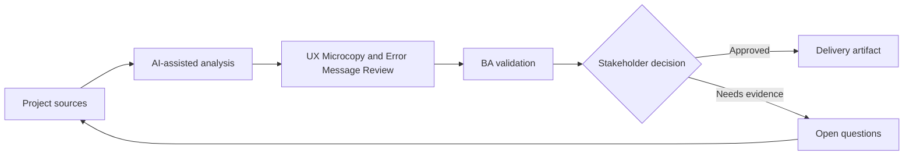

# UX Microcopy and Error Message Review

<div class="case-meta">
  <span>Frontend, UI, and UX</span>
  <span>UX writing</span>
  <span>Project use case</span>
</div>

## Project context

A signup flow has multiple validation errors, consent messages, confirmation dialogs, and success states. The wording is inconsistent and some messages blame users or hide next steps. In UX writing, this work usually starts when screen behavior, accessibility, design states, analytics, and user feedback must become implementable requirements. The BA should treat UI copy list and Validation rules as evidence to organize, not as raw material for an unconstrained AI answer. The goal is to make the next decision clearer for the people who own the outcome.

## BA challenge

The BA must help UX and product ensure copy reflects business rules, compliance, user recovery, and system truth. AI can draft copy options, but the BA must validate accuracy and decision implications. For UX Microcopy and Error Message Review, the practical difficulty is missing states and unmeasurable UX. AI can accelerate UI-state analysis, content critique, accessibility review, event taxonomy, and edge-case discovery, but the BA must still expose assumptions, missing approvals, and the point where stakeholder judgment is required.

## Where AI fits

<div class="ba-workbench-panel">
AI fits this Frontend, UI, and UX use case when it is constrained to UI-state analysis, content critique, accessibility review, event taxonomy, and edge-case discovery. A useful first AI task is: Generate copy variants for errors, confirmations, empty states, and success messages. AI should not approve scope, invent policy, bypass wireframes, design tokens, user journeys, analytics questions, and accessibility expectations, or turn a draft into a final decision.
</div>

- Generate copy variants for errors, confirmations, empty states, and success messages.
- Critique copy for clarity, blame, compliance risk, and recovery guidance.
- Map each message to trigger, rule, and user next action.
- Create localized copy review questions.

## Inputs to prepare

- UI copy list
- Validation rules
- Compliance wording constraints
- Brand voice guide
- User research notes

Before prompting for UX Microcopy and Error Message Review, label each input by owner, date, approval status, sensitivity, and role in the decision. The most important evidence lens is wireframes, design tokens, user journeys, analytics questions, and accessibility expectations; without it, AI may rank old notes, draft designs, and approved rules as if they had equal authority.

## BA workflow

1. Inventory messages by screen, trigger, and user state.
2. Ask AI to critique message clarity and recovery guidance.
3. Generate alternative copy options without changing business meaning.
4. Validate regulated or sensitive wording with legal or compliance owners.
5. Map each message to rule, source, and acceptance criteria.
6. Prepare copy handoff for frontend and localization.

Run the workflow as screen-state review before frontend build: start with "Inventory messages by screen, trigger, and user state.", then keep a visible decision log as the artifact moves toward Message catalog. This prevents AI suggestions from silently becoming backlog, design, release, or operational commitments.

## Diagram



## Deliverables

| Deliverable | What it contains | Owner | Done signal |
| --- | --- | --- | --- |
| Message catalog | Screen, trigger, current copy, proposed copy, rule, and owner | BA and UX writer | Every message has trigger and source |
| Recovery guidance matrix | Error, user action, system action, and support path | BA | Users know next step |
| Compliance copy review | Sensitive message, constraint, reviewer, and approval status | Compliance | Regulated copy is approved |
| Localization notes | Variable, tone, length, and translation risk | Localization owner | Copy can be localized safely |

Treat Message catalog as a BA-owned frontend requirement specification. AI may draft structure, but the BA must validate whether "Every message has trigger and source" is actually true, whether the artifact is traceable to source evidence, and whether the receiving team can act on it.

## Prompt to try

```text
Act as a senior AI-aware Business Analyst. Help me apply the "UX Microcopy and Error Message Review" use case to my project. First ask for source evidence and constraints. Then create a structured analysis with project context, assumptions, AI-fit boundary, workflow steps, deliverables, risks, controls, open questions, and stakeholder decisions. Do not invent policy, thresholds, or approvals.
```

## Review checklist

- UI copy list is labeled with owner, date, approval status, and sensitivity.
- Message catalog traces to source evidence and has a named human owner.
- The AI task stays inside UI-state analysis, content critique, accessibility review, event taxonomy, and edge-case discovery and does not approve scope or policy.
- The "Misleading copy" risk has a practical control: Map copy to source rule.
- Open assumptions are converted into validation questions or stakeholder decisions.
- Success metric: UI copy becomes accurate, recoverable, testable, and ready for localization.

## Risks and controls

| Risk | Why it matters | BA control |
| --- | --- | --- |
| Misleading copy | Friendly wording may hide important rule or risk | Map copy to source rule |
| User blame | Messages may increase frustration | Use neutral, recovery-focused language |
| Compliance drift | AI may rewrite regulated wording incorrectly | Require compliance approval |
| Localization breakage | Copy may not fit translated UI | Track variables and length constraints |

The main control for the "Misleading copy" risk is explicit human accountability: Map copy to source rule. If evidence is weak, the output should create a validation question or decision item, not a final requirement.
