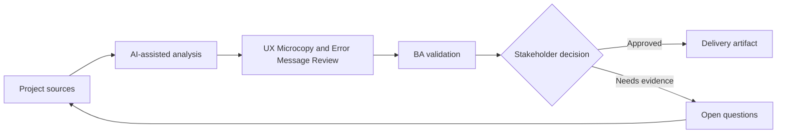

# UX Microcopy and Error Message Review

<div class="case-meta">
  <span>Frontend, UI, and UX</span>
  <span>UX writing</span>
  <span>Project use case</span>
</div>

## Project context

A signup flow has multiple validation errors, consent messages, confirmation dialogs, and success states. The wording is inconsistent and some messages blame users or hide next steps. In a real delivery environment, this work usually appears under time pressure: stakeholders want clarity, delivery needs a backlog, QA needs testable behavior, and operations needs a process that can survive exceptions. The BA uses AI here to accelerate analysis and synthesis, but the BA remains accountable for evidence, business meaning, stakeholder decisioning, and artifact quality.

## BA challenge

The BA must help UX and product ensure copy reflects business rules, compliance, user recovery, and system truth. AI can draft copy options, but the BA must validate accuracy and decision implications. The practical difficulty is that AI can make early material look more complete than it is. A strong BA keeps the output reviewable by separating source-backed facts, assumptions, unsupported claims, decision gaps, and recommended next actions. The objective is not to make the document longer; it is to make the project decision clearer and safer.

## Where AI fits

<div class="ba-workbench-panel">
AI is useful in this use case when it is constrained to analysis support, pattern detection, structured drafting, and critique. It should not approve scope, invent policy, decide business trade-offs, or replace accountable stakeholder judgment.
</div>

- Generate copy variants for errors, confirmations, empty states, and success messages.
- Critique copy for clarity, blame, compliance risk, and recovery guidance.
- Map each message to trigger, rule, and user next action.
- Create localized copy review questions.

## Inputs to prepare

- UI copy list
- Validation rules
- Compliance wording constraints
- Brand voice guide
- User research notes

A BA should label these inputs before using AI: source owner, source date, approval status, sensitivity level, and whether the source is fact, opinion, policy, draft, or historical evidence. This preparation prevents the model from treating every input as equally current and authoritative.

## BA workflow

1. Inventory messages by screen, trigger, and user state.
2. Ask AI to critique message clarity and recovery guidance.
3. Generate alternative copy options without changing business meaning.
4. Validate regulated or sensitive wording with legal or compliance owners.
5. Map each message to rule, source, and acceptance criteria.
6. Prepare copy handoff for frontend and localization.

The workflow works best as a staged AI collaboration: first organize the evidence, then ask for analysis, then create the artifact, then run a critique pass. The BA should keep a visible decision log throughout the process so that AI-generated suggestions do not silently become approved scope.

## Diagram



## Deliverables

| Deliverable | What it contains | Owner | Done signal |
| --- | --- | --- | --- |
| Message catalog | Screen, trigger, current copy, proposed copy, rule, and owner | BA and UX writer | Every message has trigger and source |
| Recovery guidance matrix | Error, user action, system action, and support path | BA | Users know next step |
| Compliance copy review | Sensitive message, constraint, reviewer, and approval status | Compliance | Regulated copy is approved |
| Localization notes | Variable, tone, length, and translation risk | Localization owner | Copy can be localized safely |

These deliverables should be treated as BA-owned artifacts. AI can draft them, but the BA must validate source support, stakeholder meaning, traceability, and whether the artifact is ready for handoff.

## Prompt to try

```text
Act as a senior AI-aware Business Analyst. Help me apply the "UX Microcopy and Error Message Review" use case to my project. First ask for source evidence and constraints. Then create a structured analysis with project context, assumptions, AI-fit boundary, workflow steps, deliverables, risks, controls, open questions, and stakeholder decisions. Do not invent policy, thresholds, or approvals.
```

## Review checklist

- Every AI-produced statement is tied to a source, assumption, or validation question.
- The BA has separated drafting assistance from business approval.
- Workflow steps identify the human owner for decisions, review, and exceptions.
- Deliverables are traceable to project inputs and can be reviewed by QA, product, or operations.
- Risk controls are practical enough to be used in a real project meeting.
- Success metric: UI copy becomes accurate, recoverable, testable, and ready for localization.

## Risks and controls

| Risk | Why it matters | BA control |
| --- | --- | --- |
| Misleading copy | Friendly wording may hide important rule or risk | Map copy to source rule |
| User blame | Messages may increase frustration | Use neutral, recovery-focused language |
| Compliance drift | AI may rewrite regulated wording incorrectly | Require compliance approval |
| Localization breakage | Copy may not fit translated UI | Track variables and length constraints |

The key control is to make uncertainty visible. If evidence is weak, the output should create a validation question or decision item, not a final requirement. If the artifact influences delivery, release, compliance, customer experience, or operational workload, the BA should require explicit human review before handoff.
