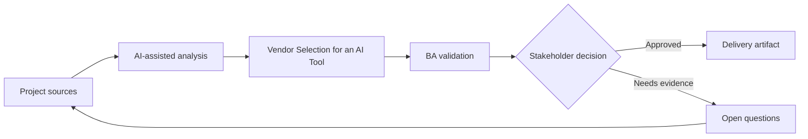

# Vendor Selection for an AI Tool

<div class="case-meta">
  <span>Governance and adoption</span>
  <span>Vendor evaluation</span>
  <span>Project use case</span>
</div>

## Project context

A BA practice evaluates AI tools for requirements drafting, meeting synthesis, document review, and internal knowledge search. Vendors promise productivity gains, but compliance and IT worry about data leakage and governance. In a real delivery environment, this work usually appears under time pressure: stakeholders want clarity, delivery needs a backlog, QA needs testable behavior, and operations needs a process that can survive exceptions. The BA uses AI here to accelerate analysis and synthesis, but the BA remains accountable for evidence, business meaning, stakeholder decisioning, and artifact quality.

## BA challenge

The BA lead must define evaluation criteria that cover use-case fit, data handling, security, audit, model behavior, integrations, admin controls, cost, and adoption support. AI can help compare vendor claims, but claims must be verified. The practical difficulty is that AI can make early material look more complete than it is. A strong BA keeps the output reviewable by separating source-backed facts, assumptions, unsupported claims, decision gaps, and recommended next actions. The objective is not to make the document longer; it is to make the project decision clearer and safer.

## Where AI fits

<div class="ba-workbench-panel">
AI is useful in this use case when it is constrained to analysis support, pattern detection, structured drafting, and critique. It should not approve scope, invent policy, decide business trade-offs, or replace accountable stakeholder judgment.
</div>

- Build a vendor scorecard from BA use cases and risk tiers.
- Extract vendor claims and map them to required evidence.
- Generate demo scripts and validation questions.
- Draft pilot success metrics and governance gates.

## Inputs to prepare

- BA use-case portfolio
- Security requirements
- Vendor documentation
- Procurement criteria
- Compliance policy

A BA should label these inputs before using AI: source owner, source date, approval status, sensitivity level, and whether the source is fact, opinion, policy, draft, or historical evidence. This preparation prevents the model from treating every input as equally current and authoritative.

## BA workflow

1. Define approved BA use cases and prohibited data before vendor demos.
2. Ask AI to create a weighted scorecard by value and risk.
3. Map vendor claims to evidence required: documentation, demo, contract, or security review.
4. Create scenario-based demo scripts using real BA workflows.
5. Run pilot evaluation with quality, cycle time, and risk metrics.
6. Prepare recommendation with conditions and rollout controls.

The workflow works best as a staged AI collaboration: first organize the evidence, then ask for analysis, then create the artifact, then run a critique pass. The BA should keep a visible decision log throughout the process so that AI-generated suggestions do not silently become approved scope.

## Diagram



## Deliverables

| Deliverable | What it contains | Owner | Done signal |
| --- | --- | --- | --- |
| Vendor scorecard | Criteria, weight, evidence, score, and risk notes | BA lead and procurement | Scores are evidence-based |
| Demo script | BA workflows, test data, expected outputs, and failure checks | BA lead | Demo tests real work |
| Security and governance checklist | Data, retention, audit, admin, access, and compliance controls | IT and compliance | Risks are reviewed |
| Pilot success plan | Metrics, participants, use cases, quality gates, and decision criteria | Sponsor | Pilot can produce decision |

These deliverables should be treated as BA-owned artifacts. AI can draft them, but the BA must validate source support, stakeholder meaning, traceability, and whether the artifact is ready for handoff.

## Prompt to try

```text
Act as a senior AI-aware Business Analyst. Help me apply the "Vendor Selection for an AI Tool" use case to my project. First ask for source evidence and constraints. Then create a structured analysis with project context, assumptions, AI-fit boundary, workflow steps, deliverables, risks, controls, open questions, and stakeholder decisions. Do not invent policy, thresholds, or approvals.
```

## Review checklist

- Every AI-produced statement is tied to a source, assumption, or validation question.
- The BA has separated drafting assistance from business approval.
- Workflow steps identify the human owner for decisions, review, and exceptions.
- Deliverables are traceable to project inputs and can be reviewed by QA, product, or operations.
- Risk controls are practical enough to be used in a real project meeting.
- Success metric: Vendor selection is driven by BA workflow value, verified controls, and pilot evidence.

## Risks and controls

| Risk | Why it matters | BA control |
| --- | --- | --- |
| Vendor-led scope | Demo may shape requirements before BA defines needs | Start from BA use cases and risk tiers |
| Unverified claims | Marketing statements may not reflect product capability | Require evidence type for each claim |
| Data leakage | Tools may process confidential data unsafely | Review data handling and approved-use policy |
| Adoption theater | Users may try tool without quality improvement | Measure artifact quality and rework, not only usage |

The key control is to make uncertainty visible. If evidence is weak, the output should create a validation question or decision item, not a final requirement. If the artifact influences delivery, release, compliance, customer experience, or operational workload, the BA should require explicit human review before handoff.
