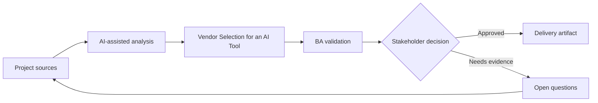

# Vendor Selection for an AI Tool

<div class="case-meta">
  <span>Governance and adoption</span>
  <span>Vendor evaluation</span>
  <span>Governance</span>
  <span>Advanced</span>
  <span>Vendor scorecard</span>
  <span>Project use case</span>
</div>

## Project context

A BA practice evaluates AI tools for requirements drafting, meeting synthesis, document review, and internal knowledge search. Vendors promise productivity gains, but compliance and IT worry about data leakage and governance. In Vendor evaluation, this work usually starts when AI usage must scale across teams without leaking sensitive data or creating unreviewable decisions. The BA should treat BA use-case portfolio and Security requirements as evidence to organize, not as raw material for an unconstrained AI answer. The goal is to make the next decision clearer for the people who own the outcome.

## BA challenge

The BA lead must define evaluation criteria that cover use-case fit, data handling, security, audit, model behavior, integrations, admin controls, cost, and adoption support. AI can help compare vendor claims, but claims must be verified. For Vendor Selection for an AI Tool, the practical difficulty is shadow AI use and weak accountability. AI can accelerate portfolio analysis, policy drafting, risk-tiering, playbook creation, and adoption measurement, but the BA must still expose assumptions, missing approvals, and the point where stakeholder judgment is required.

## Where AI fits

<div class="ba-workbench-panel">
AI fits this Governance and adoption use case when it is constrained to portfolio analysis, policy drafting, risk-tiering, playbook creation, and adoption measurement. A useful first AI task is: Build a vendor scorecard from BA use cases and risk tiers. AI should not approve scope, invent policy, bypass data policy, approved tools, risk appetite, audit need, and team capability, or turn a draft into a final decision.
</div>

- Build a vendor scorecard from BA use cases and risk tiers.
- Extract vendor claims and map them to required evidence.
- Generate demo scripts and validation questions.
- Draft pilot success metrics and governance gates.

## Inputs to prepare

- BA use-case portfolio
- Security requirements
- Vendor documentation
- Procurement criteria
- Compliance policy

Before prompting for Vendor Selection for an AI Tool, label each input by owner, date, approval status, sensitivity, and role in the decision. The most important evidence lens is data policy, approved tools, risk appetite, audit need, and team capability; without it, AI may rank old notes, draft designs, and approved rules as if they had equal authority.

## BA workflow

1. Define approved BA use cases and prohibited data before vendor demos.
2. Ask AI to create a weighted scorecard by value and risk.
3. Map vendor claims to evidence required: documentation, demo, contract, or security review.
4. Create scenario-based demo scripts using real BA workflows.
5. Run pilot evaluation with quality, cycle time, and risk metrics.
6. Prepare recommendation with conditions and rollout controls.

Run the workflow as governance design before broad rollout: start with "Define approved BA use cases and prohibited data before vendor demos.", then keep a visible decision log as the artifact moves toward Vendor scorecard. This prevents AI suggestions from silently becoming backlog, design, release, or operational commitments.

## Diagram



## Deliverables

| Deliverable | What it contains | Owner | Done signal |
| --- | --- | --- | --- |
| Vendor scorecard | Criteria, weight, evidence, score, and risk notes | BA lead and procurement | Scores are evidence-based |
| Demo script | BA workflows, test data, expected outputs, and failure checks | BA lead | Demo tests real work |
| Security and governance checklist | Data, retention, audit, admin, access, and compliance controls | IT and compliance | Risks are reviewed |
| Pilot success plan | Metrics, participants, use cases, quality gates, and decision criteria | Sponsor | Pilot can produce decision |

Treat Vendor scorecard as a BA-owned AI adoption control pack. AI may draft structure, but the BA must validate whether "Scores are evidence-based" is actually true, whether the artifact is traceable to source evidence, and whether the receiving team can act on it.

## Prompt to try

```text
Act as a senior AI-aware Business Analyst. Help me apply the "Vendor Selection for an AI Tool" use case to my project. First ask for source evidence and constraints. Then create a structured analysis with project context, assumptions, AI-fit boundary, workflow steps, deliverables, risks, controls, open questions, and stakeholder decisions. Do not invent policy, thresholds, or approvals.
```

## Review checklist

- BA use-case portfolio is labeled with owner, date, approval status, and sensitivity.
- Vendor scorecard traces to source evidence and has a named human owner.
- The AI task stays inside portfolio analysis, policy drafting, risk-tiering, playbook creation, and adoption measurement and does not approve scope or policy.
- The "Vendor-led scope" risk has a practical control: Start from BA use cases and risk tiers.
- Open assumptions are converted into validation questions or stakeholder decisions.
- Success metric: Vendor selection is driven by BA workflow value, verified controls, and pilot evidence.

## Risks and controls

| Risk | Why it matters | BA control |
| --- | --- | --- |
| Vendor-led scope | Demo may shape requirements before BA defines needs | Start from BA use cases and risk tiers |
| Unverified claims | Marketing statements may not reflect product capability | Require evidence type for each claim |
| Data leakage | Tools may process confidential data unsafely | Review data handling and approved-use policy |
| Adoption theater | Users may try tool without quality improvement | Measure artifact quality and rework, not only usage |

The main control for the "Vendor-led scope" risk is explicit human accountability: Start from BA use cases and risk tiers. If evidence is weak, the output should create a validation question or decision item, not a final requirement.
