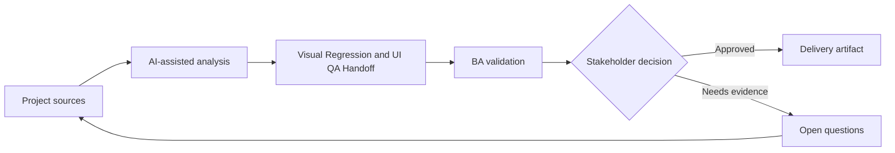

# Visual Regression and UI QA Handoff

<div class="case-meta">
  <span>Frontend, UI, and UX</span>
  <span>Visual QA</span>
  <span>Project use case</span>
</div>

## Project context

A redesign updates shared components across many pages. The team needs QA guidance for visual regressions, layout shifts, browser differences, and component variants. In Visual QA, this work usually starts when screen behavior, accessibility, design states, analytics, and user feedback must become implementable requirements. The BA should treat Redesign scope and Component inventory as evidence to organize, not as raw material for an unconstrained AI answer. The goal is to make the next decision clearer for the people who own the outcome.

## BA challenge

The BA must help define what visual quality means in business terms: critical pages, supported browsers, responsive states, component variants, and acceptable deviations. AI can create checklist drafts, but visual decisions need design ownership. For Visual Regression and UI QA Handoff, the practical difficulty is missing states and unmeasurable UX. AI can accelerate UI-state analysis, content critique, accessibility review, event taxonomy, and edge-case discovery, but the BA must still expose assumptions, missing approvals, and the point where stakeholder judgment is required.

## Where AI fits

<div class="ba-workbench-panel">
AI fits this Frontend, UI, and UX use case when it is constrained to UI-state analysis, content critique, accessibility review, event taxonomy, and edge-case discovery. A useful first AI task is: Generate visual QA checklist from redesign scope. AI should not approve scope, invent policy, bypass wireframes, design tokens, user journeys, analytics questions, and accessibility expectations, or turn a draft into a final decision.
</div>

- Generate visual QA checklist from redesign scope.
- Identify critical pages and component variants needing coverage.
- Draft risk-based browser and viewport matrix.
- Create defect severity rubric for visual issues.

## Inputs to prepare

- Redesign scope
- Component inventory
- Critical page list
- Supported browser policy
- Design acceptance notes

Before prompting for Visual Regression and UI QA Handoff, label each input by owner, date, approval status, sensitivity, and role in the decision. The most important evidence lens is wireframes, design tokens, user journeys, analytics questions, and accessibility expectations; without it, AI may rank old notes, draft designs, and approved rules as if they had equal authority.

## BA workflow

1. Inventory affected pages, components, variants, and viewports.
2. Ask AI to propose visual QA coverage and severity categories.
3. Review coverage with UX, frontend, and QA.
4. Define acceptable deviation, critical defects, and release blockers.
5. Add screenshot or baseline expectations where useful.
6. Publish visual QA handoff and defect triage rules.

Run the workflow as screen-state review before frontend build: start with "Inventory affected pages, components, variants, and viewports.", then keep a visible decision log as the artifact moves toward Visual QA matrix. This prevents AI suggestions from silently becoming backlog, design, release, or operational commitments.

## Diagram



## Deliverables

| Deliverable | What it contains | Owner | Done signal |
| --- | --- | --- | --- |
| Visual QA matrix | Page, component, variant, viewport, browser, and priority | BA and QA | Coverage is risk-based |
| Severity rubric | Visual issue type, user impact, severity, and release decision | Product and UX | Triage is consistent |
| Baseline checklist | Expected layout, spacing, overflow, and interaction states | UX | Design intent is testable |
| Regression triage board | Defect, affected page, severity, owner, and decision | QA lead | Visual defects are managed |

Treat Visual QA matrix as a BA-owned frontend requirement specification. AI may draft structure, but the BA must validate whether "Coverage is risk-based" is actually true, whether the artifact is traceable to source evidence, and whether the receiving team can act on it.

## Prompt to try

```text
Act as a senior AI-aware Business Analyst. Help me apply the "Visual Regression and UI QA Handoff" use case to my project. First ask for source evidence and constraints. Then create a structured analysis with project context, assumptions, AI-fit boundary, workflow steps, deliverables, risks, controls, open questions, and stakeholder decisions. Do not invent policy, thresholds, or approvals.
```

## Review checklist

- Redesign scope is labeled with owner, date, approval status, and sensitivity.
- Visual QA matrix traces to source evidence and has a named human owner.
- The AI task stays inside UI-state analysis, content critique, accessibility review, event taxonomy, and edge-case discovery and does not approve scope or policy.
- The "Subjective defects" risk has a practical control: Use severity rubric tied to user impact.
- Open assumptions are converted into validation questions or stakeholder decisions.
- Success metric: Visual QA focuses on user-impacting regressions across critical pages, components, and supported viewports.

## Risks and controls

| Risk | Why it matters | BA control |
| --- | --- | --- |
| Subjective defects | People may disagree whether a visual issue matters | Use severity rubric tied to user impact |
| Coverage gaps | Shared component changes can break hidden pages | Inventory pages and component variants |
| Browser surprise | A layout may fail only in a supported browser | Define browser and viewport matrix |
| Design drift | Implementation may slowly diverge from system rules | Use baseline checklist and design review |

The main control for the "Subjective defects" risk is explicit human accountability: Use severity rubric tied to user impact. If evidence is weak, the output should create a validation question or decision item, not a final requirement.
