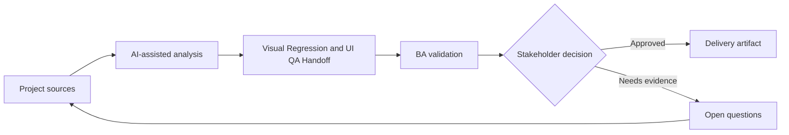

# Visual Regression and UI QA Handoff

<div class="case-meta">
  <span>Frontend, UI, and UX</span>
  <span>Visual QA</span>
  <span>Project use case</span>
</div>

## Project context

A redesign updates shared components across many pages. The team needs QA guidance for visual regressions, layout shifts, browser differences, and component variants. In a real delivery environment, this work usually appears under time pressure: stakeholders want clarity, delivery needs a backlog, QA needs testable behavior, and operations needs a process that can survive exceptions. The BA uses AI here to accelerate analysis and synthesis, but the BA remains accountable for evidence, business meaning, stakeholder decisioning, and artifact quality.

## BA challenge

The BA must help define what visual quality means in business terms: critical pages, supported browsers, responsive states, component variants, and acceptable deviations. AI can create checklist drafts, but visual decisions need design ownership. The practical difficulty is that AI can make early material look more complete than it is. A strong BA keeps the output reviewable by separating source-backed facts, assumptions, unsupported claims, decision gaps, and recommended next actions. The objective is not to make the document longer; it is to make the project decision clearer and safer.

## Where AI fits

<div class="ba-workbench-panel">
AI is useful in this use case when it is constrained to analysis support, pattern detection, structured drafting, and critique. It should not approve scope, invent policy, decide business trade-offs, or replace accountable stakeholder judgment.
</div>

- Generate visual QA checklist from redesign scope.
- Identify critical pages and component variants needing coverage.
- Draft risk-based browser and viewport matrix.
- Create defect severity rubric for visual issues.

## Inputs to prepare

- Redesign scope
- Component inventory
- Critical page list
- Supported browser policy
- Design acceptance notes

A BA should label these inputs before using AI: source owner, source date, approval status, sensitivity level, and whether the source is fact, opinion, policy, draft, or historical evidence. This preparation prevents the model from treating every input as equally current and authoritative.

## BA workflow

1. Inventory affected pages, components, variants, and viewports.
2. Ask AI to propose visual QA coverage and severity categories.
3. Review coverage with UX, frontend, and QA.
4. Define acceptable deviation, critical defects, and release blockers.
5. Add screenshot or baseline expectations where useful.
6. Publish visual QA handoff and defect triage rules.

The workflow works best as a staged AI collaboration: first organize the evidence, then ask for analysis, then create the artifact, then run a critique pass. The BA should keep a visible decision log throughout the process so that AI-generated suggestions do not silently become approved scope.

## Diagram



## Deliverables

| Deliverable | What it contains | Owner | Done signal |
| --- | --- | --- | --- |
| Visual QA matrix | Page, component, variant, viewport, browser, and priority | BA and QA | Coverage is risk-based |
| Severity rubric | Visual issue type, user impact, severity, and release decision | Product and UX | Triage is consistent |
| Baseline checklist | Expected layout, spacing, overflow, and interaction states | UX | Design intent is testable |
| Regression triage board | Defect, affected page, severity, owner, and decision | QA lead | Visual defects are managed |

These deliverables should be treated as BA-owned artifacts. AI can draft them, but the BA must validate source support, stakeholder meaning, traceability, and whether the artifact is ready for handoff.

## Prompt to try

```text
Act as a senior AI-aware Business Analyst. Help me apply the "Visual Regression and UI QA Handoff" use case to my project. First ask for source evidence and constraints. Then create a structured analysis with project context, assumptions, AI-fit boundary, workflow steps, deliverables, risks, controls, open questions, and stakeholder decisions. Do not invent policy, thresholds, or approvals.
```

## Review checklist

- Every AI-produced statement is tied to a source, assumption, or validation question.
- The BA has separated drafting assistance from business approval.
- Workflow steps identify the human owner for decisions, review, and exceptions.
- Deliverables are traceable to project inputs and can be reviewed by QA, product, or operations.
- Risk controls are practical enough to be used in a real project meeting.
- Success metric: Visual QA focuses on user-impacting regressions across critical pages, components, and supported viewports.

## Risks and controls

| Risk | Why it matters | BA control |
| --- | --- | --- |
| Subjective defects | People may disagree whether a visual issue matters | Use severity rubric tied to user impact |
| Coverage gaps | Shared component changes can break hidden pages | Inventory pages and component variants |
| Browser surprise | A layout may fail only in a supported browser | Define browser and viewport matrix |
| Design drift | Implementation may slowly diverge from system rules | Use baseline checklist and design review |

The key control is to make uncertainty visible. If evidence is weak, the output should create a validation question or decision item, not a final requirement. If the artifact influences delivery, release, compliance, customer experience, or operational workload, the BA should require explicit human review before handoff.
