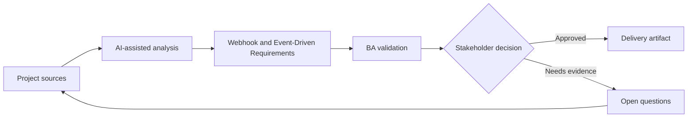

# Webhook and Event-Driven Requirements

<div class="case-meta">
  <span>Backend and API</span>
  <span>Event-driven integration</span>
  <span>Project use case</span>
</div>

## Project context

A platform needs to notify partner systems when invoices are created, paid, voided, or disputed. Partners require reliable webhooks, replay support, and clear event payloads. In a real delivery environment, this work usually appears under time pressure: stakeholders want clarity, delivery needs a backlog, QA needs testable behavior, and operations needs a process that can survive exceptions. The BA uses AI here to accelerate analysis and synthesis, but the BA remains accountable for evidence, business meaning, stakeholder decisioning, and artifact quality.

## BA challenge

The BA must specify event behavior beyond naming events. Requirements must cover trigger, payload, ordering, retries, replay, security, subscription management, and partner-facing documentation. The practical difficulty is that AI can make early material look more complete than it is. A strong BA keeps the output reviewable by separating source-backed facts, assumptions, unsupported claims, decision gaps, and recommended next actions. The objective is not to make the document longer; it is to make the project decision clearer and safer.

## Where AI fits

<div class="ba-workbench-panel">
AI is useful in this use case when it is constrained to analysis support, pattern detection, structured drafting, and critique. It should not approve scope, invent policy, decide business trade-offs, or replace accountable stakeholder judgment.
</div>

- Generate event catalog and payload questions from lifecycle states.
- Identify retry, replay, ordering, and duplicate scenarios.
- Draft partner documentation requirements.
- Create negative and operational test scenarios.

## Inputs to prepare

- Entity lifecycle
- Partner integration needs
- Security requirements
- Existing webhook examples
- Operational support process

A BA should label these inputs before using AI: source owner, source date, approval status, sensitivity level, and whether the source is fact, opinion, policy, draft, or historical evidence. This preparation prevents the model from treating every input as equally current and authoritative.

## BA workflow

1. Map entity lifecycle transitions to event triggers.
2. Ask AI to draft event catalog and missing payload fields.
3. Define event payload, subscription, authentication, retry, replay, and idempotency behavior.
4. Review partner documentation and support needs.
5. Write acceptance criteria for success, failure, duplicate, and replay cases.
6. Create operational monitoring and incident handling requirements.

The workflow works best as a staged AI collaboration: first organize the evidence, then ask for analysis, then create the artifact, then run a critique pass. The BA should keep a visible decision log throughout the process so that AI-generated suggestions do not silently become approved scope.

## Diagram



## Deliverables

| Deliverable | What it contains | Owner | Done signal |
| --- | --- | --- | --- |
| Event catalog | Event, trigger, payload, consumer, business meaning, and owner | BA and backend | Events map to lifecycle |
| Webhook behavior spec | Subscription, security, retry, replay, ordering, and duplicate handling | Backend | Operational behavior is defined |
| Partner documentation outline | Payload examples, signing, retries, error handling, and support | Developer relations | Partners can integrate |
| Event QA scenarios | Success, retry, replay, duplicate, missing consumer, and bad signature | QA | Integration behavior is testable |

These deliverables should be treated as BA-owned artifacts. AI can draft them, but the BA must validate source support, stakeholder meaning, traceability, and whether the artifact is ready for handoff.

## Prompt to try

```text
Act as a senior AI-aware Business Analyst. Help me apply the "Webhook and Event-Driven Requirements" use case to my project. First ask for source evidence and constraints. Then create a structured analysis with project context, assumptions, AI-fit boundary, workflow steps, deliverables, risks, controls, open questions, and stakeholder decisions. Do not invent policy, thresholds, or approvals.
```

## Review checklist

- Every AI-produced statement is tied to a source, assumption, or validation question.
- The BA has separated drafting assistance from business approval.
- Workflow steps identify the human owner for decisions, review, and exceptions.
- Deliverables are traceable to project inputs and can be reviewed by QA, product, or operations.
- Risk controls are practical enough to be used in a real project meeting.
- Success metric: Event-driven integration has clear semantics, reliability behavior, and partner-ready documentation.

## Risks and controls

| Risk | Why it matters | BA control |
| --- | --- | --- |
| Event ambiguity | Consumers may interpret event meaning differently | Document business meaning and trigger |
| Duplicate delivery | Partners may process same event twice | Specify event ID and idempotency |
| Replay gap | Partners cannot recover from outage | Define replay and event history |
| Security weakness | Webhook may be spoofed | Specify signing and authentication |

The key control is to make uncertainty visible. If evidence is weak, the output should create a validation question or decision item, not a final requirement. If the artifact influences delivery, release, compliance, customer experience, or operational workload, the BA should require explicit human review before handoff.
