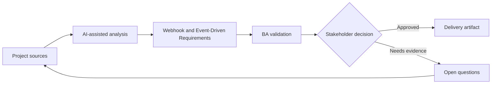

# Webhook and Event-Driven Requirements

<div class="case-meta">
  <span>Backend and API</span>
  <span>Event-driven integration</span>
  <span>Backend/API refinement</span>
  <span>Practitioner</span>
  <span>Event catalog</span>
  <span>Project use case</span>
</div>

## Project context

A platform needs to notify partner systems when invoices are created, paid, voided, or disputed. Partners require reliable webhooks, replay support, and clear event payloads. In Event-driven integration, this work usually starts when API contracts, permissions, errors, audit, and operational behavior must be explicit enough for backend delivery. The BA should treat Entity lifecycle and Partner integration needs as evidence to organize, not as raw material for an unconstrained AI answer. The goal is to make the next decision clearer for the people who own the outcome.

## BA challenge

The BA must specify event behavior beyond naming events. Requirements must cover trigger, payload, ordering, retries, replay, security, subscription management, and partner-facing documentation. For Webhook and Event-Driven Requirements, the practical difficulty is ambiguous service behavior and security gaps. AI can accelerate contract critique, rule extraction, error taxonomy, permission review, and NFR gap detection, but the BA must still expose assumptions, missing approvals, and the point where stakeholder judgment is required.

## Where AI fits

<div class="ba-workbench-panel">
AI fits this Backend and API use case when it is constrained to contract critique, rule extraction, error taxonomy, permission review, and NFR gap detection. A useful first AI task is: Generate event catalog and payload questions from lifecycle states. AI should not approve scope, invent policy, bypass API draft, data model, auth rules, error samples, audit policy, and integration needs, or turn a draft into a final decision.
</div>

- Generate event catalog and payload questions from lifecycle states.
- Identify retry, replay, ordering, and duplicate scenarios.
- Draft partner documentation requirements.
- Create negative and operational test scenarios.

## Inputs to prepare

- Entity lifecycle
- Partner integration needs
- Security requirements
- Existing webhook examples
- Operational support process

Before prompting for Webhook and Event-Driven Requirements, label each input by owner, date, approval status, sensitivity, and role in the decision. The most important evidence lens is API draft, data model, auth rules, error samples, audit policy, and integration needs; without it, AI may rank old notes, draft designs, and approved rules as if they had equal authority.

## BA workflow

1. Map entity lifecycle transitions to event triggers.
2. Ask AI to draft event catalog and missing payload fields.
3. Define event payload, subscription, authentication, retry, replay, and idempotency behavior.
4. Review partner documentation and support needs.
5. Write acceptance criteria for success, failure, duplicate, and replay cases.
6. Create operational monitoring and incident handling requirements.

Run the workflow as contract validation before implementation: start with "Map entity lifecycle transitions to event triggers.", then keep a visible decision log as the artifact moves toward Event catalog. This prevents AI suggestions from silently becoming backlog, design, release, or operational commitments.

## Diagram



## Deliverables

| Deliverable | What it contains | Owner | Done signal |
| --- | --- | --- | --- |
| Event catalog | Event, trigger, payload, consumer, business meaning, and owner | BA and backend | Events map to lifecycle |
| Webhook behavior spec | Subscription, security, retry, replay, ordering, and duplicate handling | Backend | Operational behavior is defined |
| Partner documentation outline | Payload examples, signing, retries, error handling, and support | Developer relations | Partners can integrate |
| Event QA scenarios | Success, retry, replay, duplicate, missing consumer, and bad signature | QA | Integration behavior is testable |

Treat Event catalog as a BA-owned backend behavior contract. AI may draft structure, but the BA must validate whether "Events map to lifecycle" is actually true, whether the artifact is traceable to source evidence, and whether the receiving team can act on it.

## Prompt to try

```text
Act as a senior AI-aware Business Analyst. Help me apply the "Webhook and Event-Driven Requirements" use case to my project. First ask for source evidence and constraints. Then create a structured analysis with project context, assumptions, AI-fit boundary, workflow steps, deliverables, risks, controls, open questions, and stakeholder decisions. Do not invent policy, thresholds, or approvals.
```

## Review checklist

- Entity lifecycle is labeled with owner, date, approval status, and sensitivity.
- Event catalog traces to source evidence and has a named human owner.
- The AI task stays inside contract critique, rule extraction, error taxonomy, permission review, and NFR gap detection and does not approve scope or policy.
- The "Event ambiguity" risk has a practical control: Document business meaning and trigger.
- Open assumptions are converted into validation questions or stakeholder decisions.
- Success metric: Event-driven integration has clear semantics, reliability behavior, and partner-ready documentation.

## Risks and controls

| Risk | Why it matters | BA control |
| --- | --- | --- |
| Event ambiguity | Consumers may interpret event meaning differently | Document business meaning and trigger |
| Duplicate delivery | Partners may process same event twice | Specify event ID and idempotency |
| Replay gap | Partners cannot recover from outage | Define replay and event history |
| Security weakness | Webhook may be spoofed | Specify signing and authentication |

The main control for the "Event ambiguity" risk is explicit human accountability: Document business meaning and trigger. If evidence is weak, the output should create a validation question or decision item, not a final requirement.
