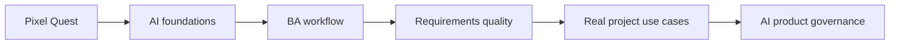

# AI for Business Analysts

Course song ngữ dành cho software Business Analyst muốn hiểu AI, dùng AI tốt hơn trong công việc BA, và đặc tả sản phẩm có AI một cách có trách nhiệm.

<PixelQuest locale="vi" mode="home" />

## Chọn ngôn ngữ / Choose a language

<a class="course-card game-entry-card" href="./vi/"><strong>Tiếng Việt</strong>Bắt đầu course bằng tiếng Việt với bài học, lab, use case và thư viện prompt.</a>
<a class="course-card" href="./en/"><strong>English</strong>Start the English learning path with lessons, labs, use cases, and reusable BA resources.</a>

## Course map

