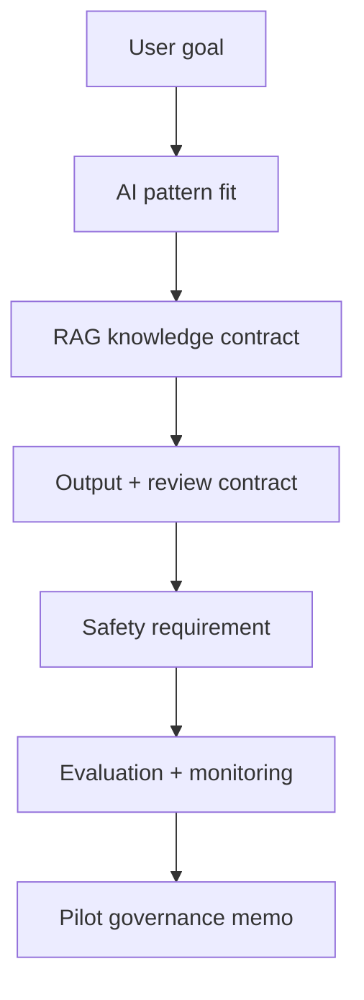

# Capstone 3: Requirement và governance cho AI assistant

<div class="lesson-meta">
  <span>Capstone</span>
  <span>Mô phỏng dự án</span>
  <span>Senior BA</span>
</div>

Đặc tả AI assistant từ user goal tới RAG knowledge contract, human review, safety control, evaluation và operating model.

## Scenario

Support organization muốn AI assistant draft ticket reply dựa trên product documentation, policy article và historical ticket. Business muốn response nhanh hơn, legal lo advice sai, support lead lo tone, engineering cần requirement rõ về retrieval, logging và fallback.

## Your role

Bạn là BA hiểu AI, chịu trách nhiệm define assistant hữu ích, govern được, đo được và đủ an toàn cho pilot release.

## Inputs to prepare

- Target user journey và support persona
- Knowledge source inventory
- Sample ticket và approved reply
- Data sensitivity và PII policy
- Support QA scorecard
- Operational escalation và review rule

## Capstone workflow

1. Classify AI pattern và giải thích vì sao RAG + human review phù hợp.
2. Define source authority, freshness, chunking assumption, citation behavior, access control và conflict handling.
3. Specify output contract, confidence behavior, refusal/fallback, human review trigger, correction capture và audit log requirement.
4. Tạo evaluation set design, answer-quality rubric, monitoring metric và pilot release gate.
5. Viết acceptance criteria cho prompt injection, unsafe input, bias/fairness, privacy và cost guardrail.
6. Chuẩn bị stakeholder decision memo có risk, control và pilot scope.

## Diagram



## Expected deliverables

| Deliverable | Nội dung | Vì sao quan trọng |
| --- | --- | --- |
| AI feature operating contract | Task boundary, allowed input, output contract, confidence, fallback và human review | Ngăn AI behavior không kiểm soát |
| RAG knowledge contract | Source inventory, authority, freshness, access, citation, conflict handling và retrieval metric | Định nghĩa assistant được phép tin gì |
| Evaluation and monitoring plan | Test set, rubric, telemetry, correction capture, alert và release gate | Làm quality đo được trước và sau release |
| Governance decision memo | Pilot scope, risk tier, control, owner và unresolved decision | Cho sponsor artifact go/no-go có trách nhiệm |

## AI collaboration prompt

```text
Hãy đóng vai expert AI product BA. Hỗ trợ đặc tả support AI assistant này. Tạo AI pattern fit, RAG knowledge contract, output contract, human review và fallback rule, privacy và prompt-injection requirement, evaluation set design, quality rubric, telemetry plan, pilot release gate, decision memo và stakeholder question. Tách fact, assumption, unsupported claim và decision needed.
```

## Scoring rubric

| Lens review | Tín hiệu đạt điểm cao |
| --- | --- |
| AI fit | AI pattern được justify theo business outcome và risk. |
| Safety | Human review, fallback, privacy, access và injection control test được. |
| Evaluation | Pilot có quality, failure và monitoring criteria đo được. |
| Operating model | Owner, review gate, escalation và post-release learning được define. |

## Submission checklist

- Evidence label visible trong mọi artifact quan trọng.
- Assumption được tách khỏi decision.
- Handoff cho frontend, backend, QA, operations và governance explicit khi liên quan.
- Output AI đã được review unsupported claim, missing context và shortcut không an toàn.
- Final pack có thể dùng cho refinement, workshop hoặc pilot decision thật.
