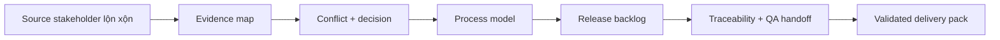

# Capstone 1: Discovery đến delivery AI BA pack

<div class="lesson-meta">
  <span>Capstone</span>
  <span>Mô phỏng dự án</span>
  <span>Senior BA</span>
</div>

Chuyển input stakeholder lộn xộn thành analysis pack sẵn sàng delivery có evidence, decision, story, risk và QA handoff.

## Scenario

Một team operations muốn modernize request intake flow. Sales muốn submit nhanh hơn, operations muốn giảm manual correction, compliance cần approval evidence, engineering cần scope rõ cho first release. Source material không nhất quán và nhiều decision còn mở.

## Your role

Bạn là senior BA chịu trách nhiệm shape first release mà không để AI biến assumption thành scope đã approved.

## Inputs to prepare

- Stakeholder notes từ sales, operations, compliance, support và engineering
- Current-state process fragment
- Draft business goal và success metric
- Constraint đã biết về role, audit, data và timeline
- Ba sample request ticket có exception case

## Capstone workflow

1. Tạo source map và classify fact, assumption, conflict, decision needed.
2. Draft current-state và target-state process diagram có exception path.
3. Split first-release scope thành epic, user story và acceptance criteria.
4. Tạo traceability matrix từ business goal tới story, rule, evidence và test scenario.
5. Chuẩn bị decision log và workshop agenda cho unresolved item.
6. Review output AI và mark unsupported claim trước khi share.

## Diagram



## Expected deliverables

| Deliverable | Nội dung | Vì sao quan trọng |
| --- | --- | --- |
| Evidence-backed discovery synthesis | Source map, theme, conflict, decision needed và assumption | Bảo vệ project khỏi false consensus |
| Process and exception model | Current-state, target-state, decision point, exception loop và handoff | Cho thấy operational complexity thật |
| Release-ready backlog pack | Epic, story, acceptance criteria, NFR và negative scenario | Giúp delivery team có work test được |
| Traceability and QA handoff | Map goal-to-requirement-to-test có owner | Kết nối BA work với release readiness |

## AI collaboration prompt

```text
Hãy đóng vai senior BA reviewer. Dựa trên project source pack, tạo delivery-ready AI BA pack. Bắt đầu bằng cách hỏi missing evidence. Sau đó tạo source map, bảng fact-assumption-conflict, current-state flow, target-state flow, release scope, user story, acceptance criteria, traceability matrix, decision log và QA handoff. Tách unsupported claim và stakeholder decision.
```

## Scoring rubric

| Lens review | Tín hiệu đạt điểm cao |
| --- | --- |
| Evidence discipline | Mọi claim quan trọng có source, owner hoặc validation question. |
| Delivery readiness | Story estimate/test được và gắn business value. |
| Risk handling | Compliance, audit, NFR và exception risk visible trước sprint commitment. |
| AI control | Output AI được dùng như draft analysis, không phải approval mechanism. |

## Submission checklist

- Evidence label visible trong mọi artifact quan trọng.
- Assumption được tách khỏi decision.
- Handoff cho frontend, backend, QA, operations và governance explicit khi liên quan.
- Output AI đã được review unsupported claim, missing context và shortcut không an toàn.
- Final pack có thể dùng cho refinement, workshop hoặc pilot decision thật.
