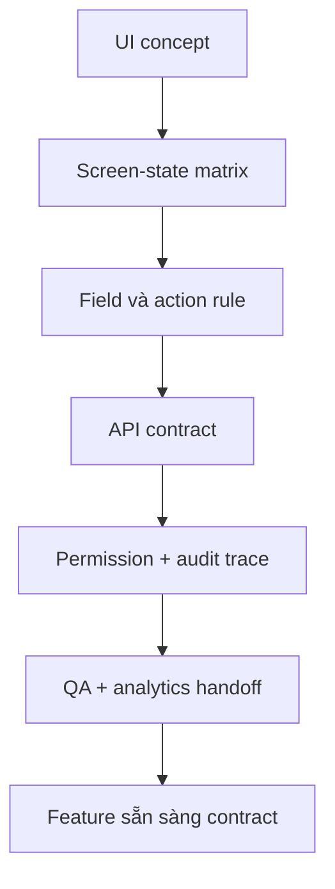

# Capstone 2: Frontend đến backend contract readiness

<div class="lesson-meta">
  <span>Capstone</span>
  <span>Mô phỏng dự án</span>
  <span>Senior BA</span>
</div>

Chuyển UI concept thành screen behavior, API contract, data rule, error state, analytics và test coverage.

## Scenario

Customer portal thêm reporting screen có filter, saved view, export, permission và partial data từ ba backend service. Figma chỉ thể hiện happy path, chưa define loading, empty, error, partial failure, RBAC, analytics hoặc API edge case.

## Your role

Bạn là BA kết nối UX intent, frontend behavior, backend contract, QA scenario và stakeholder decision.

## Inputs to prepare

- Figma screen hoặc wireframe note
- User role và permission rule
- Draft API description
- Sample response payload
- Reporting metric và business definition
- Expectation về browser, mobile và accessibility

## Capstone workflow

1. Tạo screen-state behavior matrix cho loading, empty, error, permission, partial data và success state.
2. Define field-level rule, filter behavior, sorting, pagination, export và saved-view logic.
3. Draft API contract requirement có request, response, validation, error code, timeout, retry và idempotency note.
4. Map UI control tới backend permission và audit need.
5. Viết analytics event requirement và QA test scenario.
6. Identify decision còn cần từ design, product, frontend, backend, data và QA.

## Diagram



## Expected deliverables

| Deliverable | Nội dung | Vì sao quan trọng |
| --- | --- | --- |
| Screen-state matrix | State, trigger, UI behavior, copy, action availability và owner | Tránh frontend requirement bị ẩn |
| API contract requirement pack | Endpoint, schema, validation, error, timeout, retry và example | Tạo shared contract cho backend và frontend |
| Permission and audit trace map | Role, control, API permission, audit event và denial behavior | Tránh assumption security chỉ nằm ở UI |
| QA and analytics handoff | Test scenario, event name, payload rule và acceptance signal | Giúp release behavior đo được |

## AI collaboration prompt

```text
Hãy đóng vai senior BA cho workshop refinement frontend-backend. Từ UI concept và API note, tạo screen-state matrix, field behavior rule, API contract requirement, permission trace map, error taxonomy, analytics event, QA scenario, open decision và acceptance criteria. Flag mọi assumption cần UX, product, backend, security hoặc QA confirm.
```

## Scoring rubric

| Lens review | Tín hiệu đạt điểm cao |
| --- | --- |
| UI completeness | Non-happy-path screen state được đặc tả đầy đủ. |
| Contract clarity | Frontend và backend có thể build từ cùng behavior agreement. |
| Security and audit | Visibility, authorization và audit behavior được align. |
| Measurement | Analytics và QA expectation chứng minh feature hoạt động sau release. |

## Submission checklist

- Evidence label visible trong mọi artifact quan trọng.
- Assumption được tách khỏi decision.
- Handoff cho frontend, backend, QA, operations và governance explicit khi liên quan.
- Output AI đã được review unsupported claim, missing context và shortcut không an toàn.
- Final pack có thể dùng cho refinement, workshop hoặc pilot decision thật.
