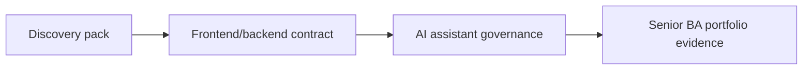

# Capstone mô phỏng dự án

Dùng các capstone này sau bài học chính và use case dự án. Mỗi bài yêu cầu tạo artifact mà delivery team thật có thể review.

<a class="template-card" href="./discovery-to-delivery-ai-ba-pack/"><strong>Capstone 1: Discovery đến delivery AI BA pack</strong>Chuyển input stakeholder lộn xộn thành analysis pack sẵn sàng delivery có evidence, decision, story, risk và QA handoff.</a>
<a class="template-card" href="./frontend-backend-contract-readiness/"><strong>Capstone 2: Frontend đến backend contract readiness</strong>Chuyển UI concept thành screen behavior, API contract, data rule, error state, analytics và test coverage.</a>
<a class="template-card" href="./ai-assistant-requirement-and-governance/"><strong>Capstone 3: Requirement và governance cho AI assistant</strong>Đặc tả AI assistant từ user goal tới RAG knowledge contract, human review, safety control, evaluation và operating model.</a>

## Capstone progression

