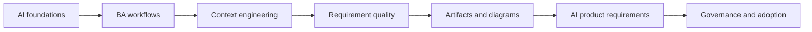

# AI for Business Analysts

Learning path song ngữ chuyên sâu cho software Business Analyst muốn dùng AI có trách nhiệm, cải thiện artifact BA và đặc tả sản phẩm có AI bằng judgment của chuyên gia.

## Các nhóm nội dung

<strong>Nền tảng AI cho Business Analyst</strong>Hiểu AI pattern, giới hạn LLM, grounding, RAG, source authority và khi nào non-AI solution phù hợp hơn.

<strong>Quy trình BA được tăng cường bởi AI</strong>Dùng AI để synthesize discovery, interview, story, process model và stakeholder decision mà không mất evidence.

<strong>AI collaboration và context engineering</strong>Xây context package, prompt pattern, critique loop và structured output tái sử dụng cho BA team collaboration.

<strong>Requirements engineering với AI</strong>Cải thiện ambiguity analysis, NFR, risk, traceability, testability và backlog readiness trước delivery commitment.

<strong>Artifact phân tích và diagramming</strong>Tạo BRD, SRS, decision artifact, diagram, matrix và handoff pack mà delivery team có thể inspect.

<strong>Xây dựng sản phẩm có AI dưới góc nhìn BA</strong>Đặc tả AI-enabled feature với task boundary, output contract, evaluation, human review, fallback và monitoring.

<strong>BA lead và expert track</strong>Scale AI adoption bằng governance, risk tier, tool policy, quality gate, coaching, metric và operating model.

<strong>Use case thực tế trong dự án</strong>70+ tình huống chi tiết, gồm frontend/UI, backend/API, data integration, QA và AI product work.

## Learning path

## Learning path theo vai trò

<strong>Software BA mới</strong>Bắt đầu với AI foundation, sau đó luyện discovery và user story.<em>Bài 01-08, Lab 01-03, use case Discovery và Requirements</em>

<strong>Senior Delivery BA</strong>Tập trung ambiguity, NFR, traceability, diagram và cross-team handoff.<em>Bài 09, 13-17, Capstone 1, use case Frontend/Backend</em>

<strong>BA làm với Frontend/UI</strong>Chuyển UX thành behavior, state, permission, analytics, accessibility và QA coverage.<em>Use case Frontend/UI, UI State Template, Capstone 2</em>

<strong>BA làm với Backend/API</strong>Clarify API contract, validation, error, RBAC, idempotency, data mapping và integration failure.<em>Use case Backend/API, API Contract Checklist, Capstone 2</em>

<strong>AI Product BA</strong>Đặc tả RAG, AI output contract, human review, fallback, evaluation, monitoring và risk control.<em>Bài 18-20, RAG Canvas, AI Feature Template, Capstone 3</em>

<strong>BA Lead hoặc Practice Lead</strong>Xây governance, prompt library, quality gate, adoption metric và team operating model.<em>Bài 20, AI Risk Matrix, DoR/DoD Template, Adoption Lab</em>

## What you will be able to do

- Giải thích concept AI rõ ràng, không hype và không cần ML math quá sâu.
- Dùng AI để cải thiện discovery, synthesis, requirement, diagram và review.
- Xây prompt/context pattern tái sử dụng cho BA team.
- Đặc tả AI-enabled feature có uncertainty, evaluation, human review, fallback và monitoring.
- Dẫn dắt AI adoption bằng governance, quality gate, metric và operating model.

## Start here

1. Đọc bài 01-05 để nắm nền tảng AI.
2. Thực hành bài 06-17 để cải thiện BA workflow và artifact.
3. Học bài 18-20 để đặc tả AI-enabled product và BA leadership.
4. Dùng project use case để áp dụng AI workflow vào tình huống delivery thật.
5. Dùng lab và resource library trên backlog thật của bạn.

## Capstone mô phỏng dự án

- [Capstone 1: Discovery đến delivery AI BA pack](./capstones/discovery-to-delivery-ai-ba-pack/) - Chuyển input stakeholder lộn xộn thành analysis pack sẵn sàng delivery có evidence, decision, story, risk và QA handoff.
- [Capstone 2: Frontend đến backend contract readiness](./capstones/frontend-backend-contract-readiness/) - Chuyển UI concept thành screen behavior, API contract, data rule, error state, analytics và test coverage.
- [Capstone 3: Requirement và governance cho AI assistant](./capstones/ai-assistant-requirement-and-governance/) - Đặc tả AI assistant từ user goal tới RAG knowledge contract, human review, safety control, evaluation và operating model.
