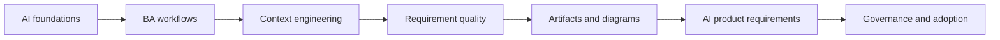

# AI for Business Analysts

Learning path song ngữ chuyên sâu cho software Business Analyst muốn dùng AI có trách nhiệm, cải thiện artifact BA và đặc tả sản phẩm có AI bằng judgment của chuyên gia.

<strong>Nền tảng AI cho Business Analyst</strong>Bài học riêng biệt với diagram, artifact, prompt và review control.

<strong>Quy trình BA được tăng cường bởi AI</strong>Bài học riêng biệt với diagram, artifact, prompt và review control.

<strong>AI collaboration và context engineering</strong>Bài học riêng biệt với diagram, artifact, prompt và review control.

<strong>Requirements engineering với AI</strong>Bài học riêng biệt với diagram, artifact, prompt và review control.

<strong>Artifact phân tích và diagramming</strong>Bài học riêng biệt với diagram, artifact, prompt và review control.

<strong>Xây dựng sản phẩm có AI dưới góc nhìn BA</strong>Bài học riêng biệt với diagram, artifact, prompt và review control.

<strong>BA lead và expert track</strong>Bài học riêng biệt với diagram, artifact, prompt và review control.

<strong>Use case thực tế trong dự án</strong>70+ tình huống chi tiết, gồm frontend/UI, backend/API, data integration, QA và AI product work.

<a class="course-card game-entry-card" href="./game/"><strong>Chơi Pixel Quest</strong>Bản đồ phiêu lưu pixel retro cho người học muốn trải nghiệm course như một game.</a>

## Learning path

## What you will be able to do

- Explain AI concepts without hype and without unnecessary ML math.
- Use AI to improve discovery, synthesis, requirements, diagrams, and review.
- Build reusable prompt/context patterns for a BA team.
- Specify AI-enabled features with uncertainty, evaluation, human review, fallback, and monitoring.
- Lead AI adoption with governance, quality gates, metrics, and operating model.

## Start here

1. Read lessons 01-05 for AI foundations.
2. Practice lessons 06-17 to improve BA workflow and artifacts.
3. Study lessons 18-20 for AI-enabled product requirements and BA leadership.
4. Use the project use cases to adapt AI workflows to real delivery situations.
5. Use the labs and resource library on your real backlog.
