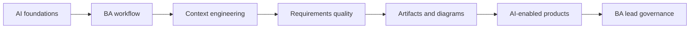

# AI for Business Analysts

Learning path đầy đủ cho software Business Analyst muốn hiểu AI, dùng AI trong công việc phân tích và đặc tả sản phẩm có AI một cách có trách nhiệm.

<strong>Nền tảng AI cho Business Analyst</strong>Concept cốt lõi, workflow thực tế và artifact dùng được cho BA.

<strong>Quy trình BA được tăng cường bởi AI</strong>Concept cốt lõi, workflow thực tế và artifact dùng được cho BA.

<strong>AI collaboration và context engineering</strong>Concept cốt lõi, workflow thực tế và artifact dùng được cho BA.

<strong>Requirements engineering với AI</strong>Concept cốt lõi, workflow thực tế và artifact dùng được cho BA.

<strong>Artifact phân tích và diagramming</strong>Concept cốt lõi, workflow thực tế và artifact dùng được cho BA.

<strong>Xây dựng sản phẩm có AI dưới góc nhìn BA</strong>Concept cốt lõi, workflow thực tế và artifact dùng được cho BA.

<strong>BA lead và expert track</strong>Concept cốt lõi, workflow thực tế và artifact dùng được cho BA.

## Learning path

## What you will be able to do

- Explain AI concepts in language stakeholders can understand.
- Use AI to improve discovery, interviews, requirements, diagrams, and review.
- Write better prompts by designing context, constraints, evidence, and output format.
- Specify AI-enabled features with data, quality, fallback, monitoring, and governance requirements.
- Lead AI adoption in a BA team with practical controls and metrics.

## Start here

1. Read lessons 01-05 to build AI foundations.
2. Practice lessons 06-17 to improve BA workflows and artifacts.
3. Study lessons 18-20 if you analyze AI products or lead BA adoption.
4. Use the labs and resource library to apply the methods on real work.
