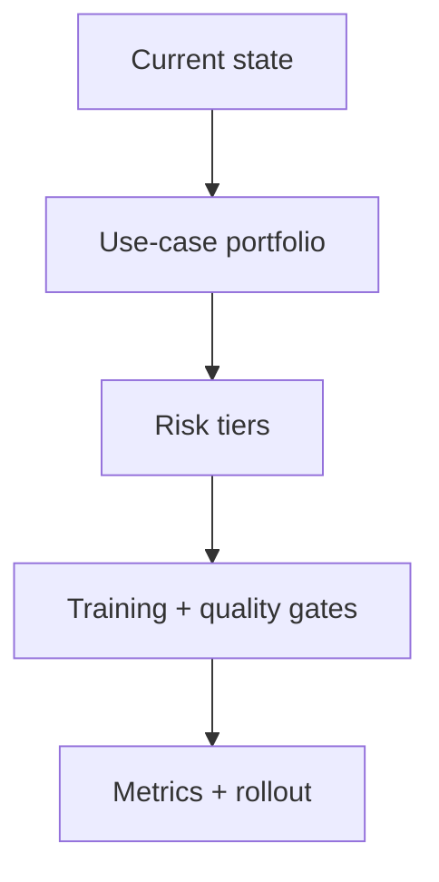

# Roadmap adoption AI

## Scenario

Bạn là BA lead lập kế hoạch adoption AI an toàn cho BA practice 20 người.

## Input sample

```text
Current state: một số BA dùng public AI tool, chưa có shared prompt library, chưa có data policy, manager muốn tăng productivity, compliance lo confidential data.
```

## Diagram



## Exercise steps

1. Xây use-case portfolio theo value và risk.
2. Định nghĩa risk tier và data rule.
3. Tạo training và quality gate.
4. Định nghĩa metric và rollout phase.

## Deliverables

- use-case portfolio
- risk-tier policy
- training plan
- governance scorecard

## AI collaboration prompt

```text
Hãy đóng vai senior BA coach. Hỗ trợ tôi hoàn thành lab này. Trước hết hỏi source evidence nào đang có. Sau đó hướng dẫn tôi theo từng exercise step. Tạo deliverables dưới dạng structured table. Đánh dấu assumption, unsupported claim và câu hỏi cần stakeholder validation.
```

## Review rubric

- Risk control match sensitivity của use case.
- Quality gate thực tế.
- Metric gồm quality và cycle time.
- Rollout có owner và phase.
