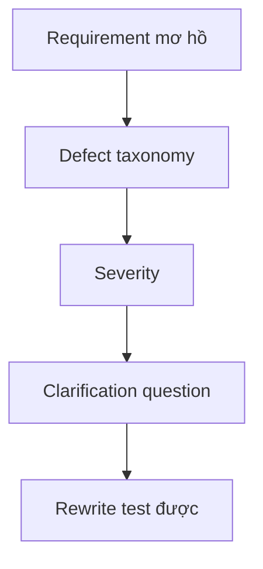

# Review requirement mơ hồ

## Scenario

Product owner đưa requirement mơ hồ trước sprint refinement. Nhiệm vụ của bạn là làm ambiguity visible và chỉ rewrite phần có thể support.

## Input sample

```text
Requirement excerpt: The system should notify users quickly when important account changes occur and make it easy for admins to manage exceptions.
```

## Diagram



## Exercise steps

1. Chạy defect taxonomy.
2. Phân loại ambiguity, missing rule, conflict và non-testable wording.
3. Viết clarification question.
4. Tạo candidate rewrite test được với assumption được label.

## Deliverables

- defect register
- clarification question list
- candidate requirement rewrite
- severity ranking

## AI collaboration prompt

```text
Hãy đóng vai senior BA coach. Hỗ trợ tôi hoàn thành lab này. Trước hết hỏi source evidence nào đang có. Sau đó hướng dẫn tôi theo từng exercise step. Tạo deliverables dưới dạng structured table. Đánh dấu assumption, unsupported claim và câu hỏi cần stakeholder validation.
```

## Review rubric

- Mỗi issue có defect type.
- Severity phản ánh business hoặc delivery risk.
- Rewrite đo được.
- Assumption không bị giấu.
