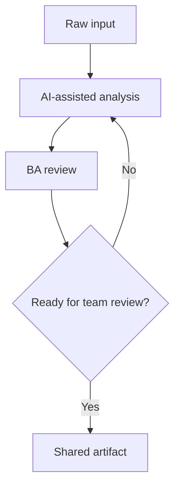

# Review requirement mơ hồ

## Mục tiêu

Product owner đưa cho bạn mười requirement mơ hồ. Bạn cần tìm ambiguity, business rule thiếu và ngôn ngữ không test được.

## Scenario

You are working in a software product team. The team expects a BA-ready artifact that can be reviewed by product, engineering, QA, and operations.

## Diagram



## Hướng dẫn

1. Clarify the business goal and target users.
2. Ask AI to produce a first draft with explicit assumptions.
3. Review the output for ambiguity, gaps, risks, and evidence.
4. Revise the artifact until it can be shared with the delivery team.
5. Capture open questions instead of hiding uncertainty.

## Deliverables

- issue register
- clarification question
- requirement viết lại
- risk note

## Lab prompt

```text
Hãy đóng vai senior BA coach. Hỗ trợ tôi hoàn thành lab từng bước. Hỏi câu hỏi làm rõ trước, sau đó tạo artifact với assumption, evidence, risk và open question.
```

## Review rubric

- Every recommendation has evidence or is marked as an assumption.
- Open questions are visible and assigned.
- The artifact is testable by QA and understandable by stakeholders.
- Risks are stated in business language, not only technical language.
