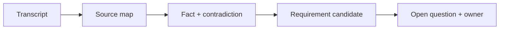

# Từ meeting transcript đến requirement

## Scenario

Bạn nhận một discovery call lộn xộn về customer onboarding. Mục tiêu là chuyển nó thành requirement candidate mà không che giấu uncertainty.

## Input sample

```text
Transcript excerpt: Sales muốn onboarding tức thì. Compliance nói KYC phải hoàn tất trước activation. Support nói customer thường upload sai document. Product muốn self-service status page.
```

## Diagram



## Exercise steps

1. Tạo source map có stakeholder attribution.
2. Extract fact, assumption, contradiction và decision needed.
3. Draft requirement candidate có evidence.
4. Viết open question và gán decision owner.

## Deliverables

- source map
- bảng requirement candidate
- danh sách contradiction
- decision log

## AI collaboration prompt

```text
Hãy đóng vai senior BA coach. Hỗ trợ tôi hoàn thành lab này. Trước hết hỏi source evidence nào đang có. Sau đó hướng dẫn tôi theo từng exercise step. Tạo deliverables dưới dạng structured table. Đánh dấu assumption, unsupported claim và câu hỏi cần stakeholder validation.
```

## Review rubric

- Mỗi requirement có source evidence.
- Contradiction không bị làm mượt thành false agreement.
- Open question có owner và next action.
- Không có unsupported AI inference trở thành final scope.
