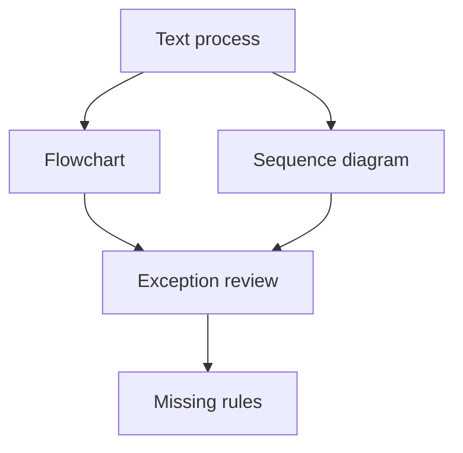

# Process và sequence diagram

## Scenario

Bạn cần giải thích approval flow đi qua user, web app, workflow engine, notification service và manager review.

## Input sample

```text
Process: User submit request. System validate document. Nếu amount cao, manager approve. User nhận result. Missing document trả về user.
```

## Diagram



## Exercise steps

1. Draft process flow.
2. Draft sequence diagram.
3. Thêm exception path và ownership.
4. Liệt kê missing rule và integration assumption.

## Deliverables

- process flow
- sequence diagram
- exception path list
- ownership note

## AI collaboration prompt

```text
Hãy đóng vai senior BA coach. Hỗ trợ tôi hoàn thành lab này. Trước hết hỏi source evidence nào đang có. Sau đó hướng dẫn tôi theo từng exercise step. Tạo deliverables dưới dạng structured table. Đánh dấu assumption, unsupported claim và câu hỏi cần stakeholder validation.
```

## Review rubric

- Actor và system được tách rõ.
- Decision rule explicit.
- Exception visible.
- Integration boundary rõ.
