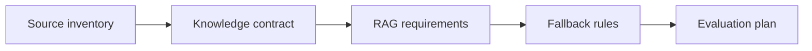

# Requirement cho RAG assistant

## Scenario

Tổ chức muốn policy assistant trả lời từ tài liệu nội bộ và có citation.

## Input sample

```text
Sources: HR policy portal, legacy PDF handbook, manager-only procedure, public FAQ. Users: employee và HR advisor.
```

## Diagram



## Exercise steps

1. Định nghĩa source authority và freshness.
2. Đặc tả access control và citation rule.
3. Viết fallback behavior cho weak evidence.
4. Định nghĩa retrieval và answer-quality evaluation.

## Deliverables

- knowledge contract
- bộ requirement RAG
- fallback rule
- evaluation plan

## AI collaboration prompt

```text
Hãy đóng vai senior BA coach. Hỗ trợ tôi hoàn thành lab này. Trước hết hỏi source evidence nào đang có. Sau đó hướng dẫn tôi theo từng exercise step. Tạo deliverables dưới dạng structured table. Đánh dấu assumption, unsupported claim và câu hỏi cần stakeholder validation.
```

## Review rubric

- Source priority được định nghĩa.
- Access control test được.
- Fallback tránh invented answer.
- Evaluation cover retrieval và generation.
