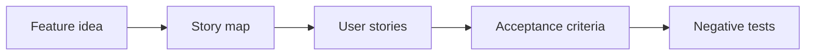

# User story và acceptance criteria

## Scenario

Một feature idea cần trở thành user story sẵn sàng cho development với acceptance criteria và negative scenario.

## Input sample

```text
Feature idea: Premium customers can export reports from analytics dashboard.
```

## Diagram



## Exercise steps

1. Xác định actor, goal và business value.
2. Tách story theo user goal và permission.
3. Draft criteria dạng Given-When-Then.
4. Thêm negative, boundary, audit và permission case.

## Deliverables

- story map
- user story
- acceptance criteria
- negative test case

## AI collaboration prompt

```text
Hãy đóng vai senior BA coach. Hỗ trợ tôi hoàn thành lab này. Trước hết hỏi source evidence nào đang có. Sau đó hướng dẫn tôi theo từng exercise step. Tạo deliverables dưới dạng structured table. Đánh dấu assumption, unsupported claim và câu hỏi cần stakeholder validation.
```

## Review rubric

- Story có business value.
- Acceptance criteria observable.
- Có negative case.
- Permission và audit explicit.
