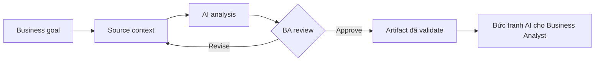

# Bức tranh AI cho Business Analyst

<div class="lesson-meta">
  <span>Nền tảng AI cho Business Analyst</span>
  <span>Software BA</span>
  <span>Core</span>
</div>

## Learning outcomes

- Giải thích bức tranh ai cho business analyst bằng ngôn ngữ business.
- Áp dụng concept vào workflow BA thực tế.
- Dùng output AI như draft có evidence, không xem là sự thật tự động.
- Xác định câu hỏi review BA phải hỏi trước khi chia sẻ artifact.

## Why this matters for BA work

AI thay đổi cách tạo ra artifact phân tích, nhưng không thay thế trách nhiệm của BA về clarity, evidence và decision.

<div class="ba-callout">
Hiểu bản đồ AI mà BA cần: predictive AI, generative AI, LLM, copilot, agent, RAG và automation.
</div>

## Core concept

Pattern hữu ích cho BA là controlled collaboration: cung cấp business context cho model, yêu cầu structured output, bắt buộc có evidence, rồi review theo goal, rule, risk và decision của stakeholder.

## Practical BA example

Một product team hỏi nên xây internal support assistant dưới dạng chatbot, workflow automation hay search experience. BA giỏi sẽ tách business outcome, user journey, nguồn dữ liệu, rủi ro quyết định và cách đo lường trước khi đề xuất solution shape.

## Diagram



## BA workflow

1. Đóng khung business question trước khi mở AI tool.
2. Cung cấp source context và constraint rõ ràng.
3. Yêu cầu structured output có mapping về source.
4. Chạy critique pass để tìm ambiguity, gap, risk và testability.
5. Chuyển kết quả thành artifact mà team có thể inspect và cùng chịu ownership.

## Prompt hoặc template

```text
Hãy đóng vai senior BA. Phân loại ý tưởng AI này theo business outcome, nhóm người dùng, phụ thuộc dữ liệu, rủi ro quyết định, và nó cần GenAI, automation truyền thống, search hay human workflow.
```

## What a BA should remember

- AI là bộ tăng tốc reasoning, không phải decision owner.
- Mọi claim quan trọng phải grounded vào source context hoặc stakeholder confirmation.
- BA giỏi giữ review loop rõ ràng: draft, critique, revise, validate.
