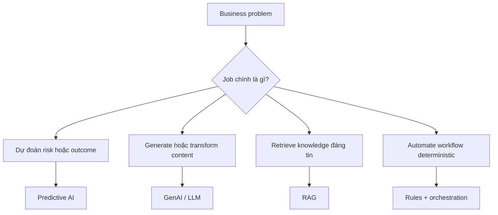

# Bức tranh AI cho Business Analyst

<div class="lesson-meta">
  <span>Nền tảng AI cho Business Analyst</span>
  <span>Software BA</span>
  <span>Core</span>
</div>

## Learning outcomes

- Phân biệt predictive AI, GenAI, RAG, agent, copilot và automation.
- Chọn đúng pattern AI trước khi đi vào solutioning.
- Nhận ra ý tưởng nào nên giải bằng workflow, rule hoặc search thay vì GenAI.

## Why this matters for BA work

<div class="ba-callout">
BA không cần trở thành kỹ sư machine learning, nhưng phải biết pattern AI nào phù hợp với loại business problem nào.
</div>

Business Analyst đứng giữa problem framing, ý nghĩa từ stakeholder, constraint triển khai và product decision. Trong công việc có AI, vị trí này quan trọng hơn vì ngôn ngữ chưa rõ có thể tạo false certainty rất nhanh. Bài này đưa ra một control thực tế để áp dụng trước khi output AI trở thành scope, backlog hoặc delivery commitment.

## Mental model or core concept

Hãy xem AI là một portfolio capability pattern, không phải một chatbot vạn năng. Việc đầu tiên của BA là phân loại business problem: prediction, generation, retrieval, decision support, automation hay tăng tốc human workflow. Cách này giúp tránh xây solution 'trông giống AI' nhưng thật ra vấn đề nằm ở data, process hoặc search.

## Practical BA example

Team sales operations muốn một AI assistant để giảm thời gian duyệt báo giá. Phân tích yếu sẽ nhảy ngay vào requirement chatbot. BA tốt hơn sẽ map pain point: approval chậm vì pricing exception thiếu policy rõ, approval rule nằm trong email, manager cần risk signal. Solution có thể là rules automation, policy retrieval và một lớp GenAI giải thích.

## Diagram



## BA artifact

### AI Pattern Fit Matrix

| Business problem | Pattern AI phù hợp | Câu hỏi BA | Cảnh báo anti-pattern |
| --- | --- | --- | --- |
| Dự đoán churn hoặc risk | Predictive AI | Có historical label và decision nào? | Không dùng GenAI để đoán risk nếu thiếu data. |
| Trả lời từ policy nội bộ | RAG | Source nào authoritative và mới nhất? | Không cho model trả lời nếu thiếu citation. |
| Draft email, story, summary | GenAI | Context và quality rubric nào định nghĩa output tốt? | Không xem first draft là nội dung đã approved. |
| Route một request | Rules hoặc workflow automation | Rule có deterministic và ổn định không? | Không đưa LLM uncertainty vào routing đơn giản. |

## AI collaboration prompt

```text
Hãy đóng vai senior BA. Phân loại ý tưởng này bằng AI Pattern Fit Matrix. Với từng option, giải thích business outcome, data dependency, decision risk, user touchpoint và vì sao GenAI, RAG, predictive AI, rules automation hoặc human workflow là phù hợp nhất. Đánh dấu rõ unsupported assumption.
```

## Mistakes to avoid

- Gọi mọi ý tưởng AI là chatbot.
- Không phân biệt content generation với business decisioning.
- Bỏ qua việc problem có reliable data và metric đo được hay không.
- Để vendor định nghĩa solution category trước khi BA frame problem.

## Apply this tomorrow

1. Chọn một AI idea trong backlog và phân loại bằng matrix.
2. Ghi rõ user decision mà feature cần cải thiện.
3. Tìm một non-AI alternative có thể giải cùng pain point.
4. Hỏi stakeholder metric nào chứng minh AI feature có hiệu quả.

## What a BA should remember

- Solution shape của AI phải đi theo problem shape.
- GenAI hữu ích cho language task, nhưng nhiều bài toán BA cần rule, data quality hoặc search.
- BA tạo clarity trước khi team chọn model hoặc tool.
