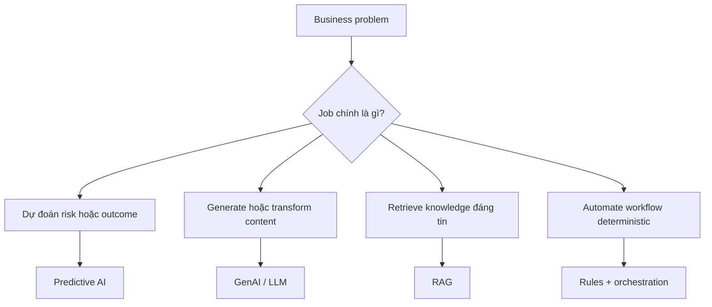

# Bức tranh AI cho Business Analyst

<div class="lesson-meta">
  <span>Nền tảng AI cho Business Analyst</span>
  <span>Software BA</span>
  <span>Core</span>
</div>

## Learning outcomes

- Phân biệt predictive AI, GenAI, RAG, agent, copilot và automation.
- Chọn đúng pattern AI trước khi đi vào solutioning.
- Nhận ra ý tưởng nào nên giải bằng workflow, rule hoặc search thay vì GenAI.

## Why this matters for BA work

<div class="ba-callout">
BA không cần trở thành kỹ sư machine learning, nhưng phải biết pattern AI nào phù hợp với loại business problem nào.
</div>

Bài này quan trọng vì thất bại sớm của sáng kiến AI thường nằm ở phân loại problem, không phải chọn model. Nếu BA frame một workflow deterministic thành tính năng GenAI, team sẽ phải gánh uncertainty, cost và governance không cần thiết. Phân loại đúng giúp bảo vệ budget, backlog priority, vendor discussion và expectation trước khi bắt đầu architecture.

## Common difficulties for BAs

Trong Nền tảng AI cho Business Analyst, Bức tranh AI cho Business Analyst trở nên khó khi stakeholder muốn câu trả lời AI thật đơn giản trong khi vấn đề thật phụ thuộc vào capability của model, data readiness, boundary của tool và risk của business decision. BA nên kiểm tra các điểm dưới đây trước khi xem artifact có AI hỗ trợ là đủ sẵn sàng cho stakeholder decision hoặc handoff.

| Khó khăn | Vì sao khó trong công việc BA | BA nên xử lý thế nào |
| --- | --- | --- |
| Gọi mọi ý tưởng AI là chatbot. | Lỗi "Gọi mọi ý tưởng AI là chatbot." xuất hiện khi team bàn về problem fit, model boundary, data dependency và decision risk nhưng chưa thống nhất source nào authoritative. AI có thể làm disagreement nghe mượt hơn, nên BA phải giữ uncertainty visible. | Áp dụng control này: yêu cầu model so sánh option AI và non-AI trước khi draft requirement. Sau đó dùng pattern tốt hơn "Phân loại job là prediction, retrieval, generation, automation hay decision support trước khi gọi tên solution." và hỏi ai phải approve artifact trước khi nó ảnh hưởng scope, build, test hoặc release. |
| Không phân biệt content generation với business decisioning. | Với Bức tranh AI cho Business Analyst, điểm khó là BA không cần trở thành kỹ sư machine learning, nhưng phải biết pattern AI nào phù hợp với loại business problem nào. Pattern yếu rất dễ xảy ra vì AI có thể tạo câu trả lời trôi chảy trước khi BA check ownership, source freshness hoặc decision right. | Áp dụng control này: yêu cầu model so sánh option AI và non-AI trước khi draft requirement. Sau đó dùng pattern tốt hơn "Chốt outcome metric, data dependency, source authority và user decision trước." và hỏi ai phải approve artifact trước khi nó ảnh hưởng scope, build, test hoặc release. |
| Bỏ qua việc problem có reliable data và metric đo được hay không. | Điểm này khó khi AI Pattern Fit Matrix được kỳ vọng hỗ trợ solution-shape decision. Nếu BA không challenge draft, unsupported assumption có thể đi vào planning, testing hoặc stakeholder communication. | Áp dụng control này: yêu cầu model so sánh option AI và non-AI trước khi draft requirement. Sau đó dùng pattern tốt hơn "Dùng rule, workflow, search hoặc RAG khi phù hợp hơn open-ended generation." và hỏi ai phải approve artifact trước khi nó ảnh hưởng scope, build, test hoặc release. |

## Where this applies in real projects

Dùng bài này khi một AI idea mới đi vào discovery, vendor discussion, roadmap planning hoặc feasibility analysis. Output thực tế không phải document dài hơn; đó là AI Pattern Fit Matrix có đủ evidence, ownership và decision clarity cho cuộc trao đổi tiếp theo của dự án.

| Thời điểm trong dự án | Cách áp dụng bài học | Output cụ thể của BA |
| --- | --- | --- |
| Idea intake | Chọn một AI idea trong backlog và phân loại bằng matrix. | AI Pattern Fit Matrix thể hiện problem fit, model boundary, data dependency và decision risk, trong đó action "Chọn một AI idea trong backlog và phân loại bằng matrix." được chuyển thành decision, requirement, checklist hoặc question có thể review ở meeting tiếp theo. |
| Feasibility review | Ghi rõ user decision mà feature cần cải thiện. | AI Pattern Fit Matrix thể hiện source evidence, trong đó action "Ghi rõ user decision mà feature cần cải thiện." được chuyển thành decision, requirement, checklist hoặc question có thể review ở meeting tiếp theo. |
| Solution framing | Tìm một non-AI alternative có thể giải cùng pain point. | AI Pattern Fit Matrix thể hiện decision owner, trong đó action "Tìm một non-AI alternative có thể giải cùng pain point." được chuyển thành decision, requirement, checklist hoặc question có thể review ở meeting tiếp theo. |

## If this is missing

Nếu thiếu Bức tranh AI cho Business Analyst, team có thể chọn tool trước khi hiểu problem shape, tạo automation tốn kém nhưng không khớp business outcome. BA vẫn có thể khôi phục, nhưng phải chuyển draft AI bóng bẩy trở lại thành evidence, assumption, owner và decision test được.

| Nếu thiếu | Ảnh hưởng tới dự án | Cách khôi phục |
| --- | --- | --- |
| Yêu cầu chatbot vì lãnh đạo muốn có AI | Tool bị xem như requirement và problem decision thật bị che khuất. | Khôi phục bằng pattern tốt hơn: Phân loại job là prediction, retrieval, generation, automation hay decision support trước khi gọi tên solution. Rework AI Pattern Fit Matrix cho đến khi nó lộ rõ problem fit, model boundary, data dependency và decision risk, và không share như bản final cho tới khi evidence, ownership và validation path explicit. |
| So sánh vendor AI trước khi định nghĩa evidence và data need | Demo vendor có thể thuyết phục dù business problem vẫn mơ hồ. | Khôi phục bằng pattern tốt hơn: Chốt outcome metric, data dependency, source authority và user decision trước. Rework AI Pattern Fit Matrix cho đến khi nó lộ rõ problem fit, model boundary, data dependency và decision risk, và không share như bản final cho tới khi evidence, ownership và validation path explicit. |
| Đưa mọi ý tưởng vào backlog GenAI | Routing đơn giản và policy ổn định trở nên chậm hơn và rủi ro hơn. | Khôi phục bằng pattern tốt hơn: Dùng rule, workflow, search hoặc RAG khi phù hợp hơn open-ended generation. Rework AI Pattern Fit Matrix cho đến khi nó lộ rõ problem fit, model boundary, data dependency và decision risk, và không share như bản final cho tới khi evidence, ownership và validation path explicit. |

## Mental model or core concept

Hãy xem AI là một portfolio capability pattern, không phải một chatbot vạn năng. Việc đầu tiên của BA là phân loại business problem: prediction, generation, retrieval, decision support, automation hay tăng tốc human workflow. Cách này giúp tránh xây solution 'trông giống AI' nhưng thật ra vấn đề nằm ở data, process hoặc search.

## Practical BA example

Team sales operations muốn một AI assistant để giảm thời gian duyệt báo giá. Phân tích yếu sẽ nhảy ngay vào requirement chatbot. BA tốt hơn sẽ map pain point: approval chậm vì pricing exception thiếu policy rõ, approval rule nằm trong email, manager cần risk signal. Solution có thể là rules automation, policy retrieval và một lớp GenAI giải thích.

## Diagram



## BA artifact

### AI Pattern Fit Matrix

| Business problem | Pattern AI phù hợp | Câu hỏi BA | Cảnh báo anti-pattern |
| --- | --- | --- | --- |
| Dự đoán churn hoặc risk | Predictive AI | Có historical label và decision nào? | Không dùng GenAI để đoán risk nếu thiếu data. |
| Trả lời từ policy nội bộ | RAG | Source nào authoritative và mới nhất? | Không cho model trả lời nếu thiếu citation. |
| Draft email, story, summary | GenAI | Context và quality rubric nào định nghĩa output tốt? | Không xem first draft là nội dung đã approved. |
| Route một request | Rules hoặc workflow automation | Rule có deterministic và ổn định không? | Không đưa LLM uncertainty vào routing đơn giản. |

## AI expert note

Với góc nhìn chuyên gia AI, tôi sẽ yêu cầu BA chứng minh problem type trước khi duyệt solution shape. Phân tích tốt phải tách language generation, knowledge retrieval, prediction, orchestration và decision support. Sự phân biệt này quyết định data need, evaluation metric, risk control, UX behavior và cả việc có nên dùng AI hay không.

## Bad vs better example

| Cách làm yếu | Vì sao fail | Cách làm BA tốt hơn |
| --- | --- | --- |
| Yêu cầu chatbot vì lãnh đạo muốn có AI | Tool bị xem như requirement và problem decision thật bị che khuất. | Phân loại job là prediction, retrieval, generation, automation hay decision support trước khi gọi tên solution. |
| So sánh vendor AI trước khi định nghĩa evidence và data need | Demo vendor có thể thuyết phục dù business problem vẫn mơ hồ. | Chốt outcome metric, data dependency, source authority và user decision trước. |
| Đưa mọi ý tưởng vào backlog GenAI | Routing đơn giản và policy ổn định trở nên chậm hơn và rủi ro hơn. | Dùng rule, workflow, search hoặc RAG khi phù hợp hơn open-ended generation. |

## AI collaboration prompt

```text
Hãy đóng vai senior BA. Phân loại ý tưởng này bằng AI Pattern Fit Matrix. Với từng option, giải thích business outcome, data dependency, decision risk, user touchpoint và vì sao GenAI, RAG, predictive AI, rules automation hoặc human workflow là phù hợp nhất. Đánh dấu rõ unsupported assumption.
```

## Mistakes to avoid

- Gọi mọi ý tưởng AI là chatbot.
- Không phân biệt content generation với business decisioning.
- Bỏ qua việc problem có reliable data và metric đo được hay không.
- Để vendor định nghĩa solution category trước khi BA frame problem.

## Apply this tomorrow

1. Chọn một AI idea trong backlog và phân loại bằng matrix.
2. Ghi rõ user decision mà feature cần cải thiện.
3. Tìm một non-AI alternative có thể giải cùng pain point.
4. Hỏi stakeholder metric nào chứng minh AI feature có hiệu quả.

## What a BA should remember

- Solution shape của AI phải đi theo problem shape.
- GenAI hữu ích cho language task, nhưng nhiều bài toán BA cần rule, data quality hoặc search.
- BA tạo clarity trước khi team chọn model hoặc tool.
