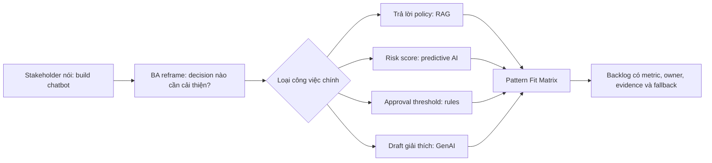
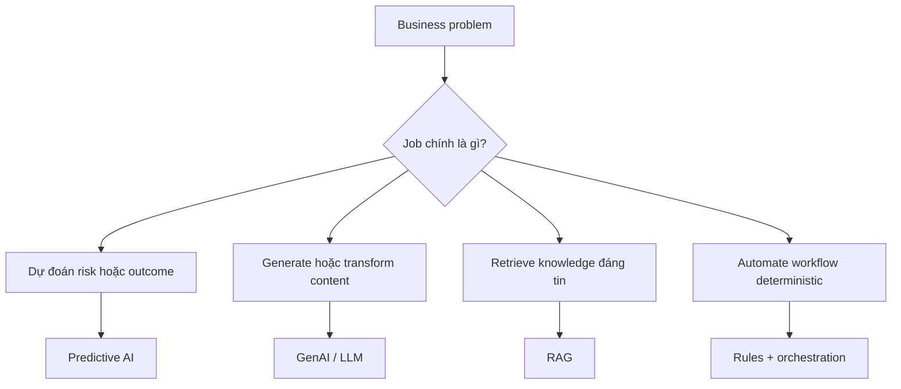

# Bức tranh AI cho Business Analyst

<div class="lesson-meta">
  <span>Nền tảng AI cho Business Analyst</span>
  <span>Software BA</span>
  <span>Core</span>
</div>

## Story mode: walkthrough theo dự án

<div class="story-mode-panel">
  <p class="story-eyebrow">Prototype dạng story</p>
  <h3>Maya biến yêu cầu chatbot thành bản đồ quyết định AI</h3>
  <p class="story-intro">Sales director yêu cầu một AI chatbot để duyệt báo giá nhanh hơn. Maya, BA của dự án, kéo cuộc thảo luận chậm lại mười phút và đổi trọng tâm từ chọn tool sang chất lượng quyết định kinh doanh.</p>
  <div class="story-scene-grid">
<article class="story-scene">
  <span>Cảnh 1</span>
  <b>01</b>
  <strong>Request nghe rất đơn giản</strong>
  <p>Stakeholder nói: chúng ta cần chatbot. Maya viết outcome thật lên bảng: giảm quote approval cycle time mà không làm tăng margin leakage.</p>
</article>
<article class="story-scene">
  <span>Cảnh 2</span>
  <b>02</b>
  <strong>Pain không chỉ có một điểm</strong>
  <p>Approval chậm vì pricing policy chưa rõ, thiếu risk signal và manager phải lục email để tìm precedent.</p>
</article>
<article class="story-scene">
  <span>Cảnh 3</span>
  <b>03</b>
  <strong>Hình dạng AI được tách ra</strong>
  <p>Câu hỏi policy cần RAG, margin risk cần predictive signal, threshold ổn định cần rules, còn đoạn giải thích có thể dùng GenAI.</p>
</article>
<article class="story-scene">
  <span>Cảnh 4</span>
  <b>04</b>
  <strong>BA đổi lại backlog</strong>
  <p>Backlog item đầu tiên không còn là build chatbot. Nó trở thành AI Pattern Fit Matrix có metric, source authority, review gate và non-AI alternative.</p>
</article>
  </div>
  <div class="visual-takeaway-strip">
<span>Problem shape trước model choice</span>
<span>Workflow evidence trước automation</span>
<span>Metric trước demo</span>
  </div>
</div>

## Reality check: số liệu hiện tại cho BA

<div class="fact-card-grid">
<article class="fact-card">
  <strong>23% + 39%</strong>
  <span>Agentic AI đang dịch chuyển, nhưng chưa mature ở mọi nơi</span>
  <p>McKinsey 2025 ghi nhận 23% tổ chức đang scale AI agent ở đâu đó và 39% đang thử nghiệm. Góc nhìn BA: phải định nghĩa autonomy boundary trước khi gọi workflow là agent-ready.</p>
  <a href="https://www.mckinsey.com/capabilities/quantumblack/our-insights/the-state-of-ai">Nguồn: McKinsey State of AI 2025</a>
</article>
<article class="fact-card">
  <strong>74%</strong>
  <span>AI đã tác động trực tiếp tới nghề BA</span>
  <p>IIBA ghi nhận 74% người tham gia khảo sát business analysis nói AI tác động tích cực tới career. Góc nhìn BA: AI literacy đang thành năng lực nghề nghiệp cốt lõi, không còn là mẹo dùng tool.</p>
  <a href="https://www.iiba.org/business-analysis-blogs/top-5-findings-from-the-2025-global-state-of-business-analysis-report/">Nguồn: IIBA Global State of BA 2025</a>
</article>
<article class="fact-card">
  <strong>21%</strong>
  <span>Value cần workflow redesign</span>
  <p>McKinsey ghi nhận 21% tổ chức dùng gen AI đã redesign căn bản ít nhất một số workflow. Góc nhìn BA: benefit đến từ decision và handoff được thiết kế lại, không phải số lượng prompt.</p>
  <a href="https://www.mckinsey.com/~/media/mckinsey/business%20functions/quantumblack/our%20insights/the%20state%20of%20ai/2025/the-state-of-ai-how-organizations-are-rewiring-to-capture-value_final.pdf">Nguồn: McKinsey State of AI 2025 PDF</a>
</article>
</div>

## Walkthrough trực quan



## Bản đồ quyết định trực quan

<div class="visual-ba-map">
  <h3>Điều BA nhìn thấy trong phòng họp</h3>
<div>
  <strong>Signal</strong>
  <span>Mọi người gọi tên AI interface trước khi gọi tên decision.</span>
  <em>Hỏi decision, metric, source và failure mode mà feature phải cải thiện.</em>
</div>
<div>
  <strong>Risk</strong>
  <span>Chatbot có thể che policy gap bằng câu chữ tự tin.</span>
  <em>Tách rules, retrieval, prediction và generation trước khi estimate.</em>
</div>
<div>
  <strong>Output</strong>
  <span>Team cần option map, không phải vendor demo.</span>
  <em>Tạo pattern fit, data dependency và anti-pattern notes.</em>
</div>
</div>

## Learning outcomes

- Phân biệt predictive AI, GenAI, RAG, agent, copilot và automation.
- Chọn đúng pattern AI trước khi đi vào solutioning.
- Nhận ra ý tưởng nào nên giải bằng workflow, rule hoặc search thay vì GenAI.

## Why this matters for BA work

<div class="ba-callout">
BA không cần trở thành kỹ sư machine learning, nhưng phải biết pattern AI nào phù hợp với loại business problem nào.
</div>

Bài này quan trọng vì thất bại sớm của sáng kiến AI thường nằm ở phân loại problem, không phải chọn model. Nếu BA frame một workflow deterministic thành tính năng GenAI, team sẽ phải gánh uncertainty, cost và governance không cần thiết. Phân loại đúng giúp bảo vệ budget, backlog priority, vendor discussion và expectation trước khi bắt đầu architecture.

## Common difficulties for BAs

Trong Nền tảng AI cho Business Analyst, Bức tranh AI cho Business Analyst trở nên khó khi stakeholder muốn câu trả lời AI thật đơn giản trong khi vấn đề thật phụ thuộc vào capability của model, data readiness, boundary của tool và risk của business decision. BA nên kiểm tra các điểm dưới đây trước khi xem artifact có AI hỗ trợ là đủ sẵn sàng cho stakeholder decision hoặc handoff.

| Khó khăn | Vì sao khó trong công việc BA | BA nên xử lý thế nào |
| --- | --- | --- |
| Gọi mọi ý tưởng AI là chatbot. | Lỗi "Gọi mọi ý tưởng AI là chatbot." xuất hiện khi team bàn về problem fit, model boundary, data dependency và decision risk nhưng chưa thống nhất source nào authoritative. AI có thể làm disagreement nghe mượt hơn, nên BA phải giữ uncertainty visible. | Áp dụng control này: yêu cầu model so sánh option AI và non-AI trước khi draft requirement. Sau đó dùng pattern tốt hơn "Phân loại job là prediction, retrieval, generation, automation hay decision support trước khi gọi tên solution." và hỏi ai phải approve artifact trước khi nó ảnh hưởng scope, build, test hoặc release. |
| Không phân biệt content generation với business decisioning. | Với Bức tranh AI cho Business Analyst, điểm khó là BA không cần trở thành kỹ sư machine learning, nhưng phải biết pattern AI nào phù hợp với loại business problem nào. Pattern yếu rất dễ xảy ra vì AI có thể tạo câu trả lời trôi chảy trước khi BA check ownership, source freshness hoặc decision right. | Áp dụng control này: yêu cầu model so sánh option AI và non-AI trước khi draft requirement. Sau đó dùng pattern tốt hơn "Chốt outcome metric, data dependency, source authority và user decision trước." và hỏi ai phải approve artifact trước khi nó ảnh hưởng scope, build, test hoặc release. |
| Bỏ qua việc problem có reliable data và metric đo được hay không. | Điểm này khó khi AI Pattern Fit Matrix được kỳ vọng hỗ trợ solution-shape decision. Nếu BA không challenge draft, unsupported assumption có thể đi vào planning, testing hoặc stakeholder communication. | Áp dụng control này: yêu cầu model so sánh option AI và non-AI trước khi draft requirement. Sau đó dùng pattern tốt hơn "Dùng rule, workflow, search hoặc RAG khi phù hợp hơn open-ended generation." và hỏi ai phải approve artifact trước khi nó ảnh hưởng scope, build, test hoặc release. |

## Where this applies in real projects

Dùng bài này khi một AI idea mới đi vào discovery, vendor discussion, roadmap planning hoặc feasibility analysis. Output thực tế không phải document dài hơn; đó là AI Pattern Fit Matrix có đủ evidence, ownership và decision clarity cho cuộc trao đổi tiếp theo của dự án.

| Thời điểm trong dự án | Cách áp dụng bài học | Output cụ thể của BA |
| --- | --- | --- |
| Idea intake | Chọn một AI idea trong backlog và phân loại bằng matrix. | AI Pattern Fit Matrix thể hiện problem fit, model boundary, data dependency và decision risk, trong đó action "Chọn một AI idea trong backlog và phân loại bằng matrix." được chuyển thành decision, requirement, checklist hoặc question có thể review ở meeting tiếp theo. |
| Feasibility review | Ghi rõ user decision mà feature cần cải thiện. | AI Pattern Fit Matrix thể hiện source evidence, trong đó action "Ghi rõ user decision mà feature cần cải thiện." được chuyển thành decision, requirement, checklist hoặc question có thể review ở meeting tiếp theo. |
| Solution framing | Tìm một non-AI alternative có thể giải cùng pain point. | AI Pattern Fit Matrix thể hiện decision owner, trong đó action "Tìm một non-AI alternative có thể giải cùng pain point." được chuyển thành decision, requirement, checklist hoặc question có thể review ở meeting tiếp theo. |

## If this is missing

Nếu thiếu Bức tranh AI cho Business Analyst, team có thể chọn tool trước khi hiểu problem shape, tạo automation tốn kém nhưng không khớp business outcome. BA vẫn có thể khôi phục, nhưng phải chuyển draft AI bóng bẩy trở lại thành evidence, assumption, owner và decision test được.

| Nếu thiếu | Ảnh hưởng tới dự án | Cách khôi phục |
| --- | --- | --- |
| Yêu cầu chatbot vì lãnh đạo muốn có AI | Tool bị xem như requirement và problem decision thật bị che khuất. | Khôi phục bằng pattern tốt hơn: Phân loại job là prediction, retrieval, generation, automation hay decision support trước khi gọi tên solution. Rework AI Pattern Fit Matrix cho đến khi nó lộ rõ problem fit, model boundary, data dependency và decision risk, và không share như bản final cho tới khi evidence, ownership và validation path explicit. |
| So sánh vendor AI trước khi định nghĩa evidence và data need | Demo vendor có thể thuyết phục dù business problem vẫn mơ hồ. | Khôi phục bằng pattern tốt hơn: Chốt outcome metric, data dependency, source authority và user decision trước. Rework AI Pattern Fit Matrix cho đến khi nó lộ rõ problem fit, model boundary, data dependency và decision risk, và không share như bản final cho tới khi evidence, ownership và validation path explicit. |
| Đưa mọi ý tưởng vào backlog GenAI | Routing đơn giản và policy ổn định trở nên chậm hơn và rủi ro hơn. | Khôi phục bằng pattern tốt hơn: Dùng rule, workflow, search hoặc RAG khi phù hợp hơn open-ended generation. Rework AI Pattern Fit Matrix cho đến khi nó lộ rõ problem fit, model boundary, data dependency và decision risk, và không share như bản final cho tới khi evidence, ownership và validation path explicit. |

## Mental model or core concept

Hãy xem AI là một portfolio capability pattern, không phải một chatbot vạn năng. Việc đầu tiên của BA là phân loại business problem: prediction, generation, retrieval, decision support, automation hay tăng tốc human workflow. Cách này giúp tránh xây solution 'trông giống AI' nhưng thật ra vấn đề nằm ở data, process hoặc search.

## Practical BA example

Team sales operations muốn một AI assistant để giảm thời gian duyệt báo giá. Phân tích yếu sẽ nhảy ngay vào requirement chatbot. BA tốt hơn sẽ map pain point: approval chậm vì pricing exception thiếu policy rõ, approval rule nằm trong email, manager cần risk signal. Solution có thể là rules automation, policy retrieval và một lớp GenAI giải thích.

## Diagram



## BA artifact

### AI Pattern Fit Matrix

| Business problem | Pattern AI phù hợp | Câu hỏi BA | Cảnh báo anti-pattern |
| --- | --- | --- | --- |
| Dự đoán churn hoặc risk | Predictive AI | Có historical label và decision nào? | Không dùng GenAI để đoán risk nếu thiếu data. |
| Trả lời từ policy nội bộ | RAG | Source nào authoritative và mới nhất? | Không cho model trả lời nếu thiếu citation. |
| Draft email, story, summary | GenAI | Context và quality rubric nào định nghĩa output tốt? | Không xem first draft là nội dung đã approved. |
| Route một request | Rules hoặc workflow automation | Rule có deterministic và ổn định không? | Không đưa LLM uncertainty vào routing đơn giản. |

## AI expert note

Với góc nhìn chuyên gia AI, tôi sẽ yêu cầu BA chứng minh problem type trước khi duyệt solution shape. Phân tích tốt phải tách language generation, knowledge retrieval, prediction, orchestration và decision support. Sự phân biệt này quyết định data need, evaluation metric, risk control, UX behavior và cả việc có nên dùng AI hay không.

## Bad vs better example

| Cách làm yếu | Vì sao fail | Cách làm BA tốt hơn |
| --- | --- | --- |
| Yêu cầu chatbot vì lãnh đạo muốn có AI | Tool bị xem như requirement và problem decision thật bị che khuất. | Phân loại job là prediction, retrieval, generation, automation hay decision support trước khi gọi tên solution. |
| So sánh vendor AI trước khi định nghĩa evidence và data need | Demo vendor có thể thuyết phục dù business problem vẫn mơ hồ. | Chốt outcome metric, data dependency, source authority và user decision trước. |
| Đưa mọi ý tưởng vào backlog GenAI | Routing đơn giản và policy ổn định trở nên chậm hơn và rủi ro hơn. | Dùng rule, workflow, search hoặc RAG khi phù hợp hơn open-ended generation. |

## Stakeholder questions to ask

| Stakeholder | Câu hỏi | Vì sao BA hỏi |
| --- | --- | --- |
| Product owner | Bức tranh AI cho Business Analyst cần cải thiện outcome nào, và trade-off nào có thể chấp nhận? | Ngăn output AI tối ưu cho mục tiêu mơ hồ. |
| Engineering lead | Source, system, data hoặc constraint nào khiến AI Pattern Fit Matrix khó implement? | Biến technical constraint ẩn thành requirement question visible. |
| QA lead | Rule, exception hoặc user state nào phải test được trước khi tin artifact này? | Chuyển wording trôi chảy của AI thành behavior quan sát được. |
| Operations hoặc support | Failure path nào tạo manual work nếu nguyên tắc "Solution shape của AI phải đi theo problem shape" bị bỏ qua? | Làm rõ support load, exception handling và operating impact. |

## Decision log entries

| Decision item | Option cần capture | Owner | Evidence cần có |
| --- | --- | --- | --- |
| Scope boundary cho AI Pattern Fit Matrix | Must-have, later, out of scope | Product owner | Business outcome và release constraint |
| Authority cho problem fit, model boundary, data dependency và decision risk | Documented source, stakeholder decision, assumption cần validate | BA + stakeholder chịu trách nhiệm | Source ID, date và approval status |
| Review gate trước handoff | Peer review, QA review, engineering review, formal approval | BA lead hoặc project lead | Risk level và receiving-team readiness |
| Cách recover nếu Gọi mọi ý tưởng AI là chatbot. | Rewrite, defer, escalate hoặc validation workshop | Decision owner | Impact lên scope, testability và release risk |

## Definition of Ready / Done

| Gate | Tín hiệu ready | Tín hiệu done |
| --- | --- | --- |
| Definition of Ready | Source cho problem fit, model boundary, data dependency và decision risk được label và còn hiệu lực. | AI Pattern Fit Matrix có thể review mà không phải đoán missing context. |
| Definition of Ready | Open assumption có owner và validation path. | Stakeholder có thể accept, reject hoặc defer từng assumption. |
| Definition of Done | Artifact áp dụng control: yêu cầu model so sánh option AI và non-AI trước khi draft requirement. | Delivery, QA hoặc governance team có thể hành động dựa trên artifact. |
| Definition of Done | Pattern yếu "Gọi mọi ý tưởng AI là chatbot." đã được kiểm tra explicit. | Không unsupported AI claim nào bị xem như requirement đã approve. |

## Before and after artifact example

| Before | Risk trong draft AI | Revision của senior BA |
| --- | --- | --- |
| Prompt: "Create AI Pattern Fit Matrix cho Bức tranh AI cho Business Analyst." | Model có thể tự bịa source fact, owner, threshold hoặc implementation rule. | Thêm source, scope boundary, source authority, output schema và instruction: Phân loại job là prediction, retrieval, generation, automation hay decision support trước khi gọi tên solution. |
| Draft statement: "Chọn một AI idea trong backlog và phân loại bằng matrix." | Action hữu ích nhưng chưa gắn decision owner hoặc acceptance signal. | Rewrite thành project step có owner, expected artifact, review gate và evidence cần trước handoff. |
| Paragraph nghe final về solution-shape decision | Tone có thể che uncertainty và approval còn thiếu. | Chuyển thành bảng fact, assumption, decision needed, risk và validation question. |

## Manual verification after AI output

| Lens kiểm tra | Manual check | Pass signal |
| --- | --- | --- |
| Evidence | Trace mọi statement quan trọng trong AI Pattern Fit Matrix về source, decision hoặc assumption có label. | Không unsupported claim nào còn bị ẩn. |
| Completeness | Check problem fit, model boundary, data dependency và decision risk theo intended audience và receiving team. | Artifact trả lời được điều product, engineering, QA và operations cần. |
| Testability | Hỏi QA có tạo được positive, negative, boundary và exception scenario không. | Wording mơ hồ được rewrite hoặc log thành question. |
| Accountability | Confirm ai approve, ai review và ai xử lý khi artifact sai. | Owner và escalation path explicit. |

## AI collaboration prompt

```text
Hãy đóng vai senior BA. Phân loại ý tưởng này bằng AI Pattern Fit Matrix. Với từng option, giải thích business outcome, data dependency, decision risk, user touchpoint và vì sao GenAI, RAG, predictive AI, rules automation hoặc human workflow là phù hợp nhất. Đánh dấu rõ unsupported assumption.
```

## Mistakes to avoid

- Gọi mọi ý tưởng AI là chatbot.
- Không phân biệt content generation với business decisioning.
- Bỏ qua việc problem có reliable data và metric đo được hay không.
- Để vendor định nghĩa solution category trước khi BA frame problem.

## Apply this tomorrow

1. Chọn một AI idea trong backlog và phân loại bằng matrix.
2. Ghi rõ user decision mà feature cần cải thiện.
3. Tìm một non-AI alternative có thể giải cùng pain point.
4. Hỏi stakeholder metric nào chứng minh AI feature có hiệu quả.

## What a BA should remember

- Solution shape của AI phải đi theo problem shape.
- GenAI hữu ích cho language task, nhưng nhiều bài toán BA cần rule, data quality hoặc search.
- BA tạo clarity trước khi team chọn model hoặc tool.
