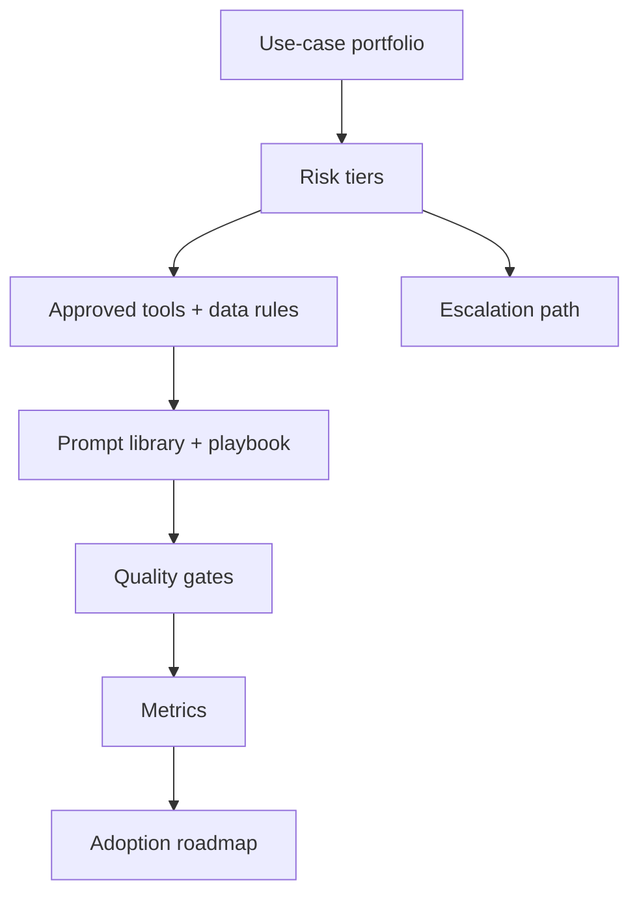

# AI strategy, governance và adoption

<div class="lesson-meta">
  <span>BA lead và expert track</span>
  <span>Software BA</span>
  <span>Expert</span>
</div>

## Learning outcomes

- Tạo AI adoption roadmap cho BA team.
- Định nghĩa governance control cho việc dùng AI trong analysis work.
- Đo adoption bằng quality, cycle time và risk reduction.

## Why this matters for BA work

<div class="ba-callout">
BA lead nên scale AI adoption bằng use-case selection, risk tier, quality gate và operating model, không phải tool enthusiasm.
</div>

Bài này quan trọng vì AI adoption ở scale BA team có thể cải thiện quality và cycle time, nhưng cũng có thể lan truyền artifact inconsistent, data leakage và false confidence. BA lead cần operating model: approved use case, risk tier, tool policy, prompt library, quality gate, training, metric và escalation path.

## Common difficulties for BAs

Trong BA lead và expert track, AI strategy, governance và adoption trở nên khó khi productivity gain của từng cá nhân phải trở thành operating model của team với governance, adoption metric và risk control thực tế. BA nên kiểm tra các điểm dưới đây trước khi xem artifact có AI hỗ trợ là đủ sẵn sàng cho stakeholder decision hoặc handoff.

| Khó khăn | Vì sao khó trong công việc BA | BA nên xử lý thế nào |
| --- | --- | --- |
| Mua tool trước khi định nghĩa safe use case. | Lỗi "Mua tool trước khi định nghĩa safe use case." xuất hiện khi team bàn về portfolio fit, policy, quality gate, adoption metric, training và escalation model nhưng chưa thống nhất source nào authoritative. AI có thể làm disagreement nghe mượt hơn, nên BA phải giữ uncertainty visible. | Áp dụng control này: tier use case AI theo sensitivity, decision impact, evidence quality và human review requirement. Sau đó dùng pattern tốt hơn "Tạo workflow theo risk tier, approved tool, training, prompt library và review gate." và hỏi ai phải approve artifact trước khi nó ảnh hưởng scope, build, test hoặc release. |
| Bỏ qua confidential data và PII rule. | Với AI strategy, governance và adoption, điểm khó là BA lead nên scale AI adoption bằng use-case selection, risk tier, quality gate và operating model, không phải tool enthusiasm. Pattern yếu rất dễ xảy ra vì AI có thể tạo câu trả lời trôi chảy trước khi BA check ownership, source freshness hoặc decision right. | Áp dụng control này: tier use case AI theo sensitivity, decision impact, evidence quality và human review requirement. Sau đó dùng pattern tốt hơn "Đo cycle time, defect reduction, evidence quality, rework và stakeholder confidence." và hỏi ai phải approve artifact trước khi nó ảnh hưởng scope, build, test hoặc release. |
| Đo adoption chỉ bằng số user. | Điểm này khó khi BA AI Adoption Scorecard được kỳ vọng hỗ trợ BA practice operating model. Nếu BA không challenge draft, unsupported assumption có thể đi vào planning, testing hoặc stakeholder communication. | Áp dụng control này: tier use case AI theo sensitivity, decision impact, evidence quality và human review requirement. Sau đó dùng pattern tốt hơn "Thiết lập BA AI operating model có governance role, audit và escalation." và hỏi ai phải approve artifact trước khi nó ảnh hưởng scope, build, test hoặc release. |

## Where this applies in real projects

Dùng bài này khi BA lead cần scale cách dùng AI qua nhiều người, tool, loại project và expectation governance. Output thực tế không phải document dài hơn; đó là BA AI Adoption Scorecard có đủ evidence, ownership và decision clarity cho cuộc trao đổi tiếp theo của dự án.

| Thời điểm trong dự án | Cách áp dụng bài học | Output cụ thể của BA |
| --- | --- | --- |
| Portfolio review | Phân loại BA AI use case theo risk tier. | BA AI Adoption Scorecard thể hiện portfolio fit, policy, quality gate, adoption metric, training và escalation model, trong đó action "Phân loại BA AI use case theo risk tier." được chuyển thành decision, requirement, checklist hoặc question có thể review ở meeting tiếp theo. |
| Governance design | Định nghĩa một approved workflow và một prohibited use. | BA AI Adoption Scorecard thể hiện source evidence, trong đó action "Định nghĩa một approved workflow và một prohibited use." được chuyển thành decision, requirement, checklist hoặc question có thể review ở meeting tiếp theo. |
| Practice rollout | Tạo quality gate cho AI-assisted requirement. | BA AI Adoption Scorecard thể hiện decision owner, trong đó action "Tạo quality gate cho AI-assisted requirement." được chuyển thành decision, requirement, checklist hoặc question có thể review ở meeting tiếp theo. |

## If this is missing

Nếu thiếu AI strategy, governance và adoption, việc dùng AI trở nên thiếu nhất quán, rủi ro, khó audit và khó cải tiến ở cấp BA practice. BA vẫn có thể khôi phục, nhưng phải chuyển draft AI bóng bẩy trở lại thành evidence, assumption, owner và decision test được.

| Nếu thiếu | Ảnh hưởng tới dự án | Cách khôi phục |
| --- | --- | --- |
| Roll out tool AI cho mọi BA rồi gọi là adoption | Usage tăng nhưng thiếu standard chung, safety rule và quality evidence. | Khôi phục bằng pattern tốt hơn: Tạo workflow theo risk tier, approved tool, training, prompt library và review gate. Rework BA AI Adoption Scorecard cho đến khi nó lộ rõ portfolio fit, policy, quality gate, adoption metric, training và escalation model, và không share như bản final cho tới khi evidence, ownership và validation path explicit. |
| Đo success bằng số prompt hoặc số user | Activity không chứng minh requirement tốt hơn hoặc decision an toàn hơn. | Khôi phục bằng pattern tốt hơn: Đo cycle time, defect reduction, evidence quality, rework và stakeholder confidence. Rework BA AI Adoption Scorecard cho đến khi nó lộ rõ portfolio fit, policy, quality gate, adoption metric, training và escalation model, và không share như bản final cho tới khi evidence, ownership và validation path explicit. |
| Để mỗi project tự invent AI rule | Quality và compliance biến động lớn giữa team. | Khôi phục bằng pattern tốt hơn: Thiết lập BA AI operating model có governance role, audit và escalation. Rework BA AI Adoption Scorecard cho đến khi nó lộ rõ portfolio fit, policy, quality gate, adoption metric, training và escalation model, và không share như bản final cho tới khi evidence, ownership và validation path explicit. |

## Mental model or core concept

AI adoption fail khi bắt đầu bằng tool thay vì operating model. BA lead nên định nghĩa safe use case, prohibited data, approved tool, prompt pattern, quality gate, training, review ritual, metric và escalation path. Governance phải enable work hữu ích đồng thời ngăn data leakage và artifact chất lượng thấp.

## Practical BA example

Một BA practice muốn mọi người dùng AI. Lead tạo risk tier: low-risk drafting, medium-risk requirement review, high-risk AI product decisions. Mỗi tier có allowed tool, data rule, review gate và measurement. Adoption trở thành managed capability, không phải random experimentation.

## Diagram



## BA artifact

### BA AI Adoption Scorecard

| Dimension | Level 1 | Level 2 | Level 3 |
| --- | --- | --- | --- |
| Use cases | Ad hoc personal use. | Approved BA workflows. | Measured portfolio theo value và risk. |
| Governance | Không có shared rule. | Data và review policy defined. | Risk-tier control và audit. |
| Quality | AI output share trực tiếp. | Peer review cho AI-assisted artifact. | Quality gate và rubric metric. |
| Capability | Tip cá nhân. | Team prompt library. | Coaching, playbook và community of practice. |

## AI expert note

AI governance nên enable high-quality work, không đóng băng experimentation. BA leadership chuyên gia định nghĩa workflow low-risk để tăng productivity, workflow medium-risk có review gate và workflow high-risk cần formal approval. Metric adoption nên đo artifact quality, review defect, cycle time, stakeholder satisfaction và avoided risk, không chỉ tool usage.

## Bad vs better example

| Cách làm yếu | Vì sao fail | Cách làm BA tốt hơn |
| --- | --- | --- |
| Roll out tool AI cho mọi BA rồi gọi là adoption | Usage tăng nhưng thiếu standard chung, safety rule và quality evidence. | Tạo workflow theo risk tier, approved tool, training, prompt library và review gate. |
| Đo success bằng số prompt hoặc số user | Activity không chứng minh requirement tốt hơn hoặc decision an toàn hơn. | Đo cycle time, defect reduction, evidence quality, rework và stakeholder confidence. |
| Để mỗi project tự invent AI rule | Quality và compliance biến động lớn giữa team. | Thiết lập BA AI operating model có governance role, audit và escalation. |

## AI collaboration prompt

```text
Tạo BA team AI adoption roadmap. Bao gồm use-case portfolio, risk tier, approved tool, prohibited data, review gate, prompt library, training plan, governance role, success metric, rollout phase và escalation process.
```

## Mistakes to avoid

- Mua tool trước khi định nghĩa safe use case.
- Bỏ qua confidential data và PII rule.
- Đo adoption chỉ bằng số user.
- Để mỗi BA tự invent quality standard.

## Apply this tomorrow

1. Phân loại BA AI use case theo risk tier.
2. Định nghĩa một approved workflow và một prohibited use.
3. Tạo quality gate cho AI-assisted requirement.
4. Đo cycle time và defect reduction cho một pilot.

## What a BA should remember

- Adoption là operating model.
- Governance nên làm good AI use dễ hơn.
- BA lead scale quality bằng shared pattern và review gate.
