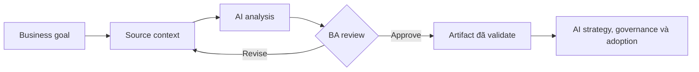

# AI strategy, governance và adoption

<div class="lesson-meta">
  <span>BA lead và expert track</span>
  <span>Software BA</span>
  <span>Expert</span>
</div>

## Learning outcomes

- Giải thích ai strategy, governance và adoption bằng ngôn ngữ business.
- Áp dụng concept vào workflow BA thực tế.
- Dùng output AI như draft có evidence, không xem là sự thật tự động.
- Xác định câu hỏi review BA phải hỏi trước khi chia sẻ artifact.

## Why this matters for BA work

AI thay đổi cách tạo ra artifact phân tích, nhưng không thay thế trách nhiệm của BA về clarity, evidence và decision.

<div class="ba-callout">
Dẫn dắt BA team adoption AI bằng governance, measurement, tool selection và operating model.
</div>

## Core concept

Pattern hữu ích cho BA là controlled collaboration: cung cấp business context cho model, yêu cầu structured output, bắt buộc có evidence, rồi review theo goal, rule, risk và decision của stakeholder.

## Practical BA example

BA lead muốn mọi analyst dùng AI. Thay vì mua tool trước, họ định nghĩa use case an toàn, data policy, prompt pattern, quality check, training và adoption metric.

## Diagram



## BA workflow

1. Đóng khung business question trước khi mở AI tool.
2. Cung cấp source context và constraint rõ ràng.
3. Yêu cầu structured output có mapping về source.
4. Chạy critique pass để tìm ambiguity, gap, risk và testability.
5. Chuyển kết quả thành artifact mà team có thể inspect và cùng chịu ownership.

## Prompt hoặc template

```text
Tạo AI adoption plan cho BA team gồm use case, risk tier, data rule, approved tool, training, quality gate, metric, governance role và rollout phase.
```

## What a BA should remember

- AI là bộ tăng tốc reasoning, không phải decision owner.
- Mọi claim quan trọng phải grounded vào source context hoặc stakeholder confirmation.
- BA giỏi giữ review loop rõ ràng: draft, critique, revise, validate.
