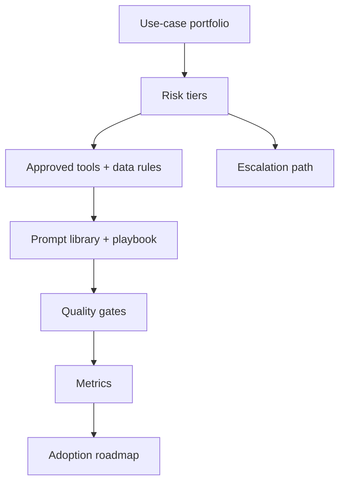

# AI strategy, governance và adoption

<div class="lesson-meta">
  <span>BA lead và expert track</span>
  <span>Software BA</span>
  <span>Expert</span>
</div>

## Learning outcomes

- Tạo AI adoption roadmap cho BA team.
- Định nghĩa governance control cho việc dùng AI trong analysis work.
- Đo adoption bằng quality, cycle time và risk reduction.

## Why this matters for BA work

<div class="ba-callout">
BA lead nên scale AI adoption bằng use-case selection, risk tier, quality gate và operating model, không phải tool enthusiasm.
</div>

Bài này quan trọng vì AI adoption ở scale BA team có thể cải thiện quality và cycle time, nhưng cũng có thể lan truyền artifact inconsistent, data leakage và false confidence. BA lead cần operating model: approved use case, risk tier, tool policy, prompt library, quality gate, training, metric và escalation path.

## Common difficulties for BAs

Trong dự án thật, chủ đề này khó vì BA phải biến evidence lộn xộn thành decision mà không để AI che mất uncertainty. Hãy chú ý các friction point này trước khi xem output là sẵn sàng.

| Khó khăn | Vì sao khó trong công việc BA | BA nên xử lý thế nào |
| --- | --- | --- |
| Mua tool trước khi định nghĩa safe use case. | Khó vì AI strategy, governance và adoption thường được áp dụng khi deadline gấp, evidence chưa đủ và stakeholder chưa thống nhất. Draft AI nghe trôi chảy có thể làm gap ít visible hơn. | Dùng source label, assumption rõ và review owner cụ thể trước khi chuyển thành backlog, specification hoặc delivery commitment. |
| Bỏ qua confidential data và PII rule. | Khó vì AI strategy, governance và adoption thường được áp dụng khi deadline gấp, evidence chưa đủ và stakeholder chưa thống nhất. Draft AI nghe trôi chảy có thể làm gap ít visible hơn. | Dùng source label, assumption rõ và review owner cụ thể trước khi chuyển thành backlog, specification hoặc delivery commitment. |
| Đo adoption chỉ bằng số user. | Khó vì AI strategy, governance và adoption thường được áp dụng khi deadline gấp, evidence chưa đủ và stakeholder chưa thống nhất. Draft AI nghe trôi chảy có thể làm gap ít visible hơn. | Dùng source label, assumption rõ và review owner cụ thể trước khi chuyển thành backlog, specification hoặc delivery commitment. |

## Where this applies in real projects

Bài này hữu ích khi BA cần chuyển conversation, policy, design hoặc technical input thành artifact chung để team implement và test được.

| Thời điểm trong dự án | Cách áp dụng bài học | Output cụ thể của BA |
| --- | --- | --- |
| Discovery | Phân loại BA AI use case theo risk tier. | BA AI Adoption Scorecard: artifact review được, nối nội dung học với decision, acceptance criteria, risk hoặc stakeholder alignment. |
| Refinement | Định nghĩa một approved workflow và một prohibited use. | BA AI Adoption Scorecard: artifact review được, nối nội dung học với decision, acceptance criteria, risk hoặc stakeholder alignment. |
| Delivery | Tạo quality gate cho AI-assisted requirement. | BA AI Adoption Scorecard: artifact review được, nối nội dung học với decision, acceptance criteria, risk hoặc stakeholder alignment. |

## If this is missing

Nếu thiếu năng lực này, AI vẫn có thể tạo text rất bóng bẩy, nhưng project mất khả năng review. Kết quả thường là rework, assumption ẩn, acceptance criteria yếu hoặc business decision thiếu evidence.

| Nếu thiếu | Ảnh hưởng tới dự án | Cách khôi phục |
| --- | --- | --- |
| Roll out tool AI cho mọi BA rồi gọi là adoption | Usage tăng nhưng thiếu standard chung, safety rule và quality evidence. | Khôi phục bằng pattern tốt hơn: Tạo workflow theo risk tier, approved tool, training, prompt library và review gate. Sau đó check lại artifact theo evidence, testability, ownership và business impact trước khi share. |
| Đo success bằng số prompt hoặc số user | Activity không chứng minh requirement tốt hơn hoặc decision an toàn hơn. | Khôi phục bằng pattern tốt hơn: Đo cycle time, defect reduction, evidence quality, rework và stakeholder confidence. Sau đó check lại artifact theo evidence, testability, ownership và business impact trước khi share. |
| Để mỗi project tự invent AI rule | Quality và compliance biến động lớn giữa team. | Khôi phục bằng pattern tốt hơn: Thiết lập BA AI operating model có governance role, audit và escalation. Sau đó check lại artifact theo evidence, testability, ownership và business impact trước khi share. |

## Mental model or core concept

AI adoption fail khi bắt đầu bằng tool thay vì operating model. BA lead nên định nghĩa safe use case, prohibited data, approved tool, prompt pattern, quality gate, training, review ritual, metric và escalation path. Governance phải enable work hữu ích đồng thời ngăn data leakage và artifact chất lượng thấp.

## Practical BA example

Một BA practice muốn mọi người dùng AI. Lead tạo risk tier: low-risk drafting, medium-risk requirement review, high-risk AI product decisions. Mỗi tier có allowed tool, data rule, review gate và measurement. Adoption trở thành managed capability, không phải random experimentation.

## Diagram



## BA artifact

### BA AI Adoption Scorecard

| Dimension | Level 1 | Level 2 | Level 3 |
| --- | --- | --- | --- |
| Use cases | Ad hoc personal use. | Approved BA workflows. | Measured portfolio theo value và risk. |
| Governance | Không có shared rule. | Data và review policy defined. | Risk-tier control và audit. |
| Quality | AI output share trực tiếp. | Peer review cho AI-assisted artifact. | Quality gate và rubric metric. |
| Capability | Tip cá nhân. | Team prompt library. | Coaching, playbook và community of practice. |

## AI expert note

AI governance nên enable high-quality work, không đóng băng experimentation. BA leadership chuyên gia định nghĩa workflow low-risk để tăng productivity, workflow medium-risk có review gate và workflow high-risk cần formal approval. Metric adoption nên đo artifact quality, review defect, cycle time, stakeholder satisfaction và avoided risk, không chỉ tool usage.

## Bad vs better example

| Cách làm yếu | Vì sao fail | Cách làm BA tốt hơn |
| --- | --- | --- |
| Roll out tool AI cho mọi BA rồi gọi là adoption | Usage tăng nhưng thiếu standard chung, safety rule và quality evidence. | Tạo workflow theo risk tier, approved tool, training, prompt library và review gate. |
| Đo success bằng số prompt hoặc số user | Activity không chứng minh requirement tốt hơn hoặc decision an toàn hơn. | Đo cycle time, defect reduction, evidence quality, rework và stakeholder confidence. |
| Để mỗi project tự invent AI rule | Quality và compliance biến động lớn giữa team. | Thiết lập BA AI operating model có governance role, audit và escalation. |

## AI collaboration prompt

```text
Tạo BA team AI adoption roadmap. Bao gồm use-case portfolio, risk tier, approved tool, prohibited data, review gate, prompt library, training plan, governance role, success metric, rollout phase và escalation process.
```

## Mistakes to avoid

- Mua tool trước khi định nghĩa safe use case.
- Bỏ qua confidential data và PII rule.
- Đo adoption chỉ bằng số user.
- Để mỗi BA tự invent quality standard.

## Apply this tomorrow

1. Phân loại BA AI use case theo risk tier.
2. Định nghĩa một approved workflow và một prohibited use.
3. Tạo quality gate cho AI-assisted requirement.
4. Đo cycle time và defect reduction cho một pilot.

## What a BA should remember

- Adoption là operating model.
- Governance nên làm good AI use dễ hơn.
- BA lead scale quality bằng shared pattern và review gate.
