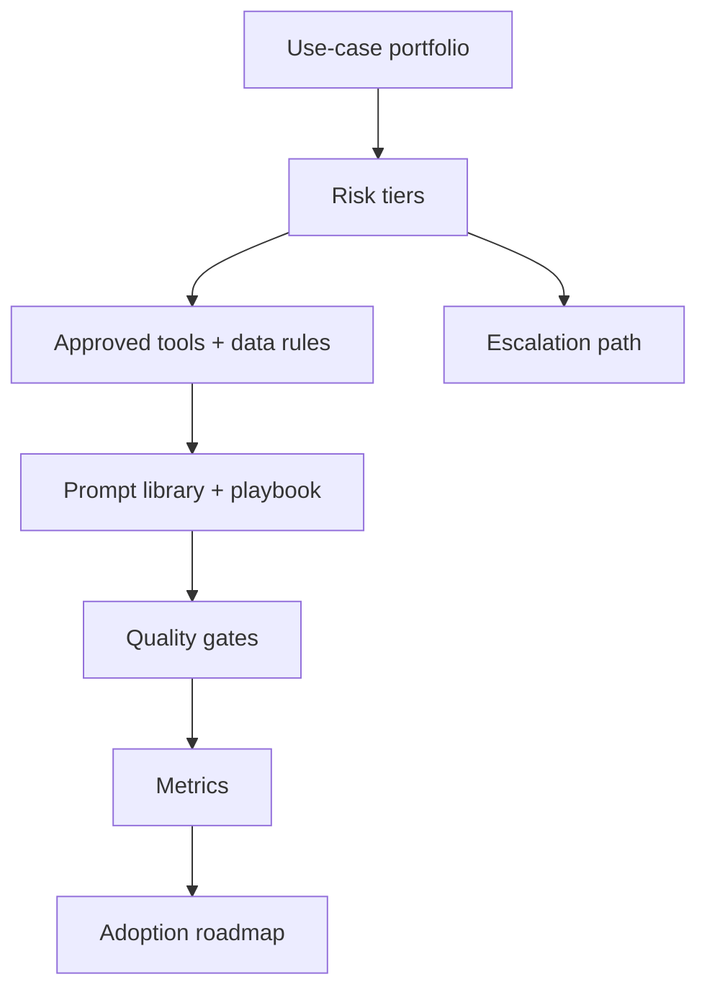

# AI strategy, governance và adoption

<div class="lesson-meta">
  <span>BA lead và expert track</span>
  <span>Software BA</span>
  <span>Expert</span>
</div>

## Learning outcomes

- Tạo AI adoption roadmap cho BA team.
- Định nghĩa governance control cho việc dùng AI trong analysis work.
- Đo adoption bằng quality, cycle time và risk reduction.

## Why this matters for BA work

<div class="ba-callout">
BA lead nên scale AI adoption bằng use-case selection, risk tier, quality gate và operating model, không phải tool enthusiasm.
</div>

Business Analyst đứng giữa problem framing, ý nghĩa từ stakeholder, constraint triển khai và product decision. Trong công việc có AI, vị trí này quan trọng hơn vì ngôn ngữ chưa rõ có thể tạo false certainty rất nhanh. Bài này đưa ra một control thực tế để áp dụng trước khi output AI trở thành scope, backlog hoặc delivery commitment.

## Mental model or core concept

AI adoption fail khi bắt đầu bằng tool thay vì operating model. BA lead nên định nghĩa safe use case, prohibited data, approved tool, prompt pattern, quality gate, training, review ritual, metric và escalation path. Governance phải enable work hữu ích đồng thời ngăn data leakage và artifact chất lượng thấp.

## Practical BA example

Một BA practice muốn mọi người dùng AI. Lead tạo risk tier: low-risk drafting, medium-risk requirement review, high-risk AI product decisions. Mỗi tier có allowed tool, data rule, review gate và measurement. Adoption trở thành managed capability, không phải random experimentation.

## Diagram



## BA artifact

### BA AI Adoption Scorecard

| Dimension | Level 1 | Level 2 | Level 3 |
| --- | --- | --- | --- |
| Use cases | Ad hoc personal use. | Approved BA workflows. | Measured portfolio theo value và risk. |
| Governance | Không có shared rule. | Data và review policy defined. | Risk-tier control và audit. |
| Quality | AI output share trực tiếp. | Peer review cho AI-assisted artifact. | Quality gate và rubric metric. |
| Capability | Tip cá nhân. | Team prompt library. | Coaching, playbook và community of practice. |

## AI collaboration prompt

```text
Tạo BA team AI adoption roadmap. Bao gồm use-case portfolio, risk tier, approved tool, prohibited data, review gate, prompt library, training plan, governance role, success metric, rollout phase và escalation process.
```

## Mistakes to avoid

- Mua tool trước khi định nghĩa safe use case.
- Bỏ qua confidential data và PII rule.
- Đo adoption chỉ bằng số user.
- Để mỗi BA tự invent quality standard.

## Apply this tomorrow

1. Phân loại BA AI use case theo risk tier.
2. Định nghĩa một approved workflow và một prohibited use.
3. Tạo quality gate cho AI-assisted requirement.
4. Đo cycle time và defect reduction cho một pilot.

## What a BA should remember

- Adoption là operating model.
- Governance nên làm good AI use dễ hơn.
- BA lead scale quality bằng shared pattern và review gate.
