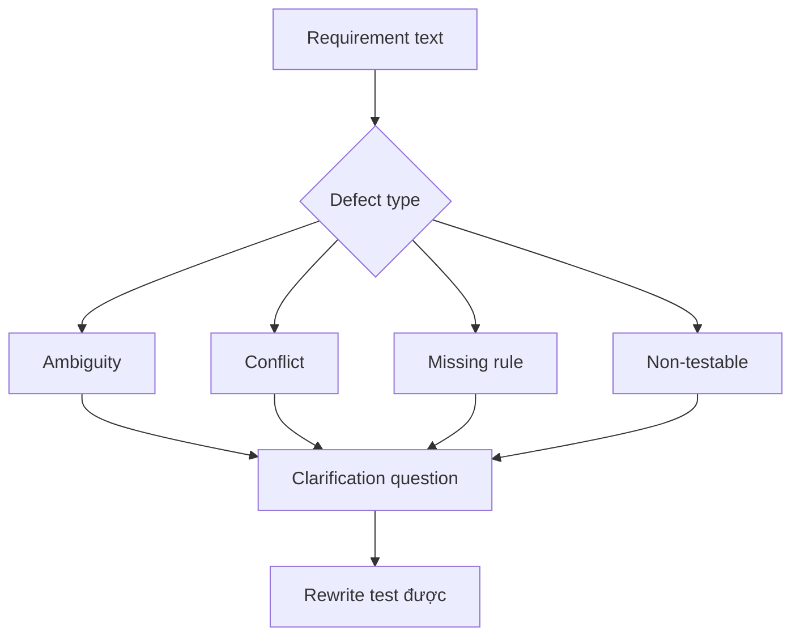

# Phân tích mơ hồ, xung đột và khoảng trống

<div class="lesson-meta">
  <span>Requirements engineering với AI</span>
  <span>Software BA</span>
  <span>Core</span>
</div>

## Learning outcomes

- Detect ambiguity, conflict, missing rule và non-testable language.
- Dùng severity để ưu tiên clarification.
- Rewrite requirement yếu thành alternative test được.

## Why this matters for BA work

<div class="ba-callout">
AI hữu ích để detect defect trong requirement khi BA cung cấp defect taxonomy và severity rubric rõ.
</div>

Business Analyst đứng giữa problem framing, ý nghĩa từ stakeholder, constraint triển khai và product decision. Trong công việc có AI, vị trí này quan trọng hơn vì ngôn ngữ chưa rõ có thể tạo false certainty rất nhanh. Bài này đưa ra một control thực tế để áp dụng trước khi output AI trở thành scope, backlog hoặc delivery commitment.

## Mental model or core concept

Requirement review tốt hơn khi defect có tên. Ambiguity, conflict, missing actor, missing data, hidden assumption và non-testable wording là các vấn đề khác nhau. AI có thể scan nhanh các category này, nhưng BA phải quyết định severity và hỏi clarification question đúng.

## Practical BA example

Requirement ghi: 'The system should notify users quickly when important changes happen.' AI flag quickly, users, important, channel, retry, opt-out, audit và SLA là gap. BA rewrite thành notification scenario đo được.

## Diagram



## BA artifact

### Requirement Defect Taxonomy

| Defect type | Signal | Clarification question | Example rewrite |
| --- | --- | --- | --- |
| Ambiguity | Term mơ hồ hoặc actor undefined. | Term hoặc actor chính xác là gì? | Notify account owner within 10 minutes. |
| Conflict | Hai rule không thể cùng đúng. | Rule nào thắng và khi nào? | VIP SLA overrides standard SLA. |
| Missing rule | Decision branch thiếu condition. | Business rule nào chọn path này? | Reject if KYC status is expired. |
| Non-testable | Không có expected result observable. | QA verify success bằng gì? | Email status is logged as sent or failed. |

## AI collaboration prompt

```text
Review requirement này bằng defect taxonomy. Trả về defect type, severity, affected text, why it matters, clarification question và candidate rewrite test được. Giữ unsupported rewrite với label assumption.
```

## Mistakes to avoid

- Nói 'unclear' mà không gọi tên defect.
- Sửa wording nhưng không sửa business rule gốc.
- Xem mọi defect cùng severity.
- Để AI rewrite requirement mà không validate source.

## Apply this tomorrow

1. Chạy taxonomy review trên năm backlog item.
2. Thêm severity và clarification question cho mỗi finding.
3. Rewrite một requirement mơ hồ thành language test được.
4. Nhờ stakeholder approve rewritten rule.

## What a BA should remember

- Defect có tên làm review nhanh hơn.
- Clarification question có giá trị như rewrite.
- AI tìm defect khả nghi; BA confirm business meaning.
