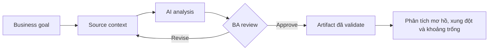

# Phân tích mơ hồ, xung đột và khoảng trống

<div class="lesson-meta">
  <span>Requirements engineering với AI</span>
  <span>Software BA</span>
  <span>Core</span>
</div>

## Learning outcomes

- Giải thích phân tích mơ hồ, xung đột và khoảng trống bằng ngôn ngữ business.
- Áp dụng concept vào workflow BA thực tế.
- Dùng output AI như draft có evidence, không xem là sự thật tự động.
- Xác định câu hỏi review BA phải hỏi trước khi chia sẻ artifact.

## Why this matters for BA work

AI thay đổi cách tạo ra artifact phân tích, nhưng không thay thế trách nhiệm của BA về clarity, evidence và decision.

<div class="ba-callout">
Dùng AI để tìm từ mơ hồ, rule không nhất quán, actor thiếu, edge case thiếu và assumption không được nói rõ.
</div>

## Core concept

Pattern hữu ích cho BA là controlled collaboration: cung cấp business context cho model, yêu cầu structured output, bắt buộc có evidence, rồi review theo goal, rule, risk và decision của stakeholder.

## Practical BA example

Requirement ghi 'system should notify users quickly.' AI flag 'quickly' là không test được, hỏi SLA, channel, retry, failure, opt-out và audit behavior.

## Diagram



## BA workflow

1. Đóng khung business question trước khi mở AI tool.
2. Cung cấp source context và constraint rõ ràng.
3. Yêu cầu structured output có mapping về source.
4. Chạy critique pass để tìm ambiguity, gap, risk và testability.
5. Chuyển kết quả thành artifact mà team có thể inspect và cùng chịu ownership.

## Prompt hoặc template

```text
Tìm ambiguity, conflict, actor thiếu, data thiếu, edge case thiếu và ngôn ngữ không test được. Trả về mỗi issue với severity và clarification question.
```

## What a BA should remember

- AI là bộ tăng tốc reasoning, không phải decision owner.
- Mọi claim quan trọng phải grounded vào source context hoặc stakeholder confirmation.
- BA giỏi giữ review loop rõ ràng: draft, critique, revise, validate.
