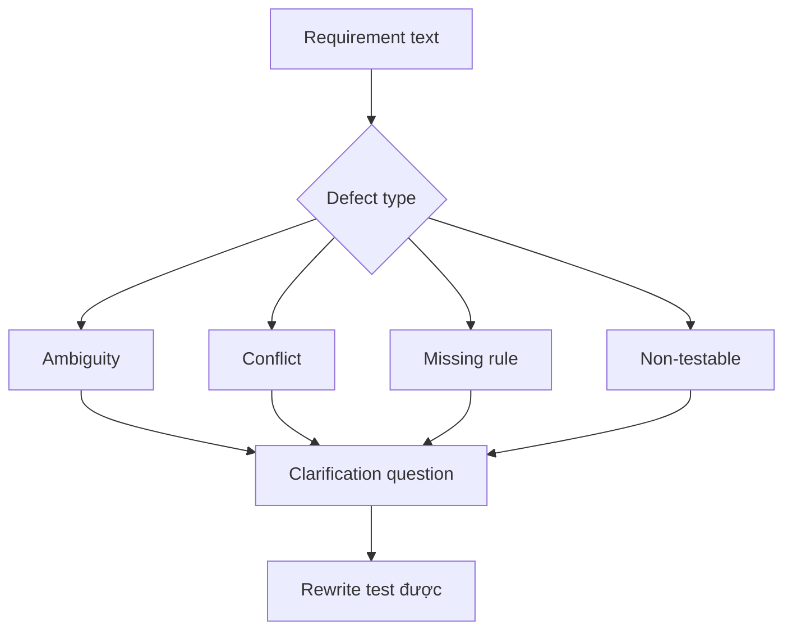

# Phân tích mơ hồ, xung đột và khoảng trống

<div class="lesson-meta">
  <span>Requirements engineering với AI</span>
  <span>Software BA</span>
  <span>Core</span>
</div>

## Learning outcomes

- Detect ambiguity, conflict, missing rule và non-testable language.
- Dùng severity để ưu tiên clarification.
- Rewrite requirement yếu thành alternative test được.

## Why this matters for BA work

<div class="ba-callout">
AI hữu ích để detect defect trong requirement khi BA cung cấp defect taxonomy và severity rubric rõ.
</div>

Bài này quan trọng vì requirement mơ hồ tạo defect đắt nhất khi sống sót tới design, build và testing. AI có thể scan vague language và contradiction, nhưng BA phải biến finding thành defect taxonomy có kỷ luật. Mục tiêu không phải wording hay hơn; mục tiêu là decision clarity sớm hơn.

## Common difficulties for BAs

Trong Requirements engineering với AI, Phân tích mơ hồ, xung đột và khoảng trống trở nên khó khi business rule, edge case, quality attribute và testability constraint phải sống sót khi chuyển từ conversation sang backlog. BA nên kiểm tra các điểm dưới đây trước khi xem artifact có AI hỗ trợ là đủ sẵn sàng cho stakeholder decision hoặc handoff.

| Khó khăn | Vì sao khó trong công việc BA | BA nên xử lý thế nào |
| --- | --- | --- |
| Nói 'unclear' mà không gọi tên defect. | Lỗi "Nói 'unclear' mà không gọi tên defect." xuất hiện khi team bàn về ambiguity, NFR risk, traceability, testability và rule ownership nhưng chưa thống nhất source nào authoritative. AI có thể làm disagreement nghe mượt hơn, nên BA phải giữ uncertainty visible. | Áp dụng control này: buộc mọi requirement statement lộ rõ actor, trigger, data, rule, exception và verification signal. Sau đó dùng pattern tốt hơn "Classify issue type, severity, evidence và owner trước khi rewrite." và hỏi ai phải approve artifact trước khi nó ảnh hưởng scope, build, test hoặc release. |
| Sửa wording nhưng không sửa business rule gốc. | Với Phân tích mơ hồ, xung đột và khoảng trống, điểm khó là AI hữu ích để detect defect trong requirement khi BA cung cấp defect taxonomy và severity rubric rõ. Pattern yếu rất dễ xảy ra vì AI có thể tạo câu trả lời trôi chảy trước khi BA check ownership, source freshness hoặc decision right. | Áp dụng control này: buộc mọi requirement statement lộ rõ actor, trigger, data, rule, exception và verification signal. Sau đó dùng pattern tốt hơn "Rank ambiguity theo business impact, test impact, regulatory impact và dependency." và hỏi ai phải approve artifact trước khi nó ảnh hưởng scope, build, test hoặc release. |
| Xem mọi defect cùng severity. | Điểm này khó khi Requirement Defect Taxonomy được kỳ vọng hỗ trợ delivery-ready requirement. Nếu BA không challenge draft, unsupported assumption có thể đi vào planning, testing hoặc stakeholder communication. | Áp dụng control này: buộc mọi requirement statement lộ rõ actor, trigger, data, rule, exception và verification signal. Sau đó dùng pattern tốt hơn "Chỉ rewrite phần source-supported và mark phần còn lại thành clarification question." và hỏi ai phải approve artifact trước khi nó ảnh hưởng scope, build, test hoặc release. |

## Where this applies in real projects

Dùng bài này khi requirement đang được refine, split, clarify, test hoặc bị QA và delivery team challenge. Output thực tế không phải document dài hơn; đó là Requirement Defect Taxonomy có đủ evidence, ownership và decision clarity cho cuộc trao đổi tiếp theo của dự án.

| Thời điểm trong dự án | Cách áp dụng bài học | Output cụ thể của BA |
| --- | --- | --- |
| Backlog refinement | Chạy taxonomy review trên năm backlog item. | Requirement Defect Taxonomy thể hiện ambiguity, NFR risk, traceability, testability và rule ownership, trong đó action "Chạy taxonomy review trên năm backlog item." được chuyển thành decision, requirement, checklist hoặc question có thể review ở meeting tiếp theo. |
| QA alignment | Thêm severity và clarification question cho mỗi finding. | Requirement Defect Taxonomy thể hiện source evidence, trong đó action "Thêm severity và clarification question cho mỗi finding." được chuyển thành decision, requirement, checklist hoặc question có thể review ở meeting tiếp theo. |
| Release readiness | Rewrite một requirement mơ hồ thành language test được. | Requirement Defect Taxonomy thể hiện decision owner, trong đó action "Rewrite một requirement mơ hồ thành language test được." được chuyển thành decision, requirement, checklist hoặc question có thể review ở meeting tiếp theo. |

## If this is missing

Nếu thiếu Phân tích mơ hồ, xung đột và khoảng trống, requirement nhìn có vẻ đầy đủ nhưng vẫn fail khi implement, test, release hoặc support operation. BA vẫn có thể khôi phục, nhưng phải chuyển draft AI bóng bẩy trở lại thành evidence, assumption, owner và decision test được.

| Nếu thiếu | Ảnh hưởng tới dự án | Cách khôi phục |
| --- | --- | --- |
| Yêu cầu AI làm requirement rõ hơn | Model có thể làm mượt missing decision thay vì phơi bày nó. | Khôi phục bằng pattern tốt hơn: Classify issue type, severity, evidence và owner trước khi rewrite. Rework Requirement Defect Taxonomy cho đến khi nó lộ rõ ambiguity, NFR risk, traceability, testability và rule ownership, và không share như bản final cho tới khi evidence, ownership và validation path explicit. |
| Xem mọi ambiguity là như nhau | Một label mơ hồ và một missing compliance rule có delivery risk rất khác. | Khôi phục bằng pattern tốt hơn: Rank ambiguity theo business impact, test impact, regulatory impact và dependency. Rework Requirement Defect Taxonomy cho đến khi nó lộ rõ ambiguity, NFR risk, traceability, testability và rule ownership, và không share như bản final cho tới khi evidence, ownership và validation path explicit. |
| Accept rewrite AI có thêm detail mới | Rewrite có thể tự bịa threshold, actor hoặc policy. | Khôi phục bằng pattern tốt hơn: Chỉ rewrite phần source-supported và mark phần còn lại thành clarification question. Rework Requirement Defect Taxonomy cho đến khi nó lộ rõ ambiguity, NFR risk, traceability, testability và rule ownership, và không share như bản final cho tới khi evidence, ownership và validation path explicit. |

## Mental model or core concept

Requirement review tốt hơn khi defect có tên. Ambiguity, conflict, missing actor, missing data, hidden assumption và non-testable wording là các vấn đề khác nhau. AI có thể scan nhanh các category này, nhưng BA phải quyết định severity và hỏi clarification question đúng.

## Practical BA example

Requirement ghi: 'The system should notify users quickly when important changes happen.' AI flag quickly, users, important, channel, retry, opt-out, audit và SLA là gap. BA rewrite thành notification scenario đo được.

## Diagram



## BA artifact

### Requirement Defect Taxonomy

| Defect type | Signal | Clarification question | Example rewrite |
| --- | --- | --- | --- |
| Ambiguity | Term mơ hồ hoặc actor undefined. | Term hoặc actor chính xác là gì? | Notify account owner within 10 minutes. |
| Conflict | Hai rule không thể cùng đúng. | Rule nào thắng và khi nào? | VIP SLA overrides standard SLA. |
| Missing rule | Decision branch thiếu condition. | Business rule nào chọn path này? | Reject if KYC status is expired. |
| Non-testable | Không có expected result observable. | QA verify success bằng gì? | Email status is logged as sent or failed. |

## AI expert note

Ambiguity analysis nên tách missing information, conflicting rule, undefined term, non-testable adjective, actor confusion và decision gap. AI mạnh ở pattern detection, nhưng BA chuyên gia gán severity, evidence, owner và clarification path. Rewrite không có decision support vẫn chỉ là assumption.

## Bad vs better example

| Cách làm yếu | Vì sao fail | Cách làm BA tốt hơn |
| --- | --- | --- |
| Yêu cầu AI làm requirement rõ hơn | Model có thể làm mượt missing decision thay vì phơi bày nó. | Classify issue type, severity, evidence và owner trước khi rewrite. |
| Xem mọi ambiguity là như nhau | Một label mơ hồ và một missing compliance rule có delivery risk rất khác. | Rank ambiguity theo business impact, test impact, regulatory impact và dependency. |
| Accept rewrite AI có thêm detail mới | Rewrite có thể tự bịa threshold, actor hoặc policy. | Chỉ rewrite phần source-supported và mark phần còn lại thành clarification question. |

## Stakeholder questions to ask

| Stakeholder | Câu hỏi | Vì sao BA hỏi |
| --- | --- | --- |
| Product owner | Phân tích mơ hồ, xung đột và khoảng trống cần cải thiện outcome nào, và trade-off nào có thể chấp nhận? | Ngăn output AI tối ưu cho mục tiêu mơ hồ. |
| Engineering lead | Source, system, data hoặc constraint nào khiến Requirement Defect Taxonomy khó implement? | Biến technical constraint ẩn thành requirement question visible. |
| QA lead | Rule, exception hoặc user state nào phải test được trước khi tin artifact này? | Chuyển wording trôi chảy của AI thành behavior quan sát được. |
| Operations hoặc support | Failure path nào tạo manual work nếu nguyên tắc "Defect có tên làm review nhanh hơn" bị bỏ qua? | Làm rõ support load, exception handling và operating impact. |

## Decision log entries

| Decision item | Option cần capture | Owner | Evidence cần có |
| --- | --- | --- | --- |
| Scope boundary cho Requirement Defect Taxonomy | Must-have, later, out of scope | Product owner | Business outcome và release constraint |
| Authority cho ambiguity, NFR risk, traceability, testability và rule ownership | Documented source, stakeholder decision, assumption cần validate | BA + stakeholder chịu trách nhiệm | Source ID, date và approval status |
| Review gate trước handoff | Peer review, QA review, engineering review, formal approval | BA lead hoặc project lead | Risk level và receiving-team readiness |
| Cách recover nếu Nói 'unclear' mà không gọi tên defect. | Rewrite, defer, escalate hoặc validation workshop | Decision owner | Impact lên scope, testability và release risk |

## Definition of Ready / Done

| Gate | Tín hiệu ready | Tín hiệu done |
| --- | --- | --- |
| Definition of Ready | Source cho ambiguity, NFR risk, traceability, testability và rule ownership được label và còn hiệu lực. | Requirement Defect Taxonomy có thể review mà không phải đoán missing context. |
| Definition of Ready | Open assumption có owner và validation path. | Stakeholder có thể accept, reject hoặc defer từng assumption. |
| Definition of Done | Artifact áp dụng control: buộc mọi requirement statement lộ rõ actor, trigger, data, rule, exception và verification signal. | Delivery, QA hoặc governance team có thể hành động dựa trên artifact. |
| Definition of Done | Pattern yếu "Nói 'unclear' mà không gọi tên defect." đã được kiểm tra explicit. | Không unsupported AI claim nào bị xem như requirement đã approve. |

## Before and after artifact example

| Before | Risk trong draft AI | Revision của senior BA |
| --- | --- | --- |
| Prompt: "Create Requirement Defect Taxonomy cho Phân tích mơ hồ, xung đột và khoảng trống." | Model có thể tự bịa source fact, owner, threshold hoặc implementation rule. | Thêm source, scope boundary, source authority, output schema và instruction: Classify issue type, severity, evidence và owner trước khi rewrite. |
| Draft statement: "Chạy taxonomy review trên năm backlog item." | Action hữu ích nhưng chưa gắn decision owner hoặc acceptance signal. | Rewrite thành project step có owner, expected artifact, review gate và evidence cần trước handoff. |
| Paragraph nghe final về delivery-ready requirement | Tone có thể che uncertainty và approval còn thiếu. | Chuyển thành bảng fact, assumption, decision needed, risk và validation question. |

## Manual verification after AI output

| Lens kiểm tra | Manual check | Pass signal |
| --- | --- | --- |
| Evidence | Trace mọi statement quan trọng trong Requirement Defect Taxonomy về source, decision hoặc assumption có label. | Không unsupported claim nào còn bị ẩn. |
| Completeness | Check ambiguity, NFR risk, traceability, testability và rule ownership theo intended audience và receiving team. | Artifact trả lời được điều product, engineering, QA và operations cần. |
| Testability | Hỏi QA có tạo được positive, negative, boundary và exception scenario không. | Wording mơ hồ được rewrite hoặc log thành question. |
| Accountability | Confirm ai approve, ai review và ai xử lý khi artifact sai. | Owner và escalation path explicit. |

## AI collaboration prompt

```text
Review requirement này bằng defect taxonomy. Trả về defect type, severity, affected text, why it matters, clarification question và candidate rewrite test được. Giữ unsupported rewrite với label assumption.
```

## Mistakes to avoid

- Nói 'unclear' mà không gọi tên defect.
- Sửa wording nhưng không sửa business rule gốc.
- Xem mọi defect cùng severity.
- Để AI rewrite requirement mà không validate source.

## Apply this tomorrow

1. Chạy taxonomy review trên năm backlog item.
2. Thêm severity và clarification question cho mỗi finding.
3. Rewrite một requirement mơ hồ thành language test được.
4. Nhờ stakeholder approve rewritten rule.

## What a BA should remember

- Defect có tên làm review nhanh hơn.
- Clarification question có giá trị như rewrite.
- AI tìm defect khả nghi; BA confirm business meaning.
