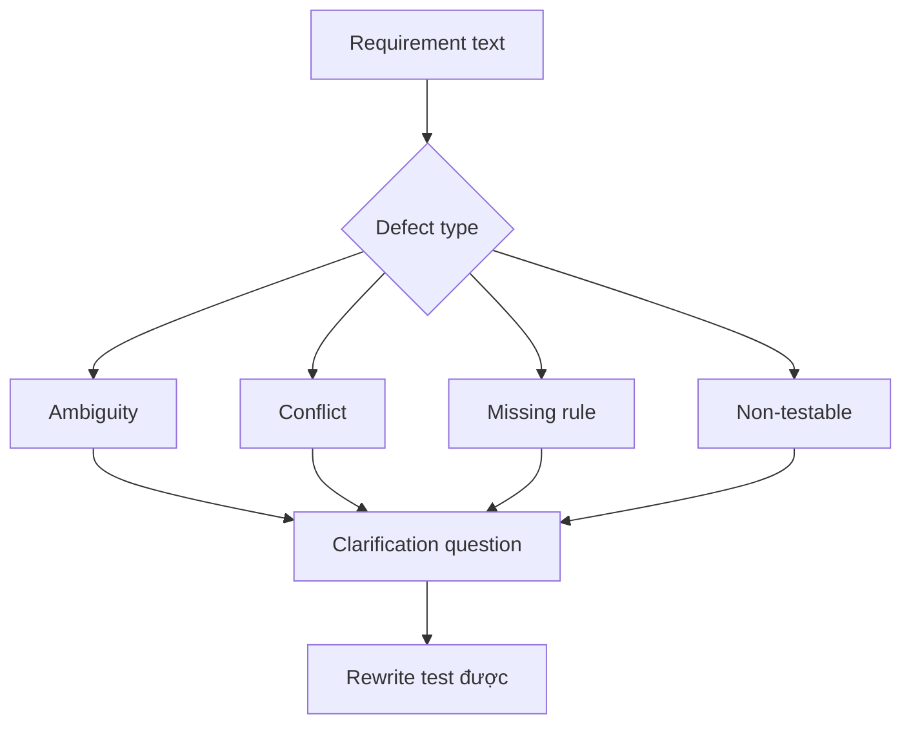

# Phân tích mơ hồ, xung đột và khoảng trống

<div class="lesson-meta">
  <span>Requirements engineering với AI</span>
  <span>Software BA</span>
  <span>Core</span>
</div>

## Learning outcomes

- Detect ambiguity, conflict, missing rule và non-testable language.
- Dùng severity để ưu tiên clarification.
- Rewrite requirement yếu thành alternative test được.

## Why this matters for BA work

<div class="ba-callout">
AI hữu ích để detect defect trong requirement khi BA cung cấp defect taxonomy và severity rubric rõ.
</div>

Bài này quan trọng vì requirement mơ hồ tạo defect đắt nhất khi sống sót tới design, build và testing. AI có thể scan vague language và contradiction, nhưng BA phải biến finding thành defect taxonomy có kỷ luật. Mục tiêu không phải wording hay hơn; mục tiêu là decision clarity sớm hơn.

## Common difficulties for BAs

Trong dự án thật, chủ đề này khó vì BA phải biến evidence lộn xộn thành decision mà không để AI che mất uncertainty. Hãy chú ý các friction point này trước khi xem output là sẵn sàng.

| Khó khăn | Vì sao khó trong công việc BA | BA nên xử lý thế nào |
| --- | --- | --- |
| Nói 'unclear' mà không gọi tên defect. | Khó vì Phân tích mơ hồ, xung đột và khoảng trống thường được áp dụng khi deadline gấp, evidence chưa đủ và stakeholder chưa thống nhất. Draft AI nghe trôi chảy có thể làm gap ít visible hơn. | Dùng source label, assumption rõ và review owner cụ thể trước khi chuyển thành backlog, specification hoặc delivery commitment. |
| Sửa wording nhưng không sửa business rule gốc. | Khó vì Phân tích mơ hồ, xung đột và khoảng trống thường được áp dụng khi deadline gấp, evidence chưa đủ và stakeholder chưa thống nhất. Draft AI nghe trôi chảy có thể làm gap ít visible hơn. | Dùng source label, assumption rõ và review owner cụ thể trước khi chuyển thành backlog, specification hoặc delivery commitment. |
| Xem mọi defect cùng severity. | Khó vì Phân tích mơ hồ, xung đột và khoảng trống thường được áp dụng khi deadline gấp, evidence chưa đủ và stakeholder chưa thống nhất. Draft AI nghe trôi chảy có thể làm gap ít visible hơn. | Dùng source label, assumption rõ và review owner cụ thể trước khi chuyển thành backlog, specification hoặc delivery commitment. |

## Where this applies in real projects

Bài này hữu ích khi BA cần chuyển conversation, policy, design hoặc technical input thành artifact chung để team implement và test được.

| Thời điểm trong dự án | Cách áp dụng bài học | Output cụ thể của BA |
| --- | --- | --- |
| Discovery | Chạy taxonomy review trên năm backlog item. | Requirement Defect Taxonomy: artifact review được, nối nội dung học với decision, acceptance criteria, risk hoặc stakeholder alignment. |
| Refinement | Thêm severity và clarification question cho mỗi finding. | Requirement Defect Taxonomy: artifact review được, nối nội dung học với decision, acceptance criteria, risk hoặc stakeholder alignment. |
| Delivery | Rewrite một requirement mơ hồ thành language test được. | Requirement Defect Taxonomy: artifact review được, nối nội dung học với decision, acceptance criteria, risk hoặc stakeholder alignment. |

## If this is missing

Nếu thiếu năng lực này, AI vẫn có thể tạo text rất bóng bẩy, nhưng project mất khả năng review. Kết quả thường là rework, assumption ẩn, acceptance criteria yếu hoặc business decision thiếu evidence.

| Nếu thiếu | Ảnh hưởng tới dự án | Cách khôi phục |
| --- | --- | --- |
| Yêu cầu AI làm requirement rõ hơn | Model có thể làm mượt missing decision thay vì phơi bày nó. | Khôi phục bằng pattern tốt hơn: Classify issue type, severity, evidence và owner trước khi rewrite. Sau đó check lại artifact theo evidence, testability, ownership và business impact trước khi share. |
| Xem mọi ambiguity là như nhau | Một label mơ hồ và một missing compliance rule có delivery risk rất khác. | Khôi phục bằng pattern tốt hơn: Rank ambiguity theo business impact, test impact, regulatory impact và dependency. Sau đó check lại artifact theo evidence, testability, ownership và business impact trước khi share. |
| Accept rewrite AI có thêm detail mới | Rewrite có thể tự bịa threshold, actor hoặc policy. | Khôi phục bằng pattern tốt hơn: Chỉ rewrite phần source-supported và mark phần còn lại thành clarification question. Sau đó check lại artifact theo evidence, testability, ownership và business impact trước khi share. |

## Mental model or core concept

Requirement review tốt hơn khi defect có tên. Ambiguity, conflict, missing actor, missing data, hidden assumption và non-testable wording là các vấn đề khác nhau. AI có thể scan nhanh các category này, nhưng BA phải quyết định severity và hỏi clarification question đúng.

## Practical BA example

Requirement ghi: 'The system should notify users quickly when important changes happen.' AI flag quickly, users, important, channel, retry, opt-out, audit và SLA là gap. BA rewrite thành notification scenario đo được.

## Diagram



## BA artifact

### Requirement Defect Taxonomy

| Defect type | Signal | Clarification question | Example rewrite |
| --- | --- | --- | --- |
| Ambiguity | Term mơ hồ hoặc actor undefined. | Term hoặc actor chính xác là gì? | Notify account owner within 10 minutes. |
| Conflict | Hai rule không thể cùng đúng. | Rule nào thắng và khi nào? | VIP SLA overrides standard SLA. |
| Missing rule | Decision branch thiếu condition. | Business rule nào chọn path này? | Reject if KYC status is expired. |
| Non-testable | Không có expected result observable. | QA verify success bằng gì? | Email status is logged as sent or failed. |

## AI expert note

Ambiguity analysis nên tách missing information, conflicting rule, undefined term, non-testable adjective, actor confusion và decision gap. AI mạnh ở pattern detection, nhưng BA chuyên gia gán severity, evidence, owner và clarification path. Rewrite không có decision support vẫn chỉ là assumption.

## Bad vs better example

| Cách làm yếu | Vì sao fail | Cách làm BA tốt hơn |
| --- | --- | --- |
| Yêu cầu AI làm requirement rõ hơn | Model có thể làm mượt missing decision thay vì phơi bày nó. | Classify issue type, severity, evidence và owner trước khi rewrite. |
| Xem mọi ambiguity là như nhau | Một label mơ hồ và một missing compliance rule có delivery risk rất khác. | Rank ambiguity theo business impact, test impact, regulatory impact và dependency. |
| Accept rewrite AI có thêm detail mới | Rewrite có thể tự bịa threshold, actor hoặc policy. | Chỉ rewrite phần source-supported và mark phần còn lại thành clarification question. |

## AI collaboration prompt

```text
Review requirement này bằng defect taxonomy. Trả về defect type, severity, affected text, why it matters, clarification question và candidate rewrite test được. Giữ unsupported rewrite với label assumption.
```

## Mistakes to avoid

- Nói 'unclear' mà không gọi tên defect.
- Sửa wording nhưng không sửa business rule gốc.
- Xem mọi defect cùng severity.
- Để AI rewrite requirement mà không validate source.

## Apply this tomorrow

1. Chạy taxonomy review trên năm backlog item.
2. Thêm severity và clarification question cho mỗi finding.
3. Rewrite một requirement mơ hồ thành language test được.
4. Nhờ stakeholder approve rewritten rule.

## What a BA should remember

- Defect có tên làm review nhanh hơn.
- Clarification question có giá trị như rewrite.
- AI tìm defect khả nghi; BA confirm business meaning.
