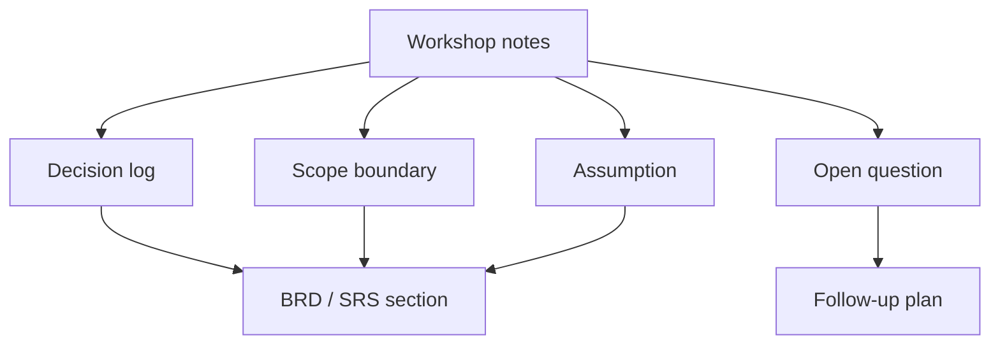

# BRD, SRS và artifact quyết định

<div class="lesson-meta">
  <span>Artifact phân tích và diagramming</span>
  <span>Software BA</span>
  <span>Core</span>
</div>

## Learning outcomes

- Dùng AI structure BRD và SRS mà không mất ownership.
- Giữ decision, assumption, risk và evidence.
- Tránh document polish che giấu unresolved scope.

## Why this matters for BA work

<div class="ba-callout">
AI có thể draft tài liệu, nhưng giá trị BA nằm ở decision structure, evidence, scope control và reviewability.
</div>

Bài này quan trọng vì AI có thể draft BRD và SRS rất nhanh, nhưng formal document không chỉ là text. Nó là record của decision, scope boundary, evidence, ownership và change control. BA phải bảo đảm document có AI hỗ trợ giữ được decision logic thay vì tạo trang bóng bẩy che giấu commitment chưa resolve.

## Common difficulties for BAs

Trong Artifact phân tích và diagramming, BRD, SRS và artifact quyết định trở nên khó khi BA phải chuyển decision phức tạp thành artifact mà product, engineering, QA, support và compliance đều inspect được. BA nên kiểm tra các điểm dưới đây trước khi xem artifact có AI hỗ trợ là đủ sẵn sàng cho stakeholder decision hoặc handoff.

| Khó khăn | Vì sao khó trong công việc BA | BA nên xử lý thế nào |
| --- | --- | --- |
| Dùng AI tạo document polished trước khi decision rõ. | Lỗi "Dùng AI tạo document polished trước khi decision rõ." xuất hiện khi team bàn về artifact purpose, audience, diagram clarity, decision trace và handoff quality nhưng chưa thống nhất source nào authoritative. AI có thể làm disagreement nghe mượt hơn, nên BA phải giữ uncertainty visible. | Áp dụng control này: review artifact với team phải build, test hoặc operate dựa trên artifact đó. Sau đó dùng pattern tốt hơn "Generate document skeleton kèm decision gap, evidence map và open approval item." và hỏi ai phải approve artifact trước khi nó ảnh hưởng scope, build, test hoặc release. |
| Giấu assumption trong prose. | Với BRD, SRS và artifact quyết định, điểm khó là AI có thể draft tài liệu, nhưng giá trị BA nằm ở decision structure, evidence, scope control và reviewability. Pattern yếu rất dễ xảy ra vì AI có thể tạo câu trả lời trôi chảy trước khi BA check ownership, source freshness hoặc decision right. | Áp dụng control này: review artifact với team phải build, test hoặc operate dựa trên artifact đó. Sau đó dùng pattern tốt hơn "Represent conflict explicit với option, impact, owner và decision date." và hỏi ai phải approve artifact trước khi nó ảnh hưởng scope, build, test hoặc release. |
| Trộn current state, future state và open question. | Điểm này khó khi Decision Artifact Skeleton được kỳ vọng hỗ trợ cross-functional handoff artifact. Nếu BA không challenge draft, unsupported assumption có thể đi vào planning, testing hoặc stakeholder communication. | Áp dụng control này: review artifact với team phải build, test hoặc operate dựa trên artifact đó. Sau đó dùng pattern tốt hơn "Giữ assumption, dependency và open question trong section được governance." và hỏi ai phải approve artifact trước khi nó ảnh hưởng scope, build, test hoặc release. |

## Where this applies in real projects

Dùng bài này khi BRD, SRS, decision memo, flow, sequence hoặc integration artifact phải carry decision qua nhiều role. Output thực tế không phải document dài hơn; đó là Decision Artifact Skeleton có đủ evidence, ownership và decision clarity cho cuộc trao đổi tiếp theo của dự án.

| Thời điểm trong dự án | Cách áp dụng bài học | Output cụ thể của BA |
| --- | --- | --- |
| Artifact drafting | Thêm decision log vào một document. | Decision Artifact Skeleton thể hiện artifact purpose, audience, diagram clarity, decision trace và handoff quality, trong đó action "Thêm decision log vào một document." được chuyển thành decision, requirement, checklist hoặc question có thể review ở meeting tiếp theo. |
| Diagram review | Nhờ AI extract assumption từ draft. | Decision Artifact Skeleton thể hiện source evidence, trong đó action "Nhờ AI extract assumption từ draft." được chuyển thành decision, requirement, checklist hoặc question có thể review ở meeting tiếp theo. |
| Handoff | Chuyển unresolved item vào open-question table. | Decision Artifact Skeleton thể hiện decision owner, trong đó action "Chuyển unresolved item vào open-question table." được chuyển thành decision, requirement, checklist hoặc question có thể review ở meeting tiếp theo. |

## If this is missing

Nếu thiếu BRD, SRS và artifact quyết định, handoff biến thành bài tập diễn giải, và các team tranh luận lại decision lẽ ra đã được capture trong artifact. BA vẫn có thể khôi phục, nhưng phải chuyển draft AI bóng bẩy trở lại thành evidence, assumption, owner và decision test được.

| Nếu thiếu | Ảnh hưởng tới dự án | Cách khôi phục |
| --- | --- | --- |
| Yêu cầu AI tạo complete BRD từ notes | Draft có thể invent decision và làm unresolved area trông như đã approve. | Khôi phục bằng pattern tốt hơn: Generate document skeleton kèm decision gap, evidence map và open approval item. Rework Decision Artifact Skeleton cho đến khi nó lộ rõ artifact purpose, audience, diagram clarity, decision trace và handoff quality, và không share như bản final cho tới khi evidence, ownership và validation path explicit. |
| Dùng wording bóng bẩy để resolve stakeholder conflict | Prose tốt có thể che disagreement thay vì escalate. | Khôi phục bằng pattern tốt hơn: Represent conflict explicit với option, impact, owner và decision date. Rework Decision Artifact Skeleton cho đến khi nó lộ rõ artifact purpose, audience, diagram clarity, decision trace và handoff quality, và không share như bản final cho tới khi evidence, ownership và validation path explicit. |
| Xóa assumption để document sạch hơn | Stakeholder mất visibility vào phần còn cần validation. | Khôi phục bằng pattern tốt hơn: Giữ assumption, dependency và open question trong section được governance. Rework Decision Artifact Skeleton cho đến khi nó lộ rõ artifact purpose, audience, diagram clarity, decision trace và handoff quality, và không share như bản final cho tới khi evidence, ownership và validation path explicit. |

## Mental model or core concept

Tài liệu BA không có giá trị vì dài; nó có giá trị vì làm decision inspect được. AI có thể tạo first draft, nhưng BA phải giữ decision log, scope boundary, source evidence, risk, assumption và open question. Tài liệu polished nhưng giấu uncertainty là nguy hiểm.

## Practical BA example

Workshop notes được chuyển thành BRD section. AI draft narrative sạch, nhưng BA bổ sung decision table, item out-of-scope rõ, pricing rule chưa resolve và stakeholder approval status trước khi share.

## Diagram



## BA artifact

### Decision Artifact Skeleton

| Section | Purpose | AI hỗ trợ gì | BA phải own gì |
| --- | --- | --- | --- |
| Business objective | Nêu vì sao work tồn tại. | Summarize workshop notes. | Metric và priority tradeoff. |
| Scope boundary | Ngăn scope expansion vô tình. | Draft in/out list. | Final scope decision. |
| Decision log | Cho thấy điều đã chốt. | Format decision. | Owner, date, rationale. |
| Open questions | Giữ uncertainty visible. | Cluster question. | Resolution path và owner. |

## AI expert note

Documentation BA chuyên gia tách narrative khỏi decision artifact. AI hữu ích cho drafting, summarizing và reorganizing, nhưng không được tự quyết scope, acceptance hoặc policy. Output BRD và SRS nên có decision log reference, source evidence, version history, open issue và approval checkpoint explicit.

## Bad vs better example

| Cách làm yếu | Vì sao fail | Cách làm BA tốt hơn |
| --- | --- | --- |
| Yêu cầu AI tạo complete BRD từ notes | Draft có thể invent decision và làm unresolved area trông như đã approve. | Generate document skeleton kèm decision gap, evidence map và open approval item. |
| Dùng wording bóng bẩy để resolve stakeholder conflict | Prose tốt có thể che disagreement thay vì escalate. | Represent conflict explicit với option, impact, owner và decision date. |
| Xóa assumption để document sạch hơn | Stakeholder mất visibility vào phần còn cần validation. | Giữ assumption, dependency và open question trong section được governance. |

## AI collaboration prompt

```text
Draft section BRD/SRS từ notes này. Bao gồm objective, scope, stakeholder, decision, assumption, requirement, risk, metric, open question và source evidence. Label mọi inference, và không đưa unresolved item vào final requirement.
```

## Mistakes to avoid

- Dùng AI tạo document polished trước khi decision rõ.
- Giấu assumption trong prose.
- Trộn current state, future state và open question.
- Quên scope boundary.

## Apply this tomorrow

1. Thêm decision log vào một document.
2. Nhờ AI extract assumption từ draft.
3. Chuyển unresolved item vào open-question table.
4. Review out-of-scope item với stakeholder.

## What a BA should remember

- Document nên làm decision visible.
- Polish không phải clarity.
- AI draft; BA kiểm soát scope và evidence.
