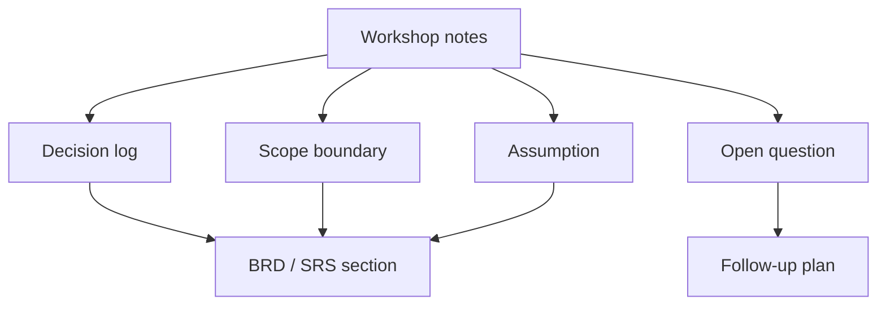

# BRD, SRS và artifact quyết định

<div class="lesson-meta">
  <span>Artifact phân tích và diagramming</span>
  <span>Software BA</span>
  <span>Core</span>
</div>

## Learning outcomes

- Dùng AI structure BRD và SRS mà không mất ownership.
- Giữ decision, assumption, risk và evidence.
- Tránh document polish che giấu unresolved scope.

## Why this matters for BA work

<div class="ba-callout">
AI có thể draft tài liệu, nhưng giá trị BA nằm ở decision structure, evidence, scope control và reviewability.
</div>

Bài này quan trọng vì AI có thể draft BRD và SRS rất nhanh, nhưng formal document không chỉ là text. Nó là record của decision, scope boundary, evidence, ownership và change control. BA phải bảo đảm document có AI hỗ trợ giữ được decision logic thay vì tạo trang bóng bẩy che giấu commitment chưa resolve.

## Mental model or core concept

Tài liệu BA không có giá trị vì dài; nó có giá trị vì làm decision inspect được. AI có thể tạo first draft, nhưng BA phải giữ decision log, scope boundary, source evidence, risk, assumption và open question. Tài liệu polished nhưng giấu uncertainty là nguy hiểm.

## Practical BA example

Workshop notes được chuyển thành BRD section. AI draft narrative sạch, nhưng BA bổ sung decision table, item out-of-scope rõ, pricing rule chưa resolve và stakeholder approval status trước khi share.

## Diagram



## BA artifact

### Decision Artifact Skeleton

| Section | Purpose | AI hỗ trợ gì | BA phải own gì |
| --- | --- | --- | --- |
| Business objective | Nêu vì sao work tồn tại. | Summarize workshop notes. | Metric và priority tradeoff. |
| Scope boundary | Ngăn scope expansion vô tình. | Draft in/out list. | Final scope decision. |
| Decision log | Cho thấy điều đã chốt. | Format decision. | Owner, date, rationale. |
| Open questions | Giữ uncertainty visible. | Cluster question. | Resolution path và owner. |

## AI expert note

Documentation BA chuyên gia tách narrative khỏi decision artifact. AI hữu ích cho drafting, summarizing và reorganizing, nhưng không được tự quyết scope, acceptance hoặc policy. Output BRD và SRS nên có decision log reference, source evidence, version history, open issue và approval checkpoint explicit.

## Bad vs better example

| Cách làm yếu | Vì sao fail | Cách làm BA tốt hơn |
| --- | --- | --- |
| Yêu cầu AI tạo complete BRD từ notes | Draft có thể invent decision và làm unresolved area trông như đã approve. | Generate document skeleton kèm decision gap, evidence map và open approval item. |
| Dùng wording bóng bẩy để resolve stakeholder conflict | Prose tốt có thể che disagreement thay vì escalate. | Represent conflict explicit với option, impact, owner và decision date. |
| Xóa assumption để document sạch hơn | Stakeholder mất visibility vào phần còn cần validation. | Giữ assumption, dependency và open question trong section được governance. |

## AI collaboration prompt

```text
Draft section BRD/SRS từ notes này. Bao gồm objective, scope, stakeholder, decision, assumption, requirement, risk, metric, open question và source evidence. Label mọi inference, và không đưa unresolved item vào final requirement.
```

## Mistakes to avoid

- Dùng AI tạo document polished trước khi decision rõ.
- Giấu assumption trong prose.
- Trộn current state, future state và open question.
- Quên scope boundary.

## Apply this tomorrow

1. Thêm decision log vào một document.
2. Nhờ AI extract assumption từ draft.
3. Chuyển unresolved item vào open-question table.
4. Review out-of-scope item với stakeholder.

## What a BA should remember

- Document nên làm decision visible.
- Polish không phải clarity.
- AI draft; BA kiểm soát scope và evidence.
