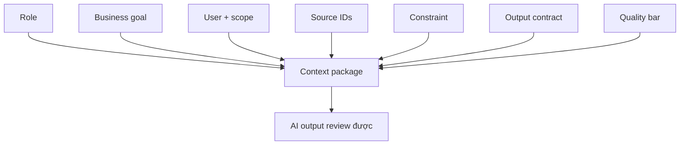

# Context engineering patterns

<div class="lesson-meta">
  <span>AI collaboration và context engineering</span>
  <span>Software BA</span>
  <span>Core</span>
</div>

## Learning outcomes

- Xây context package cho task BA lặp lại.
- Định nghĩa output contract cho AI-assisted analysis.
- Giảm hallucination bằng cách kiểm soát source và review rule.

## Why this matters for BA work

<div class="ba-callout">
AI work tốt không phải một prompt thông minh; đó là context package tái sử dụng được với goal, source, constraint và review criteria.
</div>

Business Analyst đứng giữa problem framing, ý nghĩa từ stakeholder, constraint triển khai và product decision. Trong công việc có AI, vị trí này quan trọng hơn vì ngôn ngữ chưa rõ có thể tạo false certainty rất nhanh. Bài này đưa ra một control thực tế để áp dụng trước khi output AI trở thành scope, backlog hoặc delivery commitment.

## Mental model or core concept

Prompting là instruction nhìn thấy; context engineering là operating design đầy đủ xung quanh nó. Với BA, context package nên gồm business goal, user, scope, source, constraint, artifact format, quality bar và câu hỏi AI phải hỏi trước khi draft.

## Practical BA example

Hai BA nhờ AI review requirement. Một người viết 'find gaps'; người kia cung cấp product goal, stakeholder role, source ID, NFR checklist, output column, severity level và evidence rule. BA thứ hai nhận được artifact review dùng được.

## Diagram



## BA artifact

### BA Context Package

| Component | Cần đưa vào | Vì sao quan trọng | Ví dụ |
| --- | --- | --- | --- |
| Role | Perspective và expertise mong muốn. | Định hình lens review. | Senior BA cho fintech onboarding. |
| Source | Document, note, ID, freshness. | Kiểm soát grounding. | SRS v0.8, policy P-12, workshop notes. |
| Task | Analysis job cụ thể. | Tránh summary quá rộng. | Find ambiguity và NFR gap. |
| Output contract | Column, format, quality bar. | Làm output review được. | Table có evidence và question. |

## AI collaboration prompt

```text
Dùng context package này: Role, Business Goal, Users, Scope, Source IDs, Constraints, Task, Output Format, Quality Bar và Questions Before Drafting. Hỏi clarification question trước nếu thiếu component bắt buộc.
```

## Mistakes to avoid

- Gọi instruction một dòng là prompt engineering.
- Bỏ output format.
- Không cung cấp source ID.
- Không nói rõ quality nghĩa là gì với artifact.

## Apply this tomorrow

1. Tạo context package reusable cho requirement review.
2. Thêm output column trước khi nhờ AI draft.
3. Đưa quality bar vào một prompt.
4. Yêu cầu AI hỏi context còn thiếu trước khi trả lời.

## What a BA should remember

- Context engineering làm AI work lặp lại được.
- Output format là một phần của requirement.
- Prompt thiếu source và review rule thì fragile.
