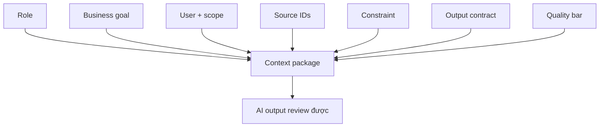

# Context engineering patterns

<div class="lesson-meta">
  <span>AI collaboration và context engineering</span>
  <span>Software BA</span>
  <span>Core</span>
</div>

## Learning outcomes

- Xây context package cho task BA lặp lại.
- Định nghĩa output contract cho AI-assisted analysis.
- Giảm hallucination bằng cách kiểm soát source và review rule.

## Why this matters for BA work

<div class="ba-callout">
AI work tốt không phải một prompt thông minh; đó là context package tái sử dụng được với goal, source, constraint và review criteria.
</div>

Bài này quan trọng vì prompt dùng một lần không scale được quality của BA team. Team cần context pattern lặp lại được, định nghĩa role, goal, evidence, constraint, output format, review rule và escalation behavior. Context engineering giúp AI work có thể audit, dạy lại và reuse trên nhiều project thay vì phụ thuộc prompt luck cá nhân.

## Common difficulties for BAs

Trong dự án thật, chủ đề này khó vì BA phải biến evidence lộn xộn thành decision mà không để AI che mất uncertainty. Hãy chú ý các friction point này trước khi xem output là sẵn sàng.

| Khó khăn | Vì sao khó trong công việc BA | BA nên xử lý thế nào |
| --- | --- | --- |
| Gọi instruction một dòng là prompt engineering. | Khó vì Context engineering patterns thường được áp dụng khi deadline gấp, evidence chưa đủ và stakeholder chưa thống nhất. Draft AI nghe trôi chảy có thể làm gap ít visible hơn. | Dùng source label, assumption rõ và review owner cụ thể trước khi chuyển thành backlog, specification hoặc delivery commitment. |
| Bỏ output format. | Khó vì Context engineering patterns thường được áp dụng khi deadline gấp, evidence chưa đủ và stakeholder chưa thống nhất. Draft AI nghe trôi chảy có thể làm gap ít visible hơn. | Dùng source label, assumption rõ và review owner cụ thể trước khi chuyển thành backlog, specification hoặc delivery commitment. |
| Không cung cấp source ID. | Khó vì Context engineering patterns thường được áp dụng khi deadline gấp, evidence chưa đủ và stakeholder chưa thống nhất. Draft AI nghe trôi chảy có thể làm gap ít visible hơn. | Dùng source label, assumption rõ và review owner cụ thể trước khi chuyển thành backlog, specification hoặc delivery commitment. |

## Where this applies in real projects

Bài này hữu ích khi BA cần chuyển conversation, policy, design hoặc technical input thành artifact chung để team implement và test được.

| Thời điểm trong dự án | Cách áp dụng bài học | Output cụ thể của BA |
| --- | --- | --- |
| Discovery | Tạo context package reusable cho requirement review. | BA Context Package: artifact review được, nối nội dung học với decision, acceptance criteria, risk hoặc stakeholder alignment. |
| Refinement | Thêm output column trước khi nhờ AI draft. | BA Context Package: artifact review được, nối nội dung học với decision, acceptance criteria, risk hoặc stakeholder alignment. |
| Delivery | Đưa quality bar vào một prompt. | BA Context Package: artifact review được, nối nội dung học với decision, acceptance criteria, risk hoặc stakeholder alignment. |

## If this is missing

Nếu thiếu năng lực này, AI vẫn có thể tạo text rất bóng bẩy, nhưng project mất khả năng review. Kết quả thường là rework, assumption ẩn, acceptance criteria yếu hoặc business decision thiếu evidence.

| Nếu thiếu | Ảnh hưởng tới dự án | Cách khôi phục |
| --- | --- | --- |
| Viết prompt thông minh riêng cho từng task | Quality phụ thuộc improvisation cá nhân và khó review. | Khôi phục bằng pattern tốt hơn: Tạo prompt pattern reusable có source rule, output contract và review gate. Sau đó check lại artifact theo evidence, testability, ownership và business impact trước khi share. |
| Cho AI role và goal nhưng thiếu evidence rule | Model có thể trộn fact được cung cấp với assumption bên ngoài nghe hợp lý. | Khôi phục bằng pattern tốt hơn: Đặc tả allowed source, unsupported-claim label và validation question. Sau đó check lại artifact theo evidence, testability, ownership và business impact trước khi share. |
| Yêu cầu answer hoàn chỉnh trong một bước | Model che missing context để tối ưu fluency. | Khôi phục bằng pattern tốt hơn: Dùng staged prompt: context pack, analysis, artifact draft, critique và revision. Sau đó check lại artifact theo evidence, testability, ownership và business impact trước khi share. |

## Mental model or core concept

Prompting là instruction nhìn thấy; context engineering là operating design đầy đủ xung quanh nó. Với BA, context package nên gồm business goal, user, scope, source, constraint, artifact format, quality bar và câu hỏi AI phải hỏi trước khi draft.

## Practical BA example

Hai BA nhờ AI review requirement. Một người viết 'find gaps'; người kia cung cấp product goal, stakeholder role, source ID, NFR checklist, output column, severity level và evidence rule. BA thứ hai nhận được artifact review dùng được.

## Diagram



## BA artifact

### BA Context Package

| Component | Cần đưa vào | Vì sao quan trọng | Ví dụ |
| --- | --- | --- | --- |
| Role | Perspective và expertise mong muốn. | Định hình lens review. | Senior BA cho fintech onboarding. |
| Source | Document, note, ID, freshness. | Kiểm soát grounding. | SRS v0.8, policy P-12, workshop notes. |
| Task | Analysis job cụ thể. | Tránh summary quá rộng. | Find ambiguity và NFR gap. |
| Output contract | Column, format, quality bar. | Làm output review được. | Table có evidence và question. |

## AI expert note

Context engineering là cách BA thiết kế môi trường analysis có kiểm soát. Điểm chuyên gia là làm task boundary explicit: source nào được dùng, phần nào phải ignore, format nào bắt buộc, evidence được tính ra sao và model phải làm gì khi information thiếu hoặc conflict.

## Bad vs better example

| Cách làm yếu | Vì sao fail | Cách làm BA tốt hơn |
| --- | --- | --- |
| Viết prompt thông minh riêng cho từng task | Quality phụ thuộc improvisation cá nhân và khó review. | Tạo prompt pattern reusable có source rule, output contract và review gate. |
| Cho AI role và goal nhưng thiếu evidence rule | Model có thể trộn fact được cung cấp với assumption bên ngoài nghe hợp lý. | Đặc tả allowed source, unsupported-claim label và validation question. |
| Yêu cầu answer hoàn chỉnh trong một bước | Model che missing context để tối ưu fluency. | Dùng staged prompt: context pack, analysis, artifact draft, critique và revision. |

## AI collaboration prompt

```text
Dùng context package này: Role, Business Goal, Users, Scope, Source IDs, Constraints, Task, Output Format, Quality Bar và Questions Before Drafting. Hỏi clarification question trước nếu thiếu component bắt buộc.
```

## Mistakes to avoid

- Gọi instruction một dòng là prompt engineering.
- Bỏ output format.
- Không cung cấp source ID.
- Không nói rõ quality nghĩa là gì với artifact.

## Apply this tomorrow

1. Tạo context package reusable cho requirement review.
2. Thêm output column trước khi nhờ AI draft.
3. Đưa quality bar vào một prompt.
4. Yêu cầu AI hỏi context còn thiếu trước khi trả lời.

## What a BA should remember

- Context engineering làm AI work lặp lại được.
- Output format là một phần của requirement.
- Prompt thiếu source và review rule thì fragile.
