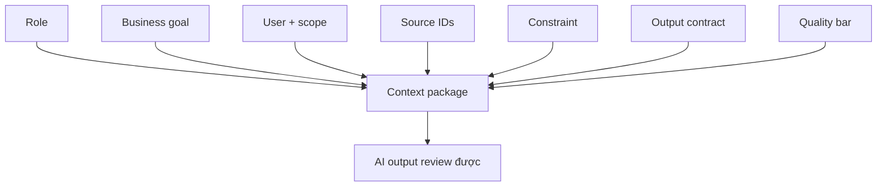

# Context engineering patterns

<div class="lesson-meta">
  <span>AI collaboration và context engineering</span>
  <span>Software BA</span>
  <span>Core</span>
</div>

## Learning outcomes

- Xây context package cho task BA lặp lại.
- Định nghĩa output contract cho AI-assisted analysis.
- Giảm hallucination bằng cách kiểm soát source và review rule.

## Why this matters for BA work

<div class="ba-callout">
AI work tốt không phải một prompt thông minh; đó là context package tái sử dụng được với goal, source, constraint và review criteria.
</div>

Bài này quan trọng vì prompt dùng một lần không scale được quality của BA team. Team cần context pattern lặp lại được, định nghĩa role, goal, evidence, constraint, output format, review rule và escalation behavior. Context engineering giúp AI work có thể audit, dạy lại và reuse trên nhiều project thay vì phụ thuộc prompt luck cá nhân.

## Common difficulties for BAs

Trong AI collaboration và context engineering, Context engineering patterns trở nên khó khi AI có thể draft rất nhanh, nhưng reviewer cần context lặp lại được, structured output và critique rule để tin kết quả. BA nên kiểm tra các điểm dưới đây trước khi xem artifact có AI hỗ trợ là đủ sẵn sàng cho stakeholder decision hoặc handoff.

| Khó khăn | Vì sao khó trong công việc BA | BA nên xử lý thế nào |
| --- | --- | --- |
| Gọi instruction một dòng là prompt engineering. | Lỗi "Gọi instruction một dòng là prompt engineering." xuất hiện khi team bàn về context package quality, prompt reuse, critique loop và output contract nhưng chưa thống nhất source nào authoritative. AI có thể làm disagreement nghe mượt hơn, nên BA phải giữ uncertainty visible. | Áp dụng control này: tách context preparation, generation, critique và human approval thành các bước visible. Sau đó dùng pattern tốt hơn "Tạo prompt pattern reusable có source rule, output contract và review gate." và hỏi ai phải approve artifact trước khi nó ảnh hưởng scope, build, test hoặc release. |
| Bỏ output format. | Với Context engineering patterns, điểm khó là AI work tốt không phải một prompt thông minh; đó là context package tái sử dụng được với goal, source, constraint và review criteria. Pattern yếu rất dễ xảy ra vì AI có thể tạo câu trả lời trôi chảy trước khi BA check ownership, source freshness hoặc decision right. | Áp dụng control này: tách context preparation, generation, critique và human approval thành các bước visible. Sau đó dùng pattern tốt hơn "Đặc tả allowed source, unsupported-claim label và validation question." và hỏi ai phải approve artifact trước khi nó ảnh hưởng scope, build, test hoặc release. |
| Không cung cấp source ID. | Điểm này khó khi BA Context Package được kỳ vọng hỗ trợ repeatable collaboration pattern. Nếu BA không challenge draft, unsupported assumption có thể đi vào planning, testing hoặc stakeholder communication. | Áp dụng control này: tách context preparation, generation, critique và human approval thành các bước visible. Sau đó dùng pattern tốt hơn "Dùng staged prompt: context pack, analysis, artifact draft, critique và revision." và hỏi ai phải approve artifact trước khi nó ảnh hưởng scope, build, test hoặc release. |

## Where this applies in real projects

Dùng bài này khi BA team muốn pattern AI collaboration tái sử dụng thay vì prompt one-off phụ thuộc thói quen từng người. Output thực tế không phải document dài hơn; đó là BA Context Package có đủ evidence, ownership và decision clarity cho cuộc trao đổi tiếp theo của dự án.

| Thời điểm trong dự án | Cách áp dụng bài học | Output cụ thể của BA |
| --- | --- | --- |
| Context setup | Tạo context package reusable cho requirement review. | BA Context Package thể hiện context package quality, prompt reuse, critique loop và output contract, trong đó action "Tạo context package reusable cho requirement review." được chuyển thành decision, requirement, checklist hoặc question có thể review ở meeting tiếp theo. |
| Prompt reuse | Thêm output column trước khi nhờ AI draft. | BA Context Package thể hiện source evidence, trong đó action "Thêm output column trước khi nhờ AI draft." được chuyển thành decision, requirement, checklist hoặc question có thể review ở meeting tiếp theo. |
| Peer review | Đưa quality bar vào một prompt. | BA Context Package thể hiện decision owner, trong đó action "Đưa quality bar vào một prompt." được chuyển thành decision, requirement, checklist hoặc question có thể review ở meeting tiếp theo. |

## If this is missing

Nếu thiếu Context engineering patterns, output thay đổi theo từng người, assumption bị ẩn và chất lượng review phụ thuộc vào ai viết prompt. BA vẫn có thể khôi phục, nhưng phải chuyển draft AI bóng bẩy trở lại thành evidence, assumption, owner và decision test được.

| Nếu thiếu | Ảnh hưởng tới dự án | Cách khôi phục |
| --- | --- | --- |
| Viết prompt thông minh riêng cho từng task | Quality phụ thuộc improvisation cá nhân và khó review. | Khôi phục bằng pattern tốt hơn: Tạo prompt pattern reusable có source rule, output contract và review gate. Rework BA Context Package cho đến khi nó lộ rõ context package quality, prompt reuse, critique loop và output contract, và không share như bản final cho tới khi evidence, ownership và validation path explicit. |
| Cho AI role và goal nhưng thiếu evidence rule | Model có thể trộn fact được cung cấp với assumption bên ngoài nghe hợp lý. | Khôi phục bằng pattern tốt hơn: Đặc tả allowed source, unsupported-claim label và validation question. Rework BA Context Package cho đến khi nó lộ rõ context package quality, prompt reuse, critique loop và output contract, và không share như bản final cho tới khi evidence, ownership và validation path explicit. |
| Yêu cầu answer hoàn chỉnh trong một bước | Model che missing context để tối ưu fluency. | Khôi phục bằng pattern tốt hơn: Dùng staged prompt: context pack, analysis, artifact draft, critique và revision. Rework BA Context Package cho đến khi nó lộ rõ context package quality, prompt reuse, critique loop và output contract, và không share như bản final cho tới khi evidence, ownership và validation path explicit. |

## Mental model or core concept

Prompting là instruction nhìn thấy; context engineering là operating design đầy đủ xung quanh nó. Với BA, context package nên gồm business goal, user, scope, source, constraint, artifact format, quality bar và câu hỏi AI phải hỏi trước khi draft.

## Practical BA example

Hai BA nhờ AI review requirement. Một người viết 'find gaps'; người kia cung cấp product goal, stakeholder role, source ID, NFR checklist, output column, severity level và evidence rule. BA thứ hai nhận được artifact review dùng được.

## Diagram



## BA artifact

### BA Context Package

| Component | Cần đưa vào | Vì sao quan trọng | Ví dụ |
| --- | --- | --- | --- |
| Role | Perspective và expertise mong muốn. | Định hình lens review. | Senior BA cho fintech onboarding. |
| Source | Document, note, ID, freshness. | Kiểm soát grounding. | SRS v0.8, policy P-12, workshop notes. |
| Task | Analysis job cụ thể. | Tránh summary quá rộng. | Find ambiguity và NFR gap. |
| Output contract | Column, format, quality bar. | Làm output review được. | Table có evidence và question. |

## AI expert note

Context engineering là cách BA thiết kế môi trường analysis có kiểm soát. Điểm chuyên gia là làm task boundary explicit: source nào được dùng, phần nào phải ignore, format nào bắt buộc, evidence được tính ra sao và model phải làm gì khi information thiếu hoặc conflict.

## Bad vs better example

| Cách làm yếu | Vì sao fail | Cách làm BA tốt hơn |
| --- | --- | --- |
| Viết prompt thông minh riêng cho từng task | Quality phụ thuộc improvisation cá nhân và khó review. | Tạo prompt pattern reusable có source rule, output contract và review gate. |
| Cho AI role và goal nhưng thiếu evidence rule | Model có thể trộn fact được cung cấp với assumption bên ngoài nghe hợp lý. | Đặc tả allowed source, unsupported-claim label và validation question. |
| Yêu cầu answer hoàn chỉnh trong một bước | Model che missing context để tối ưu fluency. | Dùng staged prompt: context pack, analysis, artifact draft, critique và revision. |

## AI collaboration prompt

```text
Dùng context package này: Role, Business Goal, Users, Scope, Source IDs, Constraints, Task, Output Format, Quality Bar và Questions Before Drafting. Hỏi clarification question trước nếu thiếu component bắt buộc.
```

## Mistakes to avoid

- Gọi instruction một dòng là prompt engineering.
- Bỏ output format.
- Không cung cấp source ID.
- Không nói rõ quality nghĩa là gì với artifact.

## Apply this tomorrow

1. Tạo context package reusable cho requirement review.
2. Thêm output column trước khi nhờ AI draft.
3. Đưa quality bar vào một prompt.
4. Yêu cầu AI hỏi context còn thiếu trước khi trả lời.

## What a BA should remember

- Context engineering làm AI work lặp lại được.
- Output format là một phần của requirement.
- Prompt thiếu source và review rule thì fragile.
