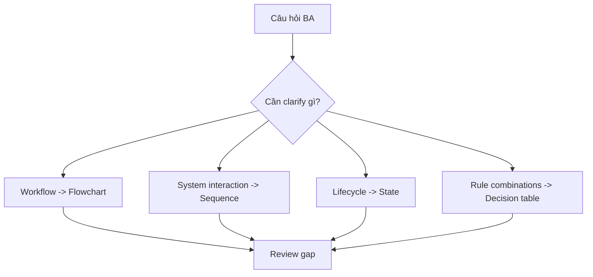

# Diagramming cho BA

<div class="lesson-meta">
  <span>Artifact phân tích và diagramming</span>
  <span>Software BA</span>
  <span>Core</span>
</div>

## Learning outcomes

- Chọn đúng diagram type cho câu hỏi BA.
- Dùng AI draft Mermaid diagram an toàn.
- Review diagram để tìm actor, flow và exception thiếu.

## Why this matters for BA work

<div class="ba-callout">
Diagram tốt thay đổi cuộc trao đổi; nó làm lộ decision, boundary và gap mà text che mất.
</div>

Bài này quan trọng vì diagram phơi bày reasoning mà prose có thể che giấu. AI có thể tạo flowchart, sequence diagram và state model nhanh, nhưng diagram chỉ có giá trị khi nó làm lộ missing actor, unclear rule, system boundary và exception path. BA phải dùng diagram như analysis instrument, không phải visual decoration.

## Common difficulties for BAs

Trong dự án thật, chủ đề này khó vì BA phải biến evidence lộn xộn thành decision mà không để AI che mất uncertainty. Hãy chú ý các friction point này trước khi xem output là sẵn sàng.

| Khó khăn | Vì sao khó trong công việc BA | BA nên xử lý thế nào |
| --- | --- | --- |
| Dùng một diagram type cho mọi problem. | Khó vì Diagramming cho BA thường được áp dụng khi deadline gấp, evidence chưa đủ và stakeholder chưa thống nhất. Draft AI nghe trôi chảy có thể làm gap ít visible hơn. | Dùng source label, assumption rõ và review owner cụ thể trước khi chuyển thành backlog, specification hoặc delivery commitment. |
| Để AI vẽ diagram mà không check business meaning. | Khó vì Diagramming cho BA thường được áp dụng khi deadline gấp, evidence chưa đủ và stakeholder chưa thống nhất. Draft AI nghe trôi chảy có thể làm gap ít visible hơn. | Dùng source label, assumption rõ và review owner cụ thể trước khi chuyển thành backlog, specification hoặc delivery commitment. |
| Bỏ failure path. | Khó vì Diagramming cho BA thường được áp dụng khi deadline gấp, evidence chưa đủ và stakeholder chưa thống nhất. Draft AI nghe trôi chảy có thể làm gap ít visible hơn. | Dùng source label, assumption rõ và review owner cụ thể trước khi chuyển thành backlog, specification hoặc delivery commitment. |

## Where this applies in real projects

Bài này hữu ích khi BA cần chuyển conversation, policy, design hoặc technical input thành artifact chung để team implement và test được.

| Thời điểm trong dự án | Cách áp dụng bài học | Output cụ thể của BA |
| --- | --- | --- |
| Discovery | Chuyển một requirement nhiều text thành Mermaid diagram. | Diagram Selection Guide: artifact review được, nối nội dung học với decision, acceptance criteria, risk hoặc stakeholder alignment. |
| Refinement | Nhờ AI chọn diagram type phù hợp. | Diagram Selection Guide: artifact review được, nối nội dung học với decision, acceptance criteria, risk hoặc stakeholder alignment. |
| Delivery | Review diagram với developer để tìm boundary gap. | Diagram Selection Guide: artifact review được, nối nội dung học với decision, acceptance criteria, risk hoặc stakeholder alignment. |

## If this is missing

Nếu thiếu năng lực này, AI vẫn có thể tạo text rất bóng bẩy, nhưng project mất khả năng review. Kết quả thường là rework, assumption ẩn, acceptance criteria yếu hoặc business decision thiếu evidence.

| Nếu thiếu | Ảnh hưởng tới dự án | Cách khôi phục |
| --- | --- | --- |
| Generate một diagram rồi thêm vào document | Một view duy nhất có thể che timing, data hoặc responsibility issue. | Khôi phục bằng pattern tốt hơn: Tạo process, sequence và state view khi problem đi qua cả workflow và system. Sau đó check lại artifact theo evidence, testability, ownership và business impact trước khi share. |
| Accept label diagram mơ hồ | Decision diamond như valid hoặc approved không định nghĩa business rule. | Khôi phục bằng pattern tốt hơn: Thay label mơ hồ bằng rule source, threshold, owner hoặc open question. Sau đó check lại artifact theo evidence, testability, ownership và business impact trước khi share. |
| Chỉ dùng diagram để presentation | Team bỏ lỡ cơ hội tìm defect trước build. | Khôi phục bằng pattern tốt hơn: Chạy diagram review session để identify gap, exception và ownership issue. Sau đó check lại artifact theo evidence, testability, ownership và business impact trước khi share. |

## Mental model or core concept

Diagram là thinking tool. Flowchart làm rõ process decision; sequence diagram làm rõ system interaction; state diagram làm rõ lifecycle; matrix làm rõ tổ hợp rule. AI có thể chuyển text sang Mermaid, nhưng BA phải validate system boundary, actor responsibility, exception path và business rule.

## Practical BA example

Requirement ghi 'payment is verified before fulfillment.' Sequence diagram làm lộ responsibility thiếu giữa payment gateway, order service, warehouse và customer notification. BA hỏi tiếp ai handle payment failure và khi nào release inventory.

## Diagram



## BA artifact

### Diagram Selection Guide

| Câu hỏi BA | Diagram type | Dùng khi | Review focus |
| --- | --- | --- | --- |
| Work flow ra sao? | Flowchart | Process và decision quan trọng. | Actor, decision rule, exception. |
| System interact ra sao? | Sequence diagram | Có API/event involved. | System boundary và failure message. |
| Entity có state nào? | State diagram | Lifecycle quan trọng. | Allowed transition và trigger. |
| Rule nào apply? | Decision table | Tổ hợp rule quyết định outcome. | Rule complete và exclusive. |

## AI expert note

Diagram do AI sinh nên được review như requirement. BA chuyên gia check notation fit, tách actor-system, decision label, data movement, error path và diagram có trả lời câu hỏi stakeholder không. Diagramming mạnh nhất khi BA yêu cầu AI tạo nhiều view cạnh tranh rồi reconcile điểm khác nhau.

## Bad vs better example

| Cách làm yếu | Vì sao fail | Cách làm BA tốt hơn |
| --- | --- | --- |
| Generate một diagram rồi thêm vào document | Một view duy nhất có thể che timing, data hoặc responsibility issue. | Tạo process, sequence và state view khi problem đi qua cả workflow và system. |
| Accept label diagram mơ hồ | Decision diamond như valid hoặc approved không định nghĩa business rule. | Thay label mơ hồ bằng rule source, threshold, owner hoặc open question. |
| Chỉ dùng diagram để presentation | Team bỏ lỡ cơ hội tìm defect trước build. | Chạy diagram review session để identify gap, exception và ownership issue. |

## AI collaboration prompt

```text
Chọn diagram type phù hợp nhất cho requirement này và giải thích vì sao. Sau đó draft Mermaid diagram. Sau diagram, liệt kê missing actor, boundary chưa rõ, exception path và business rule cần validate.
```

## Mistakes to avoid

- Dùng một diagram type cho mọi problem.
- Để AI vẽ diagram mà không check business meaning.
- Bỏ failure path.
- Tạo diagram đẹp nhưng không giúp decision.

## Apply this tomorrow

1. Chuyển một requirement nhiều text thành Mermaid diagram.
2. Nhờ AI chọn diagram type phù hợp.
3. Review diagram với developer để tìm boundary gap.
4. Thêm exception path trước khi share.

## What a BA should remember

- Diagram là analysis, không phải decoration.
- Diagram tốt nhất làm lộ decision tiếp theo.
- AI vẽ nhanh; BA kiểm tra meaning.
